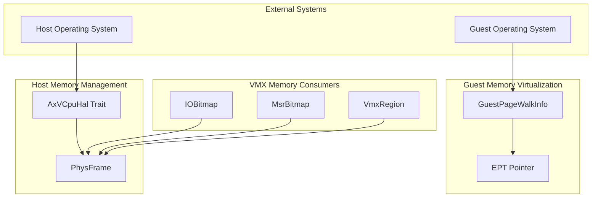
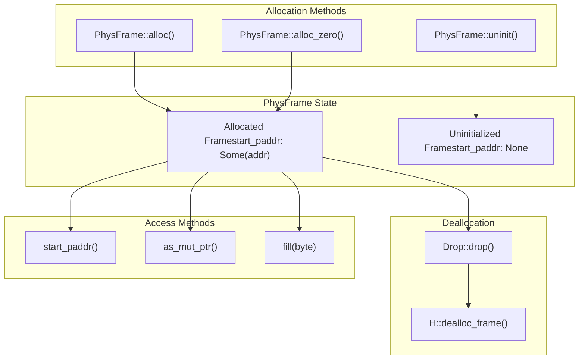
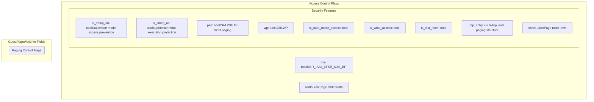

# Memory Management

> **Relevant source files**
> * [src/ept.rs](https://github.com/arceos-hypervisor/x86_vcpu/blob/2cc42349/src/ept.rs)
> * [src/frame.rs](https://github.com/arceos-hypervisor/x86_vcpu/blob/2cc42349/src/frame.rs)

## Purpose and Scope

This document covers the memory management systems in the x86_vcpu hypervisor library, which handle both host physical memory allocation and guest memory virtualization. The memory management architecture provides two primary functions: RAII-based physical frame allocation for VMX data structures and Extended Page Table (EPT) support for guest memory virtualization.

For details on how memory management integrates with specific VMX structures, see [VMX Data Structures](/arceos-hypervisor/x86_vcpu/2.2-vmx-data-structures). For information about the hardware abstraction layer that enables memory management, see [Physical Frame Management](/arceos-hypervisor/x86_vcpu/3.1-physical-frame-management).

## Memory Management Architecture

The memory management system operates at two distinct levels: host physical memory management through the `PhysFrame` abstraction, and guest memory virtualization through EPT mechanisms.

### Memory Management Overview

Sources: [src/frame.rs(L1 - L63)&emsp;](https://github.com/arceos-hypervisor/x86_vcpu/blob/2cc42349/src/frame.rs#L1-L63) [src/ept.rs(L1 - L28)&emsp;](https://github.com/arceos-hypervisor/x86_vcpu/blob/2cc42349/src/ept.rs#L1-L28)

## Physical Memory Abstraction

The `PhysFrame<H: AxVCpuHal>` struct provides RAII-based management of 4KB physical memory pages. Each frame is automatically deallocated when dropped, preventing memory leaks in the hypervisor.

### PhysFrame Lifecycle Management

Sources: [src/frame.rs(L18 - L62)&emsp;](https://github.com/arceos-hypervisor/x86_vcpu/blob/2cc42349/src/frame.rs#L18-L62)

### Hardware Abstraction Interface

The `AxVCpuHal` trait defines the interface that must be implemented by the underlying system to support physical memory operations:

|Method|Purpose|Return Type|
| --- | --- | --- |
|alloc_frame()|Allocate a 4KB physical frame|Option<HostPhysAddr>|
|dealloc_frame(addr)|Deallocate a physical frame|()|
|phys_to_virt(addr)|Convert physical to virtual address|VirtAddr|

Sources: [src/frame.rs(L6)&emsp;](https://github.com/arceos-hypervisor/x86_vcpu/blob/2cc42349/src/frame.rs#L6-L6) [src/frame.rs(L20 - L21)&emsp;](https://github.com/arceos-hypervisor/x86_vcpu/blob/2cc42349/src/frame.rs#L20-L21) [src/frame.rs(L47)&emsp;](https://github.com/arceos-hypervisor/x86_vcpu/blob/2cc42349/src/frame.rs#L47-L47) [src/frame.rs(L58)&emsp;](https://github.com/arceos-hypervisor/x86_vcpu/blob/2cc42349/src/frame.rs#L58-L58)

## Guest Memory Virtualization

Guest memory virtualization is handled through the Extended Page Tables (EPT) mechanism and guest page walk information tracking.

### Guest Page Walk Information Structure

Sources: [src/ept.rs(L3 - L27)&emsp;](https://github.com/arceos-hypervisor/x86_vcpu/blob/2cc42349/src/ept.rs#L3-L27)

## Memory Management Integration

The memory management system integrates with VMX structures by providing the underlying physical memory backing for virtualization data structures.

### VMX Structure Memory Dependencies

|VMX Structure|Memory Requirement|Purpose|
| --- | --- | --- |
|VmxRegion|1xPhysFrame|VMXON/VMCS memory region|
|IOBitmap|2xPhysFrame|I/O port interception bitmap (64KB)|
|MsrBitmap|1xPhysFrame|MSR access control bitmap (4KB)|

The `PAGE_SIZE_4K` constant from the `memory_addr` crate defines the standard 4KB frame size used throughout the system [src/frame.rs(L8)&emsp;](https://github.com/arceos-hypervisor/x86_vcpu/blob/2cc42349/src/frame.rs#L8-L8)

### Memory Safety Guarantees

The `PhysFrame` implementation provides several safety guarantees:

1. **RAII Management**: Automatic deallocation on drop prevents memory leaks [src/frame.rs(L55 - L62)&emsp;](https://github.com/arceos-hypervisor/x86_vcpu/blob/2cc42349/src/frame.rs#L55-L62)
2. **Initialization Validation**: `start_paddr()` panics on uninitialized frames [src/frame.rs(L42 - L44)&emsp;](https://github.com/arceos-hypervisor/x86_vcpu/blob/2cc42349/src/frame.rs#L42-L44)
3. **Zero-fill Support**: `alloc_zero()` provides zero-initialized frames [src/frame.rs(L29 - L33)&emsp;](https://github.com/arceos-hypervisor/x86_vcpu/blob/2cc42349/src/frame.rs#L29-L33)
4. **Address Validation**: Allocation asserts non-zero physical addresses [src/frame.rs(L22)&emsp;](https://github.com/arceos-hypervisor/x86_vcpu/blob/2cc42349/src/frame.rs#L22-L22)

Sources: [src/frame.rs(L10 - L16)&emsp;](https://github.com/arceos-hypervisor/x86_vcpu/blob/2cc42349/src/frame.rs#L10-L16) [src/frame.rs(L18 - L53)&emsp;](https://github.com/arceos-hypervisor/x86_vcpu/blob/2cc42349/src/frame.rs#L18-L53) [src/frame.rs(L55 - L62)&emsp;](https://github.com/arceos-hypervisor/x86_vcpu/blob/2cc42349/src/frame.rs#L55-L62)