# Model-Specific Register Access

> **Relevant source files**
> * [src/msr.rs](https://github.com/arceos-hypervisor/x86_vcpu/blob/2cc42349/src/msr.rs)

This document covers the Model-Specific Register (MSR) access abstraction layer in the x86_vcpu hypervisor library. MSRs are processor-specific configuration and status registers that control various aspects of CPU behavior, particularly important for VMX virtualization features.

The MSR access system provides a type-safe abstraction over x86 MSR operations, with a focus on VMX-related registers and other MSRs essential for hypervisor operation. For information about VMX-specific data structures and configuration, see [VMX Data Structures](/arceos-hypervisor/x86_vcpu/2.2-vmx-data-structures). For details about VMCS field management, see [VMCS Field Management](/arceos-hypervisor/x86_vcpu/2.3-vmcs-field-management).

## MSR Access Architecture

The MSR access system is built around two main components: the `Msr` enum that defines specific MSR constants, and the `MsrReadWrite` trait that provides a higher-level abstraction for typed MSR access.


Sources: [src/msr.rs(L1 - L74)&emsp;](https://github.com/arceos-hypervisor/x86_vcpu/blob/2cc42349/src/msr.rs#L1-L74)

## MSR Definitions and Categories

The `Msr` enum defines specific MSR constants organized by functional categories. Each MSR is represented as a variant with its corresponding hardware register number.

### VMX Control and Capability MSRs

The largest category of MSRs relates to VMX virtualization capabilities and control settings:

|MSR Name|Value|Purpose|
| --- | --- | --- |
|IA32_VMX_BASIC|0x480|Basic VMX capabilities|
|IA32_VMX_PINBASED_CTLS|0x481|Pin-based VM execution controls|
|IA32_VMX_PROCBASED_CTLS|0x482|Primary processor-based controls|
|IA32_VMX_EXIT_CTLS|0x483|VM exit controls|
|IA32_VMX_ENTRY_CTLS|0x484|VM entry controls|
|IA32_VMX_PROCBASED_CTLS2|0x48b|Secondary processor-based controls|
|IA32_VMX_EPT_VPID_CAP|0x48c|EPT and VPID capabilities|

```mermaid
flowchart TD
subgraph subGraph5["VMX MSR Categories"]
    subgraph subGraph2["True Controls"]
        TruePinBased["IA32_VMX_TRUE_PINBASED_CTLS0x48d"]
        TrueProcBased["IA32_VMX_TRUE_PROCBASED_CTLS0x48e"]
        TrueExit["IA32_VMX_TRUE_EXIT_CTLS0x48f"]
        TrueEntry["IA32_VMX_TRUE_ENTRY_CTLS0x490"]
    end
    subgraph subGraph1["Control Capabilities"]
        PinBased["IA32_VMX_PINBASED_CTLS0x481"]
        ProcBased["IA32_VMX_PROCBASED_CTLS0x482"]
        ProcBased2["IA32_VMX_PROCBASED_CTLS20x48b"]
        ExitCtls["IA32_VMX_EXIT_CTLS0x483"]
        EntryCtls["IA32_VMX_ENTRY_CTLS0x484"]
    end
    subgraph subGraph0["Basic VMX Info"]
        VmxBasic["IA32_VMX_BASIC0x480Core VMX Features"]
        VmxMisc["IA32_VMX_MISC0x485Miscellaneous Data"]
    end
    subgraph subGraph4["Memory Virtualization"]
        EptVpid["IA32_VMX_EPT_VPID_CAP0x48cEPT & VPID Features"]
        Cr0Fixed0["IA32_VMX_CR0_FIXED00x486"]
    end
    subgraph subGraph3["Fixed Settings"]
        EptVpid["IA32_VMX_EPT_VPID_CAP0x48cEPT & VPID Features"]
        Cr0Fixed0["IA32_VMX_CR0_FIXED00x486"]
        Cr0Fixed1["IA32_VMX_CR0_FIXED10x487"]
        Cr4Fixed0["IA32_VMX_CR4_FIXED00x488"]
        Cr4Fixed1["IA32_VMX_CR4_FIXED10x489"]
    end
end

EntryCtls --> TrueEntry
ExitCtls --> TrueExit
PinBased --> TruePinBased
ProcBased --> ProcBased2
ProcBased --> TrueProcBased
VmxBasic --> EntryCtls
VmxBasic --> ExitCtls
VmxBasic --> PinBased
VmxBasic --> ProcBased
```



Sources: [src/msr.rs(L8 - L28)&emsp;](https://github.com/arceos-hypervisor/x86_vcpu/blob/2cc42349/src/msr.rs#L8-L28)

### System Configuration MSRs

Additional MSRs handle general x86 system configuration:

* **Feature Control**: `IA32_FEATURE_CONTROL` (0x3a) - Controls processor feature enablement
* **Memory Management**: `IA32_PAT` (0x277) - Page Attribute Table configuration
* **Extended State**: `IA32_XSS` (0xda0) - Extended State Save configuration

### Long Mode and Segment MSRs

MSRs for 64-bit mode operation and segment base addresses:

* **Mode Control**: `IA32_EFER` (0xc0000080) - Extended Feature Enable Register
* **System Call**: `IA32_STAR`, `IA32_LSTAR`, `IA32_CSTAR`, `IA32_FMASK` - System call configuration
* **Segment Bases**: `IA32_FS_BASE`, `IA32_GS_BASE`, `IA32_KERNEL_GSBASE` - Segment base addresses

Sources: [src/msr.rs(L8 - L40)&emsp;](https://github.com/arceos-hypervisor/x86_vcpu/blob/2cc42349/src/msr.rs#L8-L40)

## MSR Access Interface

The `Msr` enum provides direct read and write methods for MSR access:

### Read Operations

The `read()` method provides safe MSR reading:

```rust
pub fn read(self) -> u64
```

This method is marked as `#[inline(always)]` for performance and uses the x86 crate's `rdmsr` function internally. Reading MSRs is generally safe as it does not modify processor state.

### Write Operations

The `write()` method provides unsafe MSR writing:

```rust
pub unsafe fn write(self, value: u64)
```

Writing to MSRs is marked as unsafe because incorrect values can cause system instability, crashes, or security vulnerabilities. The caller must ensure that the write operation has no unsafe side effects.

Sources: [src/msr.rs(L42 - L59)&emsp;](https://github.com/arceos-hypervisor/x86_vcpu/blob/2cc42349/src/msr.rs#L42-L59)

## MsrReadWrite Trait

The `MsrReadWrite` trait provides a higher-level abstraction for types that represent specific MSR functionality:


The trait defines:

* **Associated MSR**: `const MSR: Msr` - Links the implementing type to a specific MSR
* **Raw Read**: `read_raw() -> u64` - Default implementation calls `Self::MSR.read()`
* **Raw Write**: `unsafe write_raw(flags: u64)` - Default implementation calls `Self::MSR.write(flags)`

This pattern allows creating type-safe wrappers around specific MSRs while maintaining the same underlying access interface.

Sources: [src/msr.rs(L61 - L73)&emsp;](https://github.com/arceos-hypervisor/x86_vcpu/blob/2cc42349/src/msr.rs#L61-L73)

## Integration with VMX System

The MSR access system integrates closely with the VMX virtualization engine:


The MSR system enables:

1. **Hardware Capability Discovery** - Reading VMX capability MSRs to determine supported features
2. **Control Register Validation** - Using fixed bit MSRs to validate CR0/CR4 settings
3. **Guest State Management** - Configuring guest segment bases and control registers
4. **Feature Control** - Managing processor feature enablement through dedicated MSRs

Sources: [src/msr.rs(L8 - L40)&emsp;](https://github.com/arceos-hypervisor/x86_vcpu/blob/2cc42349/src/msr.rs#L8-L40)