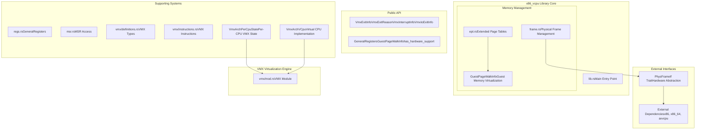
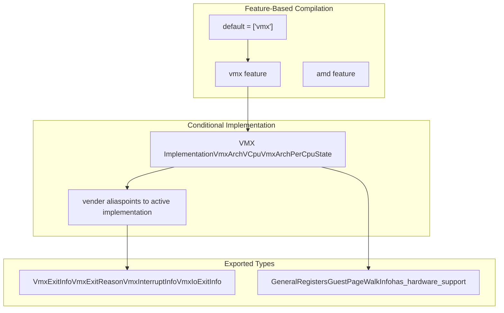

# Overview

> **Relevant source files**
> * [Cargo.toml](https://github.com/arceos-hypervisor/x86_vcpu/blob/2cc42349/Cargo.toml)
> * [README.md](https://github.com/arceos-hypervisor/x86_vcpu/blob/2cc42349/README.md)
> * [src/lib.rs](https://github.com/arceos-hypervisor/x86_vcpu/blob/2cc42349/src/lib.rs)

## Purpose and Scope

The `x86_vcpu` library provides a complete Intel VMX-based virtualization framework for x86_64 architectures. This library implements virtual CPU management, memory virtualization through Extended Page Tables (EPT), and hardware abstraction for building hypervisors.

The library focuses specifically on Intel VMX technology and provides the core virtualization primitives needed to create and manage virtual machines. For AMD SVM support, see the `amd` feature flag documented in [Project Configuration](/arceos-hypervisor/x86_vcpu/5.1-project-configuration). For build and development processes, see [Development and Configuration](/arceos-hypervisor/x86_vcpu/5-development-and-configuration).

**Sources:** [src/lib.rs(L1 - L31)&emsp;](https://github.com/arceos-hypervisor/x86_vcpu/blob/2cc42349/src/lib.rs#L1-L31) [README.md(L1 - L29)&emsp;](https://github.com/arceos-hypervisor/x86_vcpu/blob/2cc42349/README.md#L1-L29) [Cargo.toml(L1 - L28)&emsp;](https://github.com/arceos-hypervisor/x86_vcpu/blob/2cc42349/Cargo.toml#L1-L28)

## System Architecture

The x86_vcpu library is structured around several core subsystems that work together to provide complete virtualization capabilities:

### Core System Components

**Sources:** [src/lib.rs(L18 - L31)&emsp;](https://github.com/arceos-hypervisor/x86_vcpu/blob/2cc42349/src/lib.rs#L18-L31) [Cargo.toml(L6 - L22)&emsp;](https://github.com/arceos-hypervisor/x86_vcpu/blob/2cc42349/Cargo.toml#L6-L22)

### VMX Feature Compilation Model

**Sources:** [src/lib.rs(L18 - L27)&emsp;](https://github.com/arceos-hypervisor/x86_vcpu/blob/2cc42349/src/lib.rs#L18-L27) [Cargo.toml(L24 - L27)&emsp;](https://github.com/arceos-hypervisor/x86_vcpu/blob/2cc42349/Cargo.toml#L24-L27)

## Key Components

### VMX Virtualization Engine

The core of the library is the VMX virtualization engine, which provides complete Intel VMX support. The `VmxArchVCpu` structure implements the virtual CPU interface defined by the `axvcpu` crate, handling VM entry/exit, guest state management, and hardware virtualization features.

For detailed information about VMX components, see [VMX Virtualization Engine](/arceos-hypervisor/x86_vcpu/2-vmx-virtualization-engine).

### Memory Management

The memory management subsystem handles both host physical memory allocation and guest memory virtualization. The `PhysFrameIf` trait provides hardware abstraction for physical frame allocation, while the EPT system manages guest virtual-to-physical memory translation.

For memory management details, see [Memory Management](/arceos-hypervisor/x86_vcpu/3-memory-management).

### Hardware Abstraction

The library defines clear interfaces for hardware abstraction through the `PhysFrameIf` trait, allowing integration with different underlying memory management systems.

## Interface Requirements

### PhysFrameIf Implementation

Users must implement the `PhysFrameIf` trait to provide physical memory management:

|Method|Purpose|
| --- | --- |
|alloc_frame()|Allocate a 4KB physical memory frame|
|dealloc_frame(paddr)|Deallocate a physical memory frame|
|phys_to_virt(paddr)|Convert physical address to virtual address|

The implementation uses the `crate_interface` mechanism for dependency injection, as shown in [README.md(L13 - L29)&emsp;](https://github.com/arceos-hypervisor/x86_vcpu/blob/2cc42349/README.md#L13-L29)

**Sources:** [README.md(L7 - L29)&emsp;](https://github.com/arceos-hypervisor/x86_vcpu/blob/2cc42349/README.md#L7-L29) [src/lib.rs(L1 - L6)&emsp;](https://github.com/arceos-hypervisor/x86_vcpu/blob/2cc42349/src/lib.rs#L1-L6)

### Dependency Integration

The library integrates with several external crates:

|Crate Category|Dependencies|Purpose|
| --- | --- | --- |
|Low-level x86|x86,x86_64,raw-cpuid|Hardware instruction and register access|
|Hypervisor Framework|axvcpu,axaddrspace|Virtual CPU and address space interfaces|
|Utility|bitflags,bit_field,memory_addr|Data structure manipulation|

**Sources:** [Cargo.toml(L6 - L22)&emsp;](https://github.com/arceos-hypervisor/x86_vcpu/blob/2cc42349/Cargo.toml#L6-L22)

## Implementation Approach

The library uses conditional compilation to support different virtualization technologies. Currently, Intel VMX is the primary implementation, with the `vmx` feature enabled by default. The architecture allows for future AMD SVM support through the `amd` feature flag.

The modular design separates concerns into distinct subsystems:

* VMX-specific code is isolated in the `vmx` module
* Memory management provides hardware-agnostic abstractions
* Supporting systems offer reusable components for register and MSR access

For specific implementation details of each subsystem, refer to the corresponding sections: [Virtual CPU Management](/arceos-hypervisor/x86_vcpu/2.1-virtual-cpu-management), [Physical Frame Management](/arceos-hypervisor/x86_vcpu/3.1-physical-frame-management), and [Supporting Systems](/arceos-hypervisor/x86_vcpu/4-supporting-systems).

**Sources:** [src/lib.rs(L18 - L31)&emsp;](https://github.com/arceos-hypervisor/x86_vcpu/blob/2cc42349/src/lib.rs#L18-L31) [Cargo.toml(L24 - L27)&emsp;](https://github.com/arceos-hypervisor/x86_vcpu/blob/2cc42349/Cargo.toml#L24-L27)