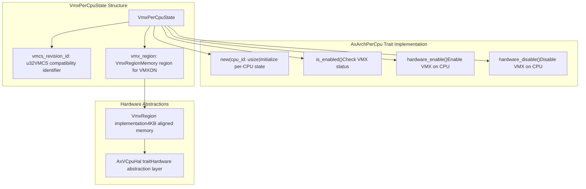
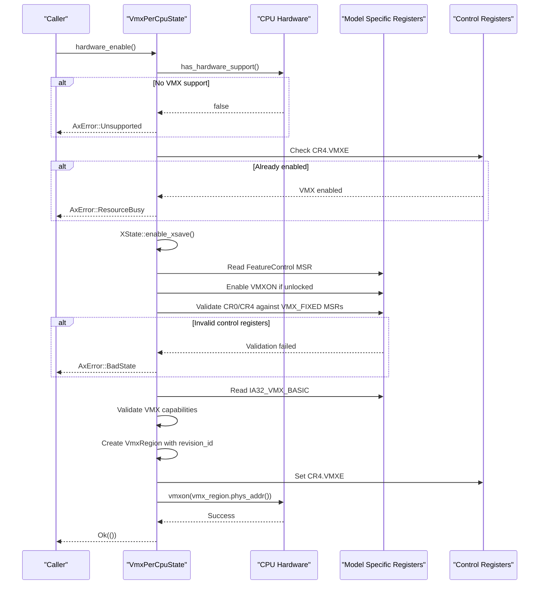
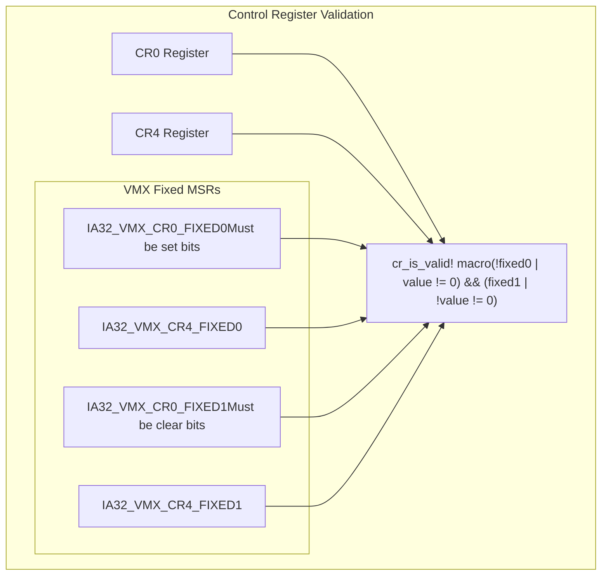
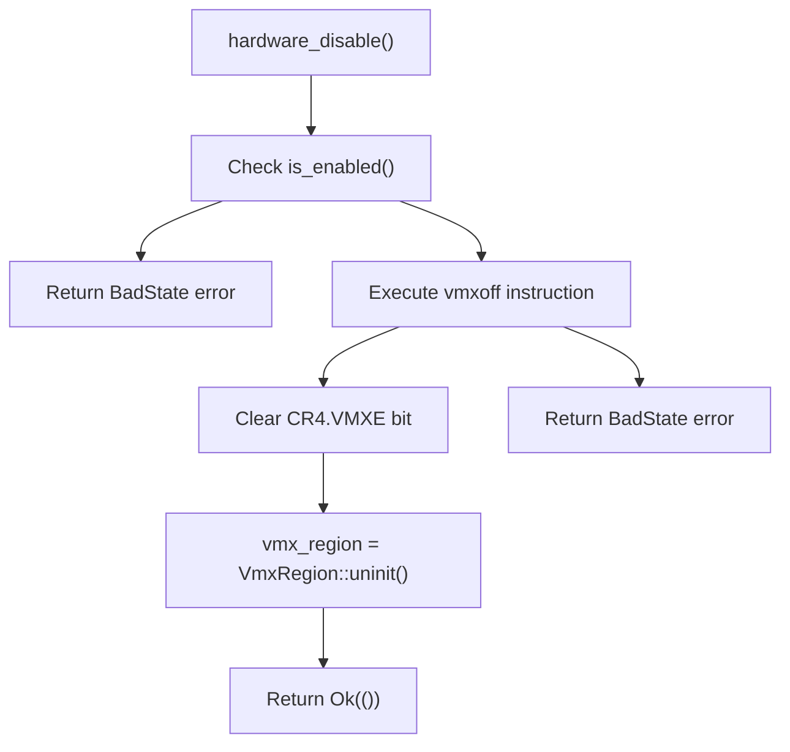
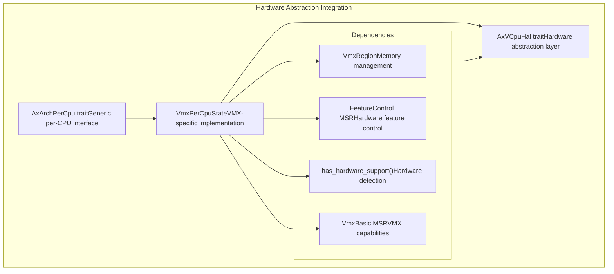

# Per-CPU VMX State

> **Relevant source files**
> * [src/vmx/percpu.rs](https://github.com/arceos-hypervisor/x86_vcpu/blob/2cc42349/src/vmx/percpu.rs)

This document covers the per-CPU VMX (Virtual Machine Extensions) state management system, which handles processor-specific initialization, enablement, and disablement of Intel's VMX virtualization technology. This system ensures that each CPU core in a multi-processor system can independently manage its VMX capabilities while maintaining proper hardware validation and state tracking.

For information about VMCS field management and virtual machine control structures, see [VMCS Field Management](/arceos-hypervisor/x86_vcpu/2.3-vmcs-field-management). For details about VMX data structures like VmxRegion, see [VMX Data Structures](/arceos-hypervisor/x86_vcpu/2.2-vmx-data-structures).

## VmxPerCpuState Structure

The `VmxPerCpuState<H: AxVCpuHal>` struct serves as the central management entity for VMX state on individual processor cores. It maintains the essential components needed for VMX operation including hardware compatibility information and memory regions.

**Sources:** [src/vmx/percpu.rs(L17 - L29)&emsp;](https://github.com/arceos-hypervisor/x86_vcpu/blob/2cc42349/src/vmx/percpu.rs#L17-L29)

The structure contains two primary fields:

|Field|Type|Purpose|
| --- | --- | --- |
|vmcs_revision_id|u32|VMCS revision identifier ensuring software-hardware compatibility|
|vmx_region|VmxRegion<H>|Memory region used for VMXON instruction execution|

## Hardware Enable Process

The `hardware_enable()` method implements a comprehensive VMX initialization sequence that validates hardware support, configures control registers, and executes the VMXON instruction to enter VMX operation mode.

**Sources:** [src/vmx/percpu.rs(L43 - L117)&emsp;](https://github.com/arceos-hypervisor/x86_vcpu/blob/2cc42349/src/vmx/percpu.rs#L43-L117)

### Hardware Validation Steps

The enable process performs several critical validation steps:

1. **VMX Support Detection**: Verifies CPU supports VMX extensions [src/vmx/percpu.rs(L44 - L46)&emsp;](https://github.com/arceos-hypervisor/x86_vcpu/blob/2cc42349/src/vmx/percpu.rs#L44-L46)
2. **Feature Control MSR**: Enables VMXON capability in IA32_FEATURE_CONTROL [src/vmx/percpu.rs(L55 - L64)&emsp;](https://github.com/arceos-hypervisor/x86_vcpu/blob/2cc42349/src/vmx/percpu.rs#L55-L64)
3. **Control Register Validation**: Ensures CR0 and CR4 comply with VMX requirements [src/vmx/percpu.rs(L67 - L81)&emsp;](https://github.com/arceos-hypervisor/x86_vcpu/blob/2cc42349/src/vmx/percpu.rs#L67-L81)
4. **VMX Basic Capabilities**: Validates memory type, addressing, and control features [src/vmx/percpu.rs(L84 - L99)&emsp;](https://github.com/arceos-hypervisor/x86_vcpu/blob/2cc42349/src/vmx/percpu.rs#L84-L99)

### Control Register Validation

The implementation uses a macro-based approach to validate control registers against VMX fixed MSRs:

**Sources:** [src/vmx/percpu.rs(L67 - L81)&emsp;](https://github.com/arceos-hypervisor/x86_vcpu/blob/2cc42349/src/vmx/percpu.rs#L67-L81)

## Hardware Disable Process

The `hardware_disable()` method provides a safe teardown sequence for VMX operation, executing VMXOFF and restoring the processor to non-VMX state.

**Sources:** [src/vmx/percpu.rs(L119 - L140)&emsp;](https://github.com/arceos-hypervisor/x86_vcpu/blob/2cc42349/src/vmx/percpu.rs#L119-L140)

## State Management and Lifecycle

The `VmxPerCpuState` follows a clear lifecycle pattern that ensures proper resource management and state transitions.

|Method|Purpose|Key Operations|
| --- | --- | --- |
|new()|Initialize uninitialized state|Setsvmcs_revision_idto 0, creates uninitializedVmxRegion|
|is_enabled()|Check current VMX status|Reads CR4.VMXE flag|
|hardware_enable()|Enable VMX on current CPU|Hardware validation, VMXON execution, state setup|
|hardware_disable()|Disable VMX on current CPU|VMXOFF execution, CR4 cleanup, resource deallocation|

**Sources:** [src/vmx/percpu.rs(L31 - L140)&emsp;](https://github.com/arceos-hypervisor/x86_vcpu/blob/2cc42349/src/vmx/percpu.rs#L31-L140)

## Integration with Hardware Abstraction

The per-CPU VMX state integrates with the broader hardware abstraction system through the `AxVCpuHal` trait and `AxArchPerCpu` interface.

**Sources:** [src/vmx/percpu.rs(L1 - L11)&emsp;](https://github.com/arceos-hypervisor/x86_vcpu/blob/2cc42349/src/vmx/percpu.rs#L1-L11) [src/vmx/percpu.rs(L31 - L37)&emsp;](https://github.com/arceos-hypervisor/x86_vcpu/blob/2cc42349/src/vmx/percpu.rs#L31-L37)

The system leverages several key abstractions:

* **AxArchPerCpu**: Provides a generic interface for per-CPU architecture-specific state
* **AxVCpuHal**: Hardware abstraction layer for memory management and physical addressing
* **VmxRegion**: RAII-managed memory regions for VMX operations

This design enables the VMX per-CPU state to operate independently on each processor core while maintaining consistent interfaces for higher-level hypervisor components.