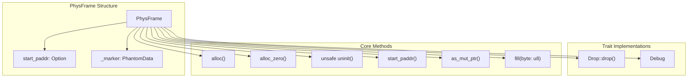
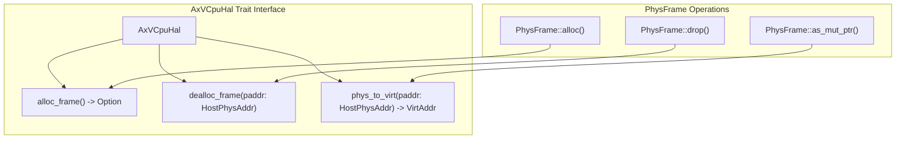
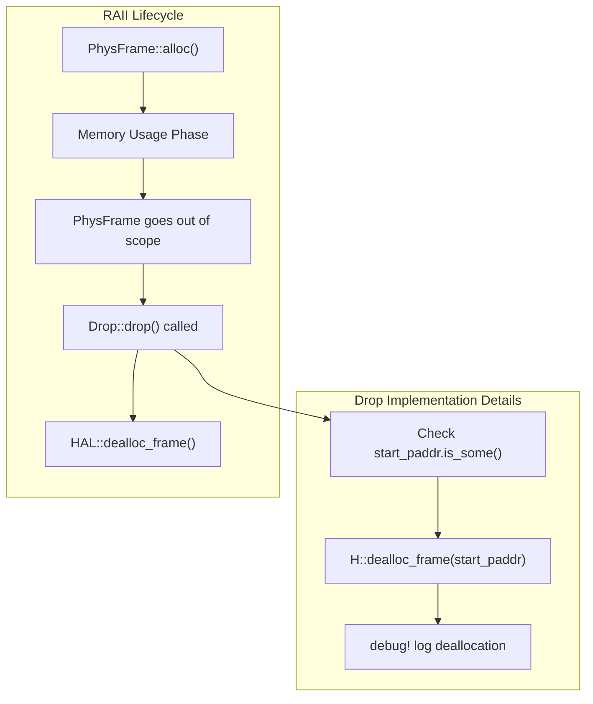
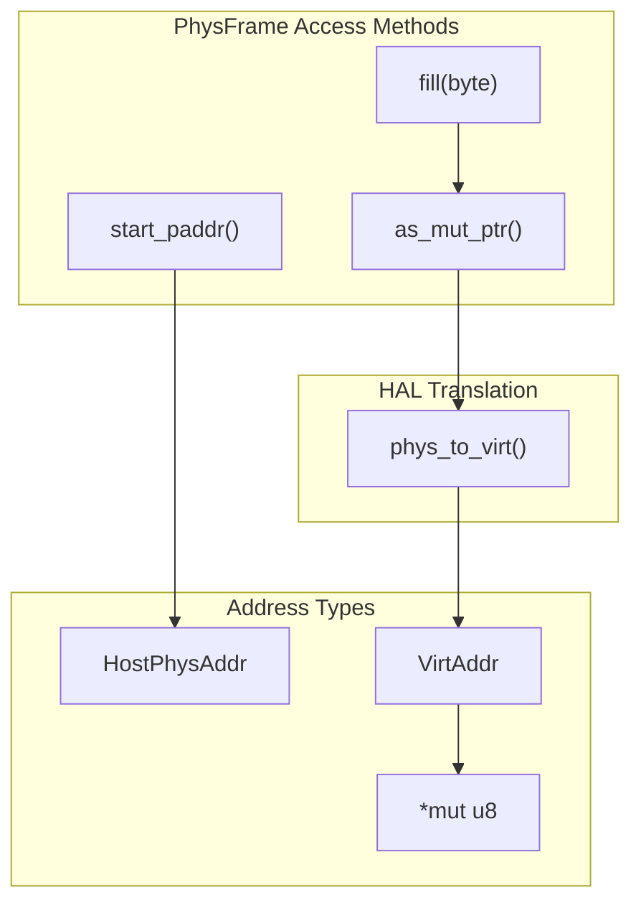
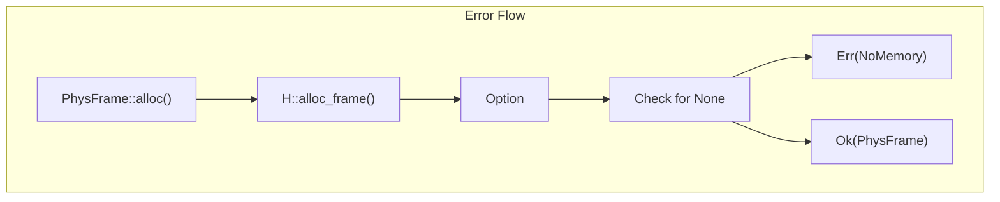

# Physical Frame Management

> **Relevant source files**
> * [src/frame.rs](https://github.com/arceos-hypervisor/x86_vcpu/blob/2cc42349/src/frame.rs)

## Purpose and Scope

The Physical Frame Management system provides RAII-based allocation and management of 4KB-aligned physical memory pages for VMX operations. This system abstracts physical memory allocation through the `AxVCpuHal` trait and ensures automatic cleanup through Rust's ownership model. The `PhysFrame<H>` type serves as the fundamental building block for VMX data structures including VMCS regions, I/O bitmaps, and MSR bitmaps.

For information about how these physical frames are used in Extended Page Tables, see [Extended Page Tables and Guest Memory](/arceos-hypervisor/x86_vcpu/3.2-extended-page-tables-and-guest-memory). For details on the broader VMX data structures that consume these frames, see [VMX Data Structures](/arceos-hypervisor/x86_vcpu/2.2-vmx-data-structures).

## Core Architecture

### PhysFrame RAII Wrapper

The `PhysFrame<H: AxVCpuHal>` struct provides a type-safe wrapper around 4KB physical memory pages with automatic resource management:



**Sources:** [src/frame.rs(L12 - L16)&emsp;](https://github.com/arceos-hypervisor/x86_vcpu/blob/2cc42349/src/frame.rs#L12-L16) [src/frame.rs(L18 - L53)&emsp;](https://github.com/arceos-hypervisor/x86_vcpu/blob/2cc42349/src/frame.rs#L18-L53)

### Hardware Abstraction Layer

The `AxVCpuHal` trait defines the interface between the frame allocator and the underlying platform:



**Sources:** [src/frame.rs(L6)&emsp;](https://github.com/arceos-hypervisor/x86_vcpu/blob/2cc42349/src/frame.rs#L6-L6) [src/frame.rs(L20 - L21)&emsp;](https://github.com/arceos-hypervisor/x86_vcpu/blob/2cc42349/src/frame.rs#L20-L21) [src/frame.rs(L47)&emsp;](https://github.com/arceos-hypervisor/x86_vcpu/blob/2cc42349/src/frame.rs#L47-L47) [src/frame.rs(L58)&emsp;](https://github.com/arceos-hypervisor/x86_vcpu/blob/2cc42349/src/frame.rs#L58-L58)

## Memory Allocation Lifecycle

### Allocation Methods

The system provides three allocation strategies:

|Method|Purpose|Zero-filled|Safety|
| --- | --- | --- | --- |
|alloc()|Standard allocation|No|Safe|
|alloc_zero()|Zero-initialized allocation|Yes|Safe|
|uninit()|Uninitialized frame|N/A|Unsafe|

```

```

**Sources:** [src/frame.rs(L19 - L27)&emsp;](https://github.com/arceos-hypervisor/x86_vcpu/blob/2cc42349/src/frame.rs#L19-L27) [src/frame.rs(L29 - L33)&emsp;](https://github.com/arceos-hypervisor/x86_vcpu/blob/2cc42349/src/frame.rs#L29-L33) [src/frame.rs(L35 - L40)&emsp;](https://github.com/arceos-hypervisor/x86_vcpu/blob/2cc42349/src/frame.rs#L35-L40)

### Automatic Deallocation

The `Drop` implementation ensures memory is automatically returned to the system:



**Sources:** [src/frame.rs(L55 - L62)&emsp;](https://github.com/arceos-hypervisor/x86_vcpu/blob/2cc42349/src/frame.rs#L55-L62)

## Memory Access Patterns

### Address Translation and Access

The frame system provides both physical and virtual access to allocated memory:



**Sources:** [src/frame.rs(L42 - L44)&emsp;](https://github.com/arceos-hypervisor/x86_vcpu/blob/2cc42349/src/frame.rs#L42-L44) [src/frame.rs(L46 - L48)&emsp;](https://github.com/arceos-hypervisor/x86_vcpu/blob/2cc42349/src/frame.rs#L46-L48) [src/frame.rs(L50 - L52)&emsp;](https://github.com/arceos-hypervisor/x86_vcpu/blob/2cc42349/src/frame.rs#L50-L52)

### Memory Operations

The system supports direct memory manipulation through safe abstractions:

|Operation|Method|Safety|Purpose|
| --- | --- | --- | --- |
|Get physical address|start_paddr()|Safe|VMX structure setup|
|Get virtual pointer|as_mut_ptr()|Safe|Direct memory access|
|Fill with pattern|fill(byte)|Safe|Zero-initialization|

## Integration with VMX Components

### VMX Data Structure Usage

Physical frames serve as the foundation for critical VMX data structures:

```mermaid
flowchart TD
subgraph PhysFrame&lt;H&gt;["PhysFrame<H>"]
    CoreFrame["PhysFrame<H>4KB alignedRAII managed"]
end
subgraph subGraph1["Frame Requirements"]
    VmxReq["1x 4KB frameVMXON/VMCS region"]
    IOReq["2x 4KB framesPort 0-0xFFFF bitmap"]
    MsrReq["1x 4KB frameMSR access bitmap"]
    EPTReq["Multiple 4KB framesPage table hierarchy"]
end
subgraph subGraph0["PhysFrame Consumers"]
    VmxRegion["VmxRegion"]
    IOBitmap["IOBitmap"]
    MsrBitmap["MsrBitmap"]
    EPTStructures["EPT Page Tables"]
end

EPTReq --> CoreFrame
EPTStructures --> EPTReq
IOBitmap --> IOReq
IOReq --> CoreFrame
MsrBitmap --> MsrReq
MsrReq --> CoreFrame
VmxRegion --> VmxReq
VmxReq --> CoreFrame
```

**Sources:** [src/frame.rs(L8)&emsp;](https://github.com/arceos-hypervisor/x86_vcpu/blob/2cc42349/src/frame.rs#L8-L8) (PAGE_SIZE_4K constant)

### Error Handling

The allocation system uses `AxResult<T>` for error propagation:



**Sources:** [src/frame.rs(L19 - L27)&emsp;](https://github.com/arceos-hypervisor/x86_vcpu/blob/2cc42349/src/frame.rs#L19-L27) [src/frame.rs(L4)&emsp;](https://github.com/arceos-hypervisor/x86_vcpu/blob/2cc42349/src/frame.rs#L4-L4) (AxResult import)

## Constants and Configuration

The system uses standardized page sizing:

|Constant|Value|Source|Purpose|
| --- | --- | --- | --- |
|PAGE_SIZE|PAGE_SIZE_4K|memory_addrcrate|Standard frame size|
|Frame alignment|4KB|Hardware requirement|VMX compatibility|

**Sources:** [src/frame.rs(L8)&emsp;](https://github.com/arceos-hypervisor/x86_vcpu/blob/2cc42349/src/frame.rs#L8-L8)