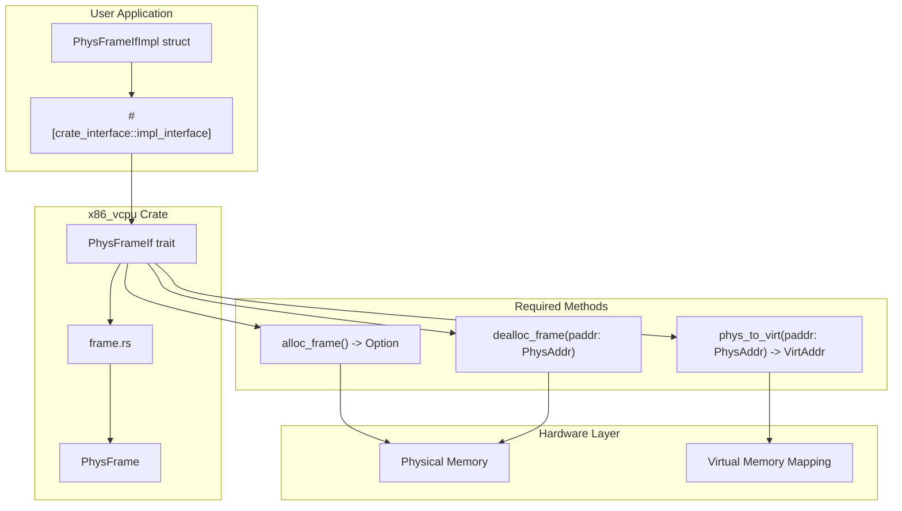

# Project Configuration

> **Relevant source files**
> * [Cargo.toml](https://github.com/arceos-hypervisor/x86_vcpu/blob/2cc42349/Cargo.toml)
> * [README.md](https://github.com/arceos-hypervisor/x86_vcpu/blob/2cc42349/README.md)

This document covers the project configuration, dependency management, and build requirements for the x86_vcpu hypervisor library. It explains the Cargo.toml configuration, feature flags for different virtualization technologies, and the crate interface requirements that users must implement.

For information about the build system and CI/CD pipeline, see [Build System and CI](/arceos-hypervisor/x86_vcpu/5.2-build-system-and-ci).

## Core Dependencies

The x86_vcpu crate is built upon a carefully selected set of dependencies that provide low-level x86 hardware access, memory management, and hypervisor framework integration.

### Dependency Architecture

```mermaid
flowchart TD
subgraph subGraph5["ArceOS Hypervisor Framework"]
    axaddrspace["axaddrspace (git)"]
    axvcpu["axvcpu (git)"]
end
subgraph subGraph4["Interface System"]
    crate_interface["crate_interface = \0.1\"]
end
subgraph subGraph3["Memory Management"]
    page_table_entry["page_table_entry = \0.5\"]
    memory_addr["memory_addr = \0.3.1\"]
    axerrno["axerrno = \0.1.0\"]
end
subgraph subGraph2["Utility Crates"]
    log["log = \0.4.19\"]
    cfg_if["cfg-if = \1.0\"]
    bitflags["bitflags = \2.2\"]
    bit_field["bit_field = \0.10\"]
    numeric_enum["numeric-enum-macro = \0.2\"]
end
subgraph subGraph1["Low-Level x86 Support"]
    x86["x86 = \0.52\"]
    x86_64["x86_64 = \0.15\"]
    raw_cpuid["raw-cpuid = \11.0\"]
end
subgraph subGraph0["x86_vcpu Project"]
    Cargo["Cargo.toml"]
    LibMain["lib.rs"]
end

Cargo --> axaddrspace
Cargo --> axerrno
Cargo --> axvcpu
Cargo --> bit_field
Cargo --> bitflags
Cargo --> cfg_if
Cargo --> crate_interface
Cargo --> log
Cargo --> memory_addr
Cargo --> numeric_enum
Cargo --> page_table_entry
Cargo --> raw_cpuid
Cargo --> x86
Cargo --> x86_64
LibMain --> crate_interface
LibMain --> x86
LibMain --> x86_64
```



**Sources:** [Cargo.toml(L6 - L22)&emsp;](https://github.com/arceos-hypervisor/x86_vcpu/blob/2cc42349/Cargo.toml#L6-L22)

### Dependency Categories

|Category|Crates|Purpose|
| --- | --- | --- |
|x86 Hardware|x86,x86_64,raw-cpuid|Low-level x86/x86_64 instruction access, CPUID feature detection|
|Bit Manipulation|bitflags,bit_field,numeric-enum-macro|Hardware register field manipulation, flag definitions|
|Memory Management|page_table_entry,memory_addr,axerrno|Page table abstractions, address types, error handling|
|Interface System|crate_interface|Trait-based dependency injection for hardware abstraction|
|Hypervisor Framework|axaddrspace,axvcpu|ArceOS hypervisor ecosystem integration|
|Utilities|log,cfg-if|Logging and conditional compilation|

**Sources:** [Cargo.toml(L6 - L22)&emsp;](https://github.com/arceos-hypervisor/x86_vcpu/blob/2cc42349/Cargo.toml#L6-L22)

## Feature Flags

The crate uses feature flags to support different virtualization technologies while maintaining a single codebase.

### Feature Configuration

```

```

**Sources:** [Cargo.toml(L24 - L27)&emsp;](https://github.com/arceos-hypervisor/x86_vcpu/blob/2cc42349/Cargo.toml#L24-L27)

### Available Features

|Feature|Default|Description|
| --- | --- | --- |
|vmx|✓|Intel VMX (Virtual Machine Extensions) support|
|amd|✗|AMD SVM (Secure Virtual Machine) support|

The `default` feature set includes `vmx`, making Intel VMX the primary supported virtualization technology. Users can explicitly enable AMD support by specifying `features = ["amd"]` in their `Cargo.toml` or disable VMX with `default-features = false`.

**Sources:** [Cargo.toml(L24 - L27)&emsp;](https://github.com/arceos-hypervisor/x86_vcpu/blob/2cc42349/Cargo.toml#L24-L27)

## Crate Interface Requirements

The x86_vcpu crate requires users to implement the `PhysFrameIf` trait to provide hardware abstraction for physical memory management.

### Interface Implementation Pattern



**Sources:** [README.md(L7 - L29)&emsp;](https://github.com/arceos-hypervisor/x86_vcpu/blob/2cc42349/README.md#L7-L29)

### Implementation Requirements

Users must provide a concrete implementation of the `PhysFrameIf` trait using the `crate_interface::impl_interface` macro. The trait defines three essential methods:

* **`alloc_frame()`**: Allocates a 4KB-aligned physical memory frame, returning `Some(PhysAddr)` on success or `None` if allocation fails
* **`dealloc_frame(paddr: PhysAddr)`**: Deallocates a previously allocated physical frame at the specified address
* **`phys_to_virt(paddr: PhysAddr) -> VirtAddr`**: Converts a physical address to its corresponding virtual address in the current address space

**Sources:** [README.md(L13 - L29)&emsp;](https://github.com/arceos-hypervisor/x86_vcpu/blob/2cc42349/README.md#L13-L29)

### Example Implementation Structure

The README provides a template showing the required implementation pattern:

```rust
// From README.md:13-29
struct PhysFrameIfImpl;

#[crate_interface::impl_interface]
impl axvm::PhysFrameIf for PhysFrameIfImpl {
    fn alloc_frame() -> Option<PhysAddr> { /* implementation */ }
    fn dealloc_frame(paddr: PhysAddr) { /* implementation */ }
    fn phys_to_virt(paddr: PhysAddr) -> VirtAddr { /* implementation */ }
}
```

The implementation must handle physical memory allocation and mapping according to the host system's memory management requirements. A reference implementation can be found in the [ArceOS project](https://github.com/arceos-hypervisor/x86_vcpu/blob/2cc42349/ArceOS project)

**Sources:** [README.md(L9)&emsp;](https://github.com/arceos-hypervisor/x86_vcpu/blob/2cc42349/README.md#L9-L9)

## Project Metadata

The project uses Rust edition 2024 and follows semantic versioning with the current version 0.1.0, indicating it is in initial development phase.

**Sources:** [Cargo.toml(L1 - L4)&emsp;](https://github.com/arceos-hypervisor/x86_vcpu/blob/2cc42349/Cargo.toml#L1-L4)