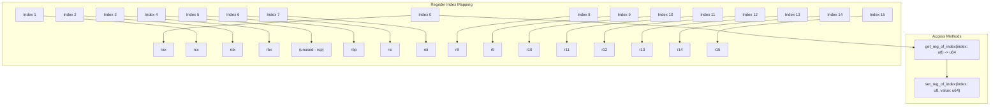
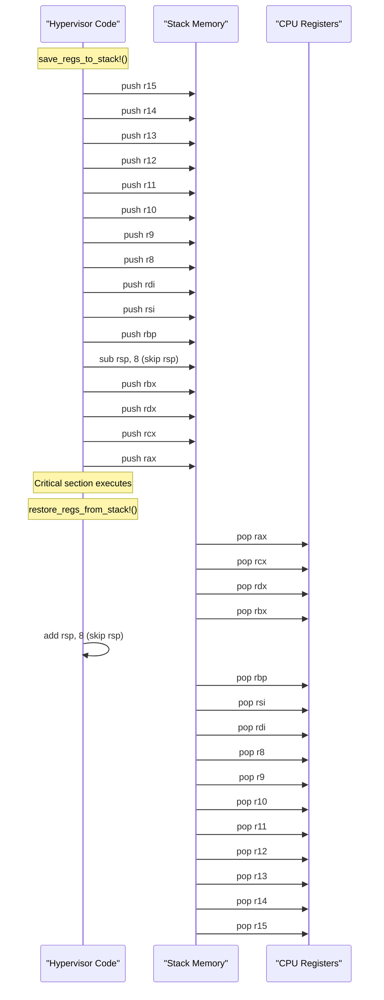
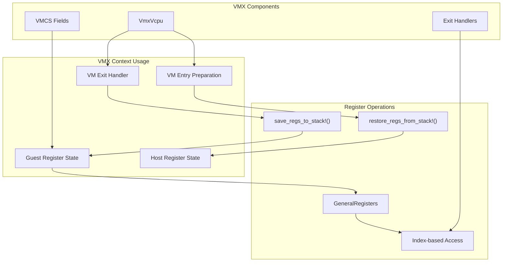

# Register Management

> **Relevant source files**
> * [src/regs.rs](https://github.com/arceos-hypervisor/x86_vcpu/blob/2cc42349/src/regs.rs)

## Purpose and Scope

The register management system provides abstractions for handling x86-64 general-purpose registers within the hypervisor context. This module defines the `GeneralRegisters` structure for storing and manipulating register state, along with assembly macros for efficient stack-based register preservation. These components are essential for managing guest CPU state during VM exits and entries in the VMX virtualization engine.

For information about model-specific register (MSR) access, see [MSR Access](/arceos-hypervisor/x86_vcpu/4.2-model-specific-register-access). For VMX-specific register handling during VM exits, see [Virtual CPU Management](/arceos-hypervisor/x86_vcpu/2.1-virtual-cpu-management).

## GeneralRegisters Structure

The `GeneralRegisters` struct provides a C-compatible representation of the x86-64 general-purpose register set. This structure serves as the primary container for guest register state during hypervisor operations.

```mermaid
flowchart TD
subgraph subGraph1["Key Features"]
    CRepr["#[repr(C)]C ABI Compatible"]
    Debug["#[derive(Debug)]Debug output"]
    Default["#[derive(Default)]Zero initialization"]
    Clone["#[derive(Clone)]Copy semantics"]
end
subgraph subGraph0["GeneralRegisters Structure"]
    RAX["rax: u64Return values"]
    RCX["rcx: u64Loop counter"]
    RDX["rdx: u64I/O operations"]
    RBX["rbx: u64Base pointer"]
    RSP["_unused_rsp: u64(Padding)"]
    RBP["rbp: u64Frame pointer"]
    RSI["rsi: u64Source index"]
    RDI["rdi: u64Dest index"]
    R8["r8: u64GP register"]
    R9["r9: u64GP register"]
    R10["r10: u64GP register"]
    R11["r11: u64GP register"]
    R12["r12: u64GP register"]
    R13["r13: u64GP register"]
    R14["r14: u64GP register"]
    R15["r15: u64GP register"]
end

CRepr --> RAX
Clone --> RAX
Debug --> RAX
Default --> RAX
```



**Register Layout and Characteristics:**

|Register|Purpose|Index|Notes|
| --- | --- | --- | --- |
|rax|Return values, accumulator|0|Primary return register|
|rcx|Loop counter, 4th argument|1|Often used in loops|
|rdx|I/O operations, 3rd argument|2|Data register|
|rbx|Base pointer, callee-saved|3|Preserved across calls|
|_unused_rsp|Stack pointer (unused)|4|Excluded from direct access|
|rbp|Frame pointer, callee-saved|5|Stack frame base|
|rsi|Source index, 2nd argument|6|String operations source|
|rdi|Destination index, 1st argument|7|String operations destination|
|r8-r15|Extended registers|8-15|Additional 64-bit registers|

Sources: [src/regs.rs(L1 - L40)&emsp;](https://github.com/arceos-hypervisor/x86_vcpu/blob/2cc42349/src/regs.rs#L1-L40)

## Index-Based Register Access

The `GeneralRegisters` struct provides index-based access methods that map numerical indices to specific registers, following the x86-64 register encoding scheme used in instruction operands.



**Key Implementation Details:**

* **Index Range**: Valid indices are 0-15, excluding index 4 (RSP)
* **Panic Behavior**: Both methods panic on invalid indices or attempts to access RSP
* **Performance**: Direct match statements provide efficient O(1) access
* **Safety**: Index validation prevents undefined behavior

**Usage Pattern:**

```javascript
// Reading a register by index
let rax_value = registers.get_reg_of_index(0);  // Gets RAX

// Writing a register by index  
registers.set_reg_of_index(8, 0x12345678);     // Sets R8
```

Sources: [src/regs.rs(L42 - L152)&emsp;](https://github.com/arceos-hypervisor/x86_vcpu/blob/2cc42349/src/regs.rs#L42-L152)

## Stack-Based Register Preservation

The module provides assembly macros for efficient bulk register save and restore operations, essential for hypervisor context switching and interrupt handling.



**Macro Implementation:**

|Macro|Purpose|Stack Operations|RSP Handling|
| --- | --- | --- | --- |
|save_regs_to_stack!|Preserve all GP registers|15 push operations + 1 subtract|sub rsp, 8to skip RSP slot|
|restore_regs_from_stack!|Restore all GP registers|15 pop operations + 1 add|add rsp, 8to skip RSP slot|

**Key Features:**

* **Order Preservation**: Restore operations reverse the save order exactly
* **RSP Handling**: Stack pointer excluded from save/restore, space reserved with arithmetic
* **Atomicity**: Complete register set saved/restored as a unit
* **Performance**: Inline assembly provides minimal overhead

Sources: [src/regs.rs(L154 - L196)&emsp;](https://github.com/arceos-hypervisor/x86_vcpu/blob/2cc42349/src/regs.rs#L154-L196)

## Integration with VMX System

The register management components integrate tightly with the VMX virtualization engine to support guest state management during VM transitions.



**Integration Points:**

* **VM Exit Processing**: Register state captured using stack macros during VM exits
* **Guest State Management**: `GeneralRegisters` stores guest CPU state between VM operations
* **Instruction Emulation**: Index-based access enables register modification for emulated instructions
* **Context Switching**: Stack preservation ensures host state integrity during guest execution

**Performance Considerations:**

* **Zero-Copy**: Direct register field access avoids unnecessary copying
* **Cache Efficiency**: C-compatible layout optimizes memory access patterns
* **Assembly Integration**: Macros provide efficient bulk operations for critical paths

Sources: [src/regs.rs(L1 - L196)&emsp;](https://github.com/arceos-hypervisor/x86_vcpu/blob/2cc42349/src/regs.rs#L1-L196)