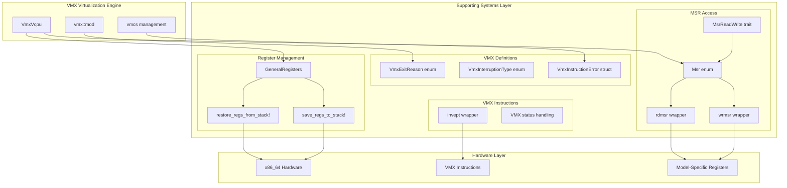
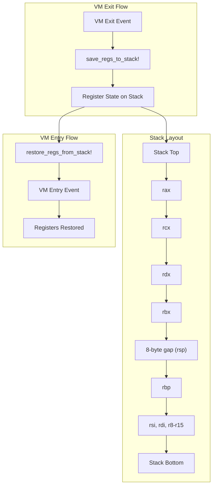
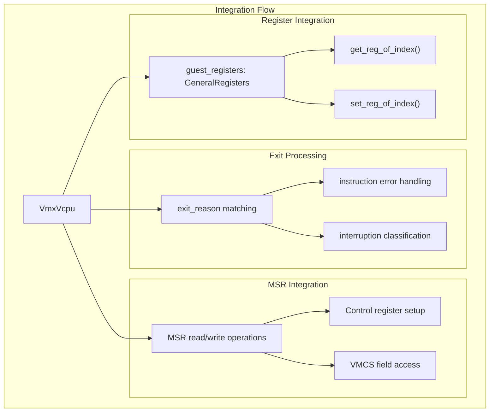

# Supporting Systems

> **Relevant source files**
> * [src/msr.rs](https://github.com/arceos-hypervisor/x86_vcpu/blob/2cc42349/src/msr.rs)
> * [src/regs.rs](https://github.com/arceos-hypervisor/x86_vcpu/blob/2cc42349/src/regs.rs)
> * [src/vmx/definitions.rs](https://github.com/arceos-hypervisor/x86_vcpu/blob/2cc42349/src/vmx/definitions.rs)

This document covers the foundational support systems that enable VMX functionality in the x86_vcpu hypervisor library. These systems provide low-level abstractions for register management, Model-Specific Register (MSR) access, VMX type definitions, and instruction wrappers that are consumed by the core VMX virtualization engine.

For information about the main VMX virtualization components, see [VMX Virtualization Engine](/arceos-hypervisor/x86_vcpu/2-vmx-virtualization-engine). For memory management abstractions, see [Memory Management](/arceos-hypervisor/x86_vcpu/3-memory-management).

## Architecture Overview

The supporting systems form the foundation layer beneath the VMX virtualization engine, providing essential abstractions for hardware interaction and type safety.



Sources: [src/regs.rs(L1 - L197)&emsp;](https://github.com/arceos-hypervisor/x86_vcpu/blob/2cc42349/src/regs.rs#L1-L197) [src/msr.rs(L1 - L74)&emsp;](https://github.com/arceos-hypervisor/x86_vcpu/blob/2cc42349/src/msr.rs#L1-L74) [src/vmx/definitions.rs(L1 - L275)&emsp;](https://github.com/arceos-hypervisor/x86_vcpu/blob/2cc42349/src/vmx/definitions.rs#L1-L275)

## Register Management System

The register management system provides abstractions for handling x86-64 general-purpose registers and register state transitions during VM exits and entries.

### GeneralRegisters Structure

The `GeneralRegisters` struct represents the complete set of x86-64 general-purpose registers in a VM context:

|Register|Purpose|Index|
| --- | --- | --- |
|rax|Return values, accumulator|0|
|rcx|Counter, function arguments|1|
|rdx|I/O operations, function arguments|2|
|rbx|Base pointer, preserved across calls|3|
|rbp|Frame pointer|5|
|rsi|Source index for string operations|6|
|rdi|Destination index for string operations|7|
|r8-r15|Additional 64-bit registers|8-15|

The structure excludes `rsp` (index 4) as it requires special handling during context switches. The `get_reg_of_index()` and `set_reg_of_index()` methods provide indexed access to registers, enabling dynamic register manipulation based on instruction operands.

### Register Save/Restore Macros



The macros implement precise stack-based register preservation:

* `save_regs_to_stack!` pushes registers in reverse order (r15 to rax)
* An 8-byte gap maintains stack alignment where `rsp` would be stored
* `restore_regs_from_stack!` pops registers in forward order (rax to r15)

Sources: [src/regs.rs(L1 - L197)&emsp;](https://github.com/arceos-hypervisor/x86_vcpu/blob/2cc42349/src/regs.rs#L1-L197)

## MSR Access System

The MSR access system provides type-safe abstractions for reading and writing Model-Specific Registers critical to VMX operation.

### MSR Enumeration

The `Msr` enum defines VMX-related MSRs with their canonical addresses:

```mermaid
flowchart TD
subgraph subGraph3["MSR Access Methods"]
    ReadMethod["Msr::read()"]
    WriteMethod["Msr::write()"]
    RdmsrCall["x86::msr::rdmsr()"]
    WrmsrCall["x86::msr::wrmsr()"]
end
subgraph subGraph2["System MSRs"]
    FeatureControl["IA32_FEATURE_CONTROL (0x3a)"]
    Efer["IA32_EFER (0xc0000080)"]
    Pat["IA32_PAT (0x277)"]
    FsBase["IA32_FS_BASE (0xc0000100)"]
    GsBase["IA32_GS_BASE (0xc0000101)"]
end
subgraph subGraph0["VMX Control MSRs"]
    PinbasedMsr["IA32_VMX_PINBASED_CTLS (0x481)"]
    ProcbasedMsr["IA32_VMX_PROCBASED_CTLS (0x482)"]
    ExitMsr["IA32_VMX_EXIT_CTLS (0x483)"]
    EntryMsr["IA32_VMX_ENTRY_CTLS (0x484)"]
    subgraph subGraph1["VMX Capability MSRs"]
        MiscMsr["IA32_VMX_MISC (0x485)"]
        Cr0Fixed0["IA32_VMX_CR0_FIXED0 (0x486)"]
        Cr0Fixed1["IA32_VMX_CR0_FIXED1 (0x487)"]
        Cr4Fixed0["IA32_VMX_CR4_FIXED0 (0x488)"]
        Cr4Fixed1["IA32_VMX_CR4_FIXED1 (0x489)"]
        EptVpidCap["IA32_VMX_EPT_VPID_CAP (0x48c)"]
        BasicMsr["IA32_VMX_BASIC (0x480)"]
    end
end

BasicMsr --> ReadMethod
FeatureControl --> WriteMethod
ReadMethod --> RdmsrCall
WriteMethod --> WrmsrCall
```



### MsrReadWrite Trait Pattern

The `MsrReadWrite` trait provides a type-safe pattern for MSR access:

```javascript
trait MsrReadWrite {
    const MSR: Msr;
    fn read_raw() -> u64;
    unsafe fn write_raw(flags: u64);
}
```

This pattern enables implementing types to associate with specific MSRs while providing consistent read/write interfaces. The trait methods delegate to the underlying `Msr::read()` and `Msr::write()` implementations.

Sources: [src/msr.rs(L1 - L74)&emsp;](https://github.com/arceos-hypervisor/x86_vcpu/blob/2cc42349/src/msr.rs#L1-L74)

## VMX Type Definitions

The VMX definitions provide comprehensive type safety for VMX exit handling and interrupt processing.

### Exit Reason Classification

```mermaid
flowchart TD
subgraph subGraph3["Control/Memory Exits (28-49)"]
    CrAccess["CR_ACCESS (28)"]
    DrAccess["DR_ACCESS (29)"]
    IoInstruction["IO_INSTRUCTION (30)"]
    MsrRead["MSR_READ (31)"]
    MsrWrite["MSR_WRITE (32)"]
    EptViolation["EPT_VIOLATION (48)"]
    EptMisconfig["EPT_MISCONFIG (49)"]
end
subgraph subGraph2["Instruction Exits (10-27)"]
    CpuidExit["CPUID (10)"]
    HltExit["HLT (12)"]
    VmcallExit["VMCALL (18)"]
    VmxInstructionExits["VMX Instructions (19-26)"]
end
subgraph subGraph1["Exception/Interrupt (0-8)"]
    ExceptionNmi["EXCEPTION_NMI (0)"]
    ExternalInt["EXTERNAL_INTERRUPT (1)"]
    TripleFault["TRIPLE_FAULT (2)"]
    InitSignal["INIT (3)"]
    SipiSignal["SIPI (4)"]
end
subgraph subGraph0["VmxExitReason Categories"]
    ExceptionCategory["Exception/Interrupt Exits"]
    InstructionCategory["Instruction-Based Exits"]
    ControlCategory["Control Register Exits"]
    SystemCategory["System Management Exits"]
end

ControlCategory --> CrAccess
ControlCategory --> EptViolation
ExceptionCategory --> ExceptionNmi
ExceptionCategory --> ExternalInt
InstructionCategory --> CpuidExit
InstructionCategory --> VmcallExit
```



### Interruption Type System

The `VmxInterruptionType` enum classifies interrupt and exception events for VM-entry and VM-exit processing:

|Type|Value|Description|Error Code|
| --- | --- | --- | --- |
|External|0|External hardware interrupt|No|
|NMI|2|Non-maskable interrupt|No|
|HardException|3|Hardware exception (#PF, #GP)|Some vectors|
|SoftIntr|4|Software interrupt (INT n)|No|
|PrivSoftException|5|Privileged software exception (INT1)|No|
|SoftException|6|Software exception (INT3, INTO)|No|

The `vector_has_error_code()` method determines if specific exception vectors push error codes, while `from_vector()` automatically classifies interruption types based on vector numbers.

### Error Handling

The `VmxInstructionError` struct provides human-readable descriptions for VMX instruction failures, mapping error codes to detailed explanations per the Intel SDM specifications.

Sources: [src/vmx/definitions.rs(L1 - L275)&emsp;](https://github.com/arceos-hypervisor/x86_vcpu/blob/2cc42349/src/vmx/definitions.rs#L1-L275)

## Integration Patterns

The supporting systems integrate with the core VMX engine through several key patterns:



The supporting systems provide the essential building blocks that enable the VMX virtualization engine to:

* Maintain guest register state across VM transitions
* Configure VMX controls through MSR capabilities
* Process VM exits with type-safe reason classification
* Handle errors with detailed diagnostic information

Sources: [src/regs.rs(L1 - L197)&emsp;](https://github.com/arceos-hypervisor/x86_vcpu/blob/2cc42349/src/regs.rs#L1-L197) [src/msr.rs(L1 - L74)&emsp;](https://github.com/arceos-hypervisor/x86_vcpu/blob/2cc42349/src/msr.rs#L1-L74) [src/vmx/definitions.rs(L1 - L275)&emsp;](https://github.com/arceos-hypervisor/x86_vcpu/blob/2cc42349/src/vmx/definitions.rs#L1-L275)