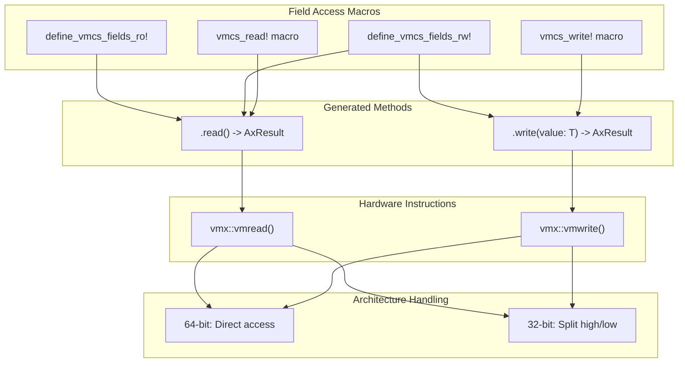
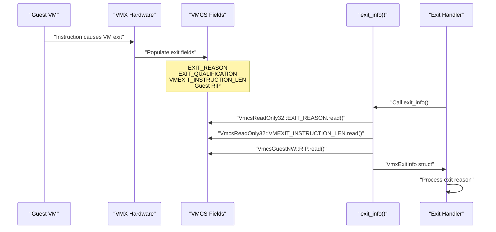
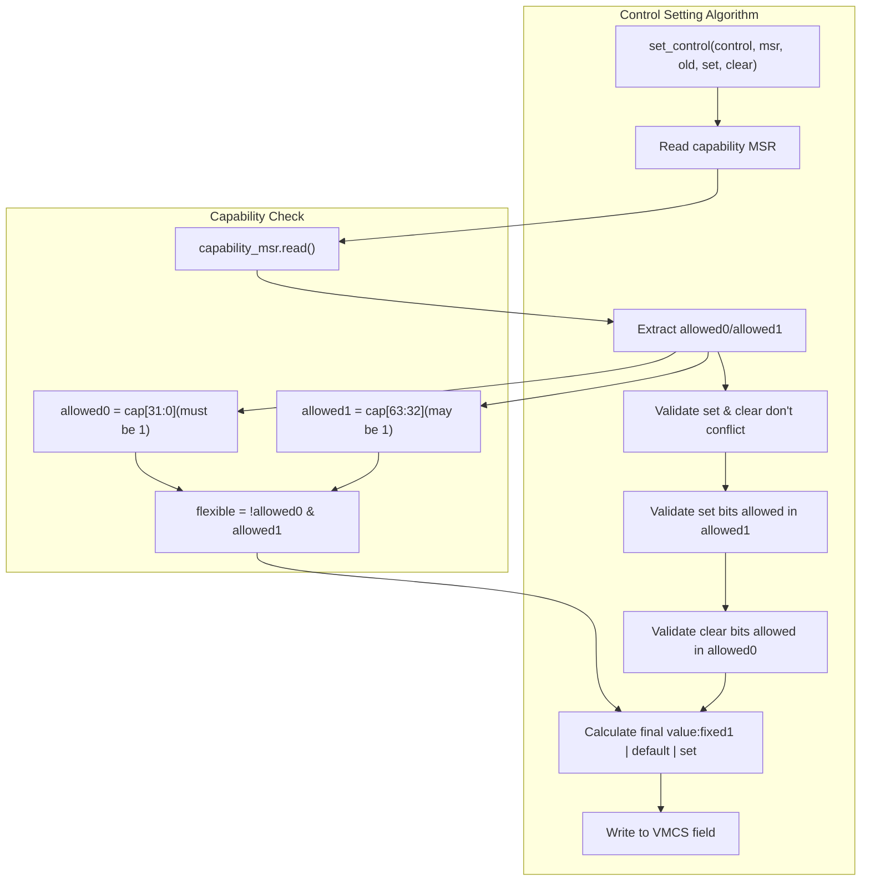
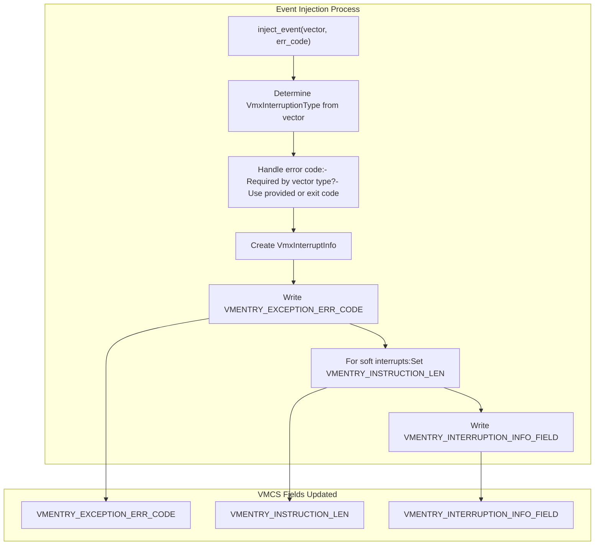

# VMCS Field Management

> **Relevant source files**
> * [src/vmx/vmcs.rs](https://github.com/arceos-hypervisor/x86_vcpu/blob/2cc42349/src/vmx/vmcs.rs)

This document covers the Virtual Machine Control Structure (VMCS) field management system within the VMX virtualization engine. The VMCS is Intel's hardware structure that controls virtual machine behavior, and this module provides type-safe access patterns, control field manipulation algorithms, and VM exit information gathering mechanisms.

For Virtual CPU lifecycle management and VM execution flow, see [Virtual CPU Management](/arceos-hypervisor/x86_vcpu/2.1-virtual-cpu-management). For the underlying VMX data structures that contain VMCS regions, see [VMX Data Structures](/arceos-hypervisor/x86_vcpu/2.2-vmx-data-structures).

## VMCS Field Organization

The VMCS contains hundreds of fields organized into distinct categories based on their purpose and access patterns. The hypervisor provides type-safe enums for each category, ensuring correct field access and preventing runtime errors.

```mermaid
flowchart TD
subgraph subGraph5["Access Implementations"]
    ReadImpl["vmcs_read! macrogenerates .read() methods"]
    WriteImpl["vmcs_write! macrogenerates .write() methods"]
    ROFields["define_vmcs_fields_ro!read-only field traits"]
    RWFields["define_vmcs_fields_rw!read-write field traits"]
end
subgraph subGraph4["VMCS Field Categories"]
    subgraph subGraph3["Read-Only Data Fields"]
        ReadOnly32["VmcsReadOnly32EXIT_REASON, VM_INSTRUCTION_ERROR"]
        ReadOnly64["VmcsReadOnly64GUEST_PHYSICAL_ADDR"]
        ReadOnlyNW["VmcsReadOnlyNWEXIT_QUALIFICATION, GUEST_LINEAR_ADDR"]
    end
    subgraph subGraph2["Host State Fields"]
        Host16["VmcsHost16ES_SELECTOR, TR_SELECTOR"]
        Host32["VmcsHost32IA32_SYSENTER_CS"]
        Host64["VmcsHost64IA32_PAT, IA32_EFER"]
        HostNW["VmcsHostNWCR0, RSP, RIP"]
    end
    subgraph subGraph1["Guest State Fields"]
        Guest16["VmcsGuest16ES_SELECTOR, CS_SELECTOR"]
        Guest32["VmcsGuest32ES_LIMIT, INTERRUPTIBILITY_STATE"]
        Guest64["VmcsGuest64IA32_EFER, IA32_PAT"]
        GuestNW["VmcsGuestNWCR0, RSP, RIP, RFLAGS"]
    end
    subgraph subGraph0["Control Fields"]
        Control16["VmcsControl16VPID, EPTP_INDEX"]
        Control32["VmcsControl32EXEC_CONTROLS, EXCEPTION_BITMAP"]
        Control64["VmcsControl64IO_BITMAP_A_ADDR, MSR_BITMAPS_ADDR"]
        ControlNW["VmcsControlNWCR0_GUEST_HOST_MASK, CR4_READ_SHADOW"]
    end
end

Control16 --> RWFields
Control32 --> RWFields
Control64 --> RWFields
ControlNW --> RWFields
Guest16 --> RWFields
Guest32 --> RWFields
Guest64 --> RWFields
GuestNW --> RWFields
Host16 --> RWFields
Host32 --> RWFields
Host64 --> RWFields
HostNW --> RWFields
ROFields --> ReadImpl
RWFields --> ReadImpl
RWFields --> WriteImpl
ReadOnly32 --> ROFields
ReadOnly64 --> ROFields
ReadOnlyNW --> ROFields
```

Sources: [src/vmx/vmcs.rs(L85 - L486)&emsp;](https://github.com/arceos-hypervisor/x86_vcpu/blob/2cc42349/src/vmx/vmcs.rs#L85-L486)

## Field Access Patterns

The system uses code generation macros to create consistent, type-safe access patterns for all VMCS fields. These macros handle the underlying `vmread` and `vmwrite` instructions while providing error handling and architecture-specific adaptations.

### Read/Write Macro Implementation

The `vmcs_read!` and `vmcs_write!` macros generate implementations that automatically handle 32-bit vs 64-bit architecture differences. On 32-bit systems, 64-bit fields require two separate hardware accesses to read the high and low portions.

Sources: [src/vmx/vmcs.rs(L19 - L83)&emsp;](https://github.com/arceos-hypervisor/x86_vcpu/blob/2cc42349/src/vmx/vmcs.rs#L19-L83)

## VM Exit Information Gathering

When a VM exit occurs, the hypervisor must gather information about why the exit happened and the guest's state. The VMCS provides read-only fields containing this information, which the system abstracts into structured data types.

### Exit Information Structures

The system defines several structured types for different categories of VM exit information:

|Structure|Purpose|Key Fields|
| --- | --- | --- |
|VmxExitInfo|General exit information|exit_reason,entry_failure,guest_rip|
|VmxInterruptInfo|Interrupt/exception details|vector,int_type,err_code|
|VmxIoExitInfo|I/O instruction exits|port,access_size,is_in|
|CrAccessInfo|Control register access|cr_number,access_type,gpr|

Sources: [src/vmx/vmcs.rs(L488 - L582)&emsp;](https://github.com/arceos-hypervisor/x86_vcpu/blob/2cc42349/src/vmx/vmcs.rs#L488-L582) [src/vmx/vmcs.rs(L645 - L774)&emsp;](https://github.com/arceos-hypervisor/x86_vcpu/blob/2cc42349/src/vmx/vmcs.rs#L645-L774)

## Control Field Management

Control fields determine VM behavior and require careful management to ensure compatibility with the underlying hardware. The `set_control()` function implements the Intel-specified algorithm for safely setting control bits while respecting hardware capabilities.

The algorithm follows Intel SDM Volume 3C, Section 31.5.1, Algorithm 3, ensuring that control bits are set correctly based on processor capabilities.

Sources: [src/vmx/vmcs.rs(L589 - L631)&emsp;](https://github.com/arceos-hypervisor/x86_vcpu/blob/2cc42349/src/vmx/vmcs.rs#L589-L631)

## Event Injection

The hypervisor can inject interrupts and exceptions into the guest using VMCS entry control fields. The `inject_event()` function handles the complex logic of setting up proper event injection based on the event type.

### Event Injection Flow

The `VmxInterruptInfo` structure encodes the interrupt information according to Intel specifications, with specific bit fields for vector, interruption type, error code validity, and overall validity.

Sources: [src/vmx/vmcs.rs(L677 - L694)&emsp;](https://github.com/arceos-hypervisor/x86_vcpu/blob/2cc42349/src/vmx/vmcs.rs#L677-L694) [src/vmx/vmcs.rs(L515 - L534)&emsp;](https://github.com/arceos-hypervisor/x86_vcpu/blob/2cc42349/src/vmx/vmcs.rs#L515-L534)

## Specialized Information Extraction

The system provides specialized functions for extracting detailed information from different types of VM exits:

### I/O Exit Information

* **Function**: `io_exit_info()`
* **Purpose**: Extract port number, access size, direction for I/O instruction exits
* **Fields**: Port number, access size (1-4 bytes), IN/OUT direction, string/repeat flags

### EPT Violation Information

* **Function**: `ept_violation_info()`
* **Purpose**: Extract guest physical address and access type for memory violations
* **Returns**: `NestedPageFaultInfo` with fault address and access flags

### Control Register Access

* **Function**: `cr_access_info()`
* **Purpose**: Decode control register access attempts (MOV, CLTS, LMSW)
* **Fields**: CR number, access type, GPR involved, LMSW source data

### EFER Management

* **Function**: `update_efer()`
* **Purpose**: Handle guest IA32_EFER updates, particularly long mode transitions
* **Actions**: Set LONG_MODE_ACTIVE bit, update VM-entry controls

Sources: [src/vmx/vmcs.rs(L696 - L774)&emsp;](https://github.com/arceos-hypervisor/x86_vcpu/blob/2cc42349/src/vmx/vmcs.rs#L696-L774)