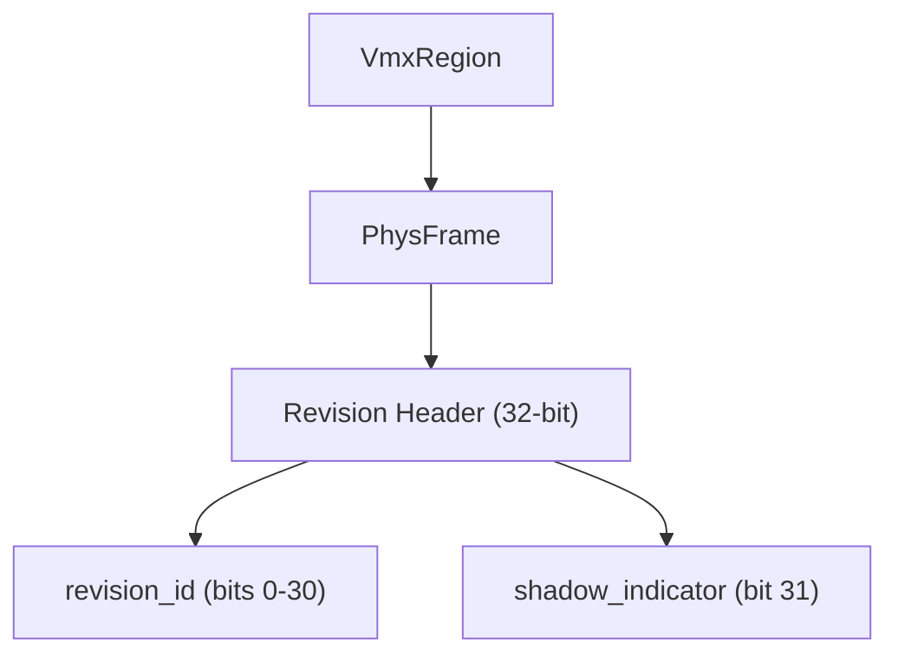
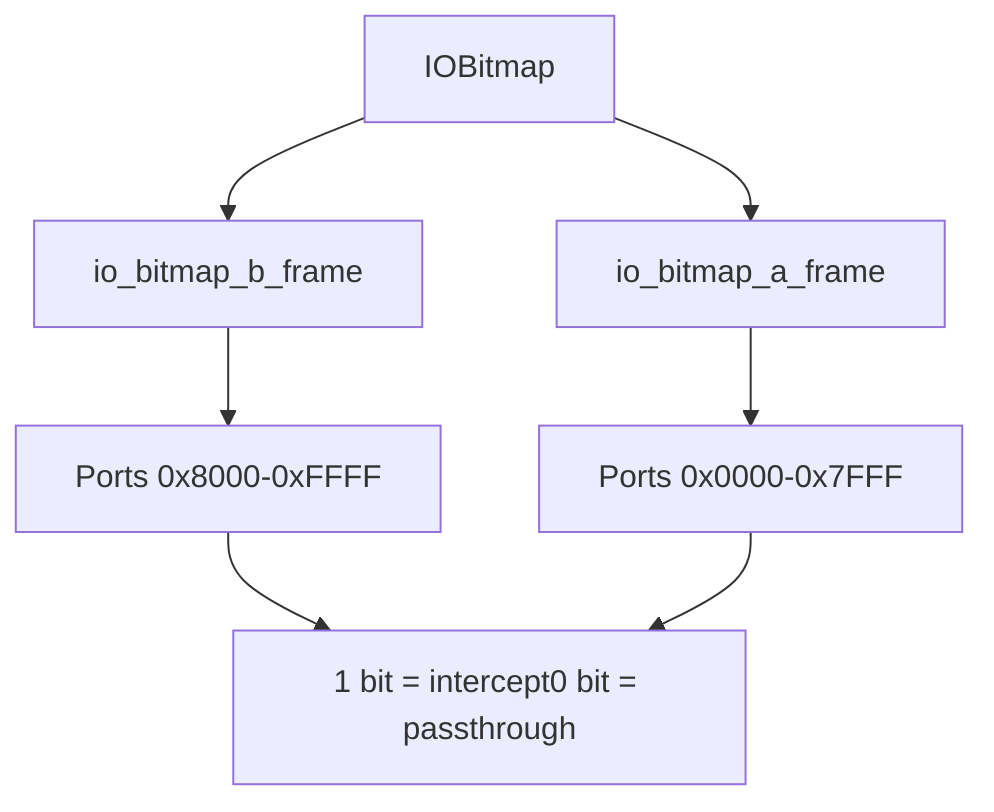
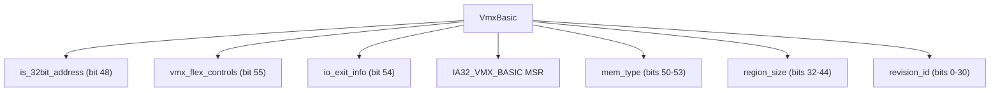
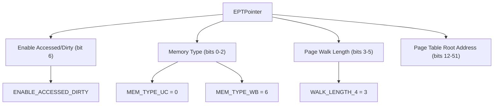
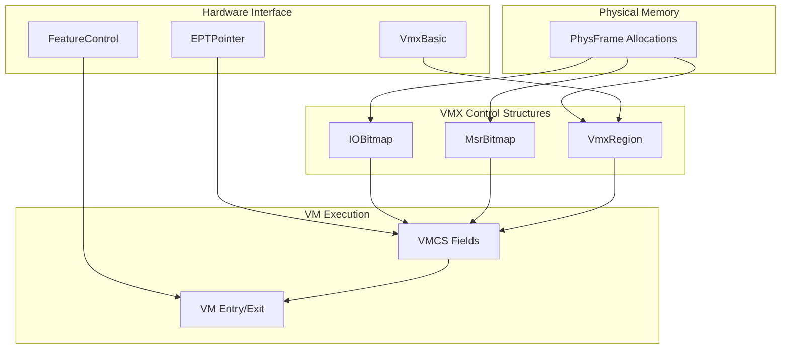

# VMX Data Structures

> **Relevant source files**
> * [src/vmx/structs.rs](https://github.com/arceos-hypervisor/x86_vcpu/blob/2cc42349/src/vmx/structs.rs)

This document covers the fundamental VMX data structures that support Intel VMX virtualization operations. These structures include memory-backed control regions (`VmxRegion`), access control bitmaps (`IOBitmap`, `MsrBitmap`), hardware capability reporting (`VmxBasic`), and page table pointers (`EPTPointer`). These structures work together to configure and control virtual machine execution.

For information about how these structures are used in VCPU management, see [Virtual CPU Management](/arceos-hypervisor/x86_vcpu/2.1-virtual-cpu-management). For details about VMCS field access patterns, see [VMCS Field Management](/arceos-hypervisor/x86_vcpu/2.3-vmcs-field-management).

## Core VMX Memory Structures

The hypervisor manages three primary memory-backed VMX structures that control virtual machine behavior. Each structure is backed by one or more 4KB physical frames managed through the `PhysFrame<H>` abstraction.

### VmxRegion

The `VmxRegion<H: AxVCpuHal>` struct represents VMCS/VMXON regions as defined in Intel SDM Vol. 3C, Section 24.2. These regions are 4KB memory areas that store VMX control structures.

The constructor `VmxRegion::new()` initializes the region with a revision identifier and shadow indicator bit as required by VMX specifications. The `phys_addr()` method provides the physical address needed for VMX instructions.

### IOBitmap

The `IOBitmap<H: AxVCpuHal>` controls I/O port access interception using two 4KB frames covering the complete 16-bit I/O port space as specified in Intel SDM Vol. 3C, Section 25.6.4.

|Frame|Port Range|Size|
| --- | --- | --- |
|io_bitmap_a_frame|0x0000-0x7FFF|4KB|
|io_bitmap_b_frame|0x8000-0xFFFF|4KB|

The `set_intercept()` method configures individual port interception by setting bits in the appropriate bitmap frame. The `passthrough_all()` constructor creates zero-filled bitmaps for unrestricted I/O access, while `intercept_all()` creates bitmaps with all bits set.

### MsrBitmap

The `MsrBitmap<H: AxVCpuHal>` controls Model-Specific Register access using a single 4KB frame divided into four 1KB regions for different MSR ranges and access types.

|Offset|Region|MSR Range|Access Type|
| --- | --- | --- | --- |
|0x000|Read Low|0x0000_0000-0x0000_1FFF|Read|
|0x400|Read High|0xC000_0000-0xC000_1FFF|Read|
|0x800|Write Low|0x0000_0000-0x0000_1FFF|Write|
|0xC00|Write High|0xC000_0000-0xC000_1FFF|Write|

The `set_read_intercept()` and `set_write_intercept()` methods configure MSR access control by manipulating bits in the appropriate region of the bitmap frame.

Sources: [src/vmx/structs.rs(L13 - L163)&emsp;](https://github.com/arceos-hypervisor/x86_vcpu/blob/2cc42349/src/vmx/structs.rs#L13-L163)

## Hardware Capability Structures

### VmxBasic Capabilities

The `VmxBasic` struct provides access to the `IA32_VMX_BASIC` MSR, which reports fundamental VMX capabilities. This structure implements the `MsrReadWrite` trait for MSR access.

Key fields include:

* `revision_id`: 31-bit VMCS revision identifier
* `region_size`: Required allocation size for VMXON/VMCS regions
* `mem_type`: Required memory type (typically `VMX_MEMORY_TYPE_WRITE_BACK = 6`)
* `vmx_flex_controls`: Indicates flexible control support

### FeatureControl Management

The `FeatureControl` struct manages the `IA32_FEATURE_CONTROL` MSR through `FeatureControlFlags` bitflags. This MSR controls VMX enablement at the processor level.

|Flag|Purpose|
| --- | --- |
|LOCKED|Prevents further MSR modification|
|VMXON_ENABLED_INSIDE_SMX|Enables VMX inside SMX mode|
|VMXON_ENABLED_OUTSIDE_SMX|Enables VMX outside SMX mode|

The `write()` method preserves reserved bits while updating control flags, ensuring proper MSR manipulation.

Sources: [src/vmx/structs.rs(L165 - L240)&emsp;](https://github.com/arceos-hypervisor/x86_vcpu/blob/2cc42349/src/vmx/structs.rs#L165-L240)

## Extended Page Table Structures

### EPTPointer Configuration

The `EPTPointer` bitflags struct configures Extended Page Table parameters as defined in Intel SDM Vol. 3C, Section 24.6.11. This structure combines page table root address with control flags.

The `from_table_phys()` constructor creates a properly configured EPT pointer from a physical page table root address, setting standard flags for write-back memory type, 4-level page walks, and accessed/dirty bit support.

## Structure Relationships and Usage Patterns

The VMX data structures work together to establish virtual machine execution context:

These structures are typically initialized during VCPU setup and configured based on virtualization requirements. The physical frame allocation through `AxVCpuHal` ensures proper memory management across different hypervisor implementations.

Sources: [src/vmx/structs.rs(L242 - L270)&emsp;](https://github.com/arceos-hypervisor/x86_vcpu/blob/2cc42349/src/vmx/structs.rs#L242-L270)