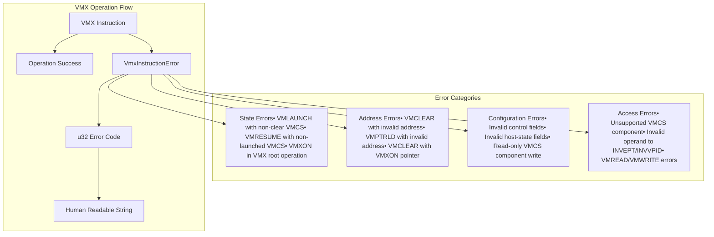
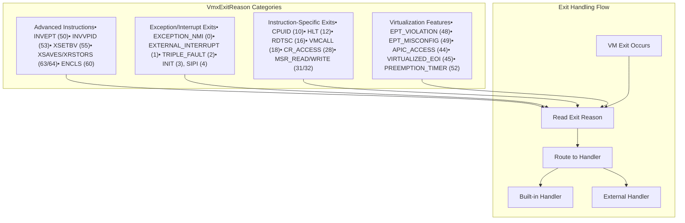
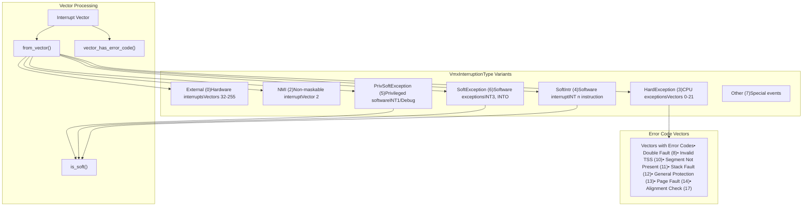
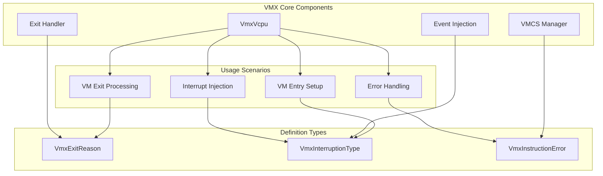

# VMX Definitions and Types

> **Relevant source files**
> * [src/vmx/definitions.rs](https://github.com/arceos-hypervisor/x86_vcpu/blob/2cc42349/src/vmx/definitions.rs)

## Purpose and Scope

This document covers the core VMX (Virtual Machine Extensions) definitions and enumerations that form the foundation of Intel VMX virtualization. These types define the various exit reasons, error conditions, and interrupt classifications used throughout the VMX virtualization engine.

For information about how these definitions are used in practice, see [Virtual CPU Management](/arceos-hypervisor/x86_vcpu/2.1-virtual-cpu-management) and [VMCS Field Management](/arceos-hypervisor/x86_vcpu/2.3-vmcs-field-management). For low-level VMX instruction wrappers that utilize these types, see [VMX Instructions](/arceos-hypervisor/x86_vcpu/4.4-vmx-instructions).

## VM Instruction Error Types

The `VmxInstructionError` struct provides human-readable descriptions for VMX instruction failures. VMX operations can fail for various reasons, and this type maps the numeric error codes to descriptive strings.

### Error Classification

**VMX Instruction Error Handling**

The error mapping covers 28 distinct error conditions defined in the Intel SDM Volume 3C, Section 30.4. Key error categories include:

|Error Type|Examples|Impact|
| --- | --- | --- |
|State Violations|VMLAUNCH with non-clear VMCS (4)|VM entry failure|
|Address Issues|Invalid physical addresses (2, 18)|Memory access violations|
|Configuration|Invalid control fields (7, 8)|VM setup failure|
|Access Control|Read-only component write (13)|VMCS corruption prevention|

Sources: [src/vmx/definitions.rs(L3 - L60)&emsp;](https://github.com/arceos-hypervisor/x86_vcpu/blob/2cc42349/src/vmx/definitions.rs#L3-L60)

## VM Exit Reasons

The `VmxExitReason` enum defines all possible reasons for VM exits in Intel VMX. This comprehensive enumeration covers 70 distinct exit reasons ranging from basic exceptions to advanced virtualization features.

### Exit Reason Categories

**VM Exit Reason Classification**

### Common Exit Reasons

The most frequently handled exit reasons include:

* **CPUID (10)**: Guest queries processor capabilities
* **CR_ACCESS (28)**: Control register modifications
* **MSR_READ/WRITE (31/32)**: Model-specific register access
* **EPT_VIOLATION (48)**: Memory access violations in nested paging
* **IO_INSTRUCTION (30)**: I/O port access
* **HLT (12)**: CPU halt instruction

Sources: [src/vmx/definitions.rs(L62 - L208)&emsp;](https://github.com/arceos-hypervisor/x86_vcpu/blob/2cc42349/src/vmx/definitions.rs#L62-L208)

## Interruption Types

The `VmxInterruptionType` enum classifies interrupt and exception types for both VM-Entry and VM-Exit interruption information fields as defined in Intel SDM Volume 3C, Sections 24.8.3 and 24.9.2.

### Interruption Classification

**VMX Interruption Type System**

### Vector Determination Logic

The `VmxInterruptionType` provides several utility methods:

|Method|Purpose|Return Type|
| --- | --- | --- |
|from_vector(vector: u8)|Determines interruption type from vector number|VmxInterruptionType|
|vector_has_error_code(vector: u8)|Checks if vector pushes error code|bool|
|is_soft()|Identifies software-generated interrupts|bool|

Key classification rules:

* **Vectors 0-21**: Hardware exceptions (except special cases)
* **Vector 1**: Debug exception (privileged software)
* **Vector 2**: NMI (non-maskable interrupt)
* **Vectors 3, 4**: Software exceptions (INT3, INTO)
* **Vectors 32-255**: External interrupts

Sources: [src/vmx/definitions.rs(L210 - L275)&emsp;](https://github.com/arceos-hypervisor/x86_vcpu/blob/2cc42349/src/vmx/definitions.rs#L210-L275)

## Integration with VMX System

These definitions form the foundation for VMX operation throughout the hypervisor:

**VMX Definitions Usage Flow**

These enumerations are used extensively in:

* **Exit handling**: Determining which handler to invoke based on `VmxExitReason`
* **Event injection**: Setting up interruption information with `VmxInterruptionType`
* **Error reporting**: Providing meaningful error messages via `VmxInstructionError`
* **VMCS configuration**: Validating and setting control fields

Sources: [src/vmx/definitions.rs(L1 - L275)&emsp;](https://github.com/arceos-hypervisor/x86_vcpu/blob/2cc42349/src/vmx/definitions.rs#L1-L275)