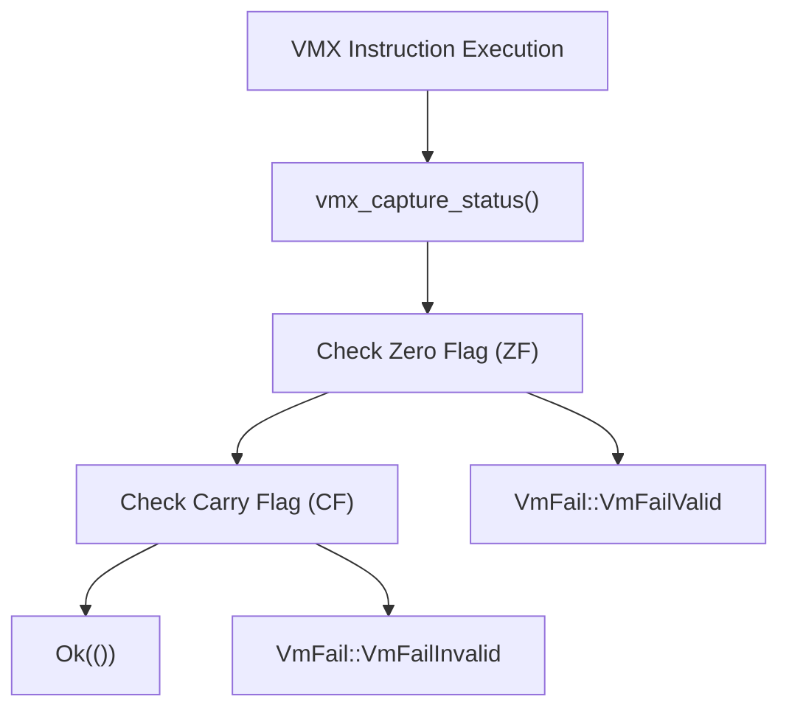
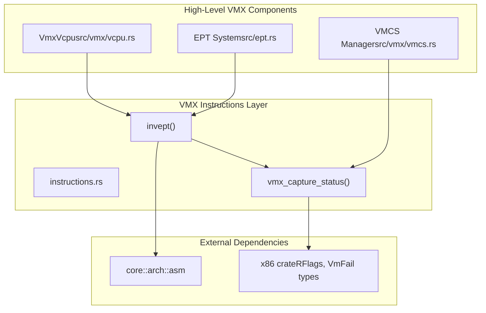

# VMX Instructions

> **Relevant source files**
> * [src/vmx/instructions.rs](https://github.com/arceos-hypervisor/x86_vcpu/blob/2cc42349/src/vmx/instructions.rs)

This document covers the low-level VMX instruction wrappers and hardware status handling mechanisms that provide primitive access to Intel VMX functionality. These instructions form the foundation for higher-level VMX operations throughout the hypervisor.

For broader VMX system functionality, see [VMX Virtualization Engine](/arceos-hypervisor/x86_vcpu/2-vmx-virtualization-engine). For VMX-specific data types and enumerations, see [VMX Definitions and Types](/arceos-hypervisor/x86_vcpu/4.3-vmx-definitions-and-types).

## Purpose and Scope

The VMX instructions module provides direct wrappers around Intel VMX hardware instructions, focusing on proper status handling and type-safe interfaces. Currently, this module specifically implements Extended Page Table (EPT) invalidation through the `INVEPT` instruction and establishes patterns for VMX result handling that can be extended to other VMX instructions.

**Sources:** [src/vmx/instructions.rs(L1 - L51)&emsp;](https://github.com/arceos-hypervisor/x86_vcpu/blob/2cc42349/src/vmx/instructions.rs#L1-L51)

## VMX Status Handling Mechanism

VMX instructions communicate their success or failure through CPU flags rather than traditional return values. The `vmx_capture_status` function implements the standard pattern for interpreting these flags according to Intel SDM conventions.

### Status Interpretation Flow



The function uses `#[inline(always)]` to ensure no intervening code can clobber the RFLAGS register between instruction execution and status reading. This critical timing requirement prevents race conditions that could corrupt status information.

|Flag State|Result|Meaning|
| --- | --- | --- |
|ZF = 1|VmFail::VmFailValid|Instruction failed with valid VMCS|
|CF = 1|VmFail::VmFailInvalid|Instruction failed with invalid VMCS|
|ZF = 0, CF = 0|Ok(())|Instruction succeeded|

**Sources:** [src/vmx/instructions.rs(L5 - L22)&emsp;](https://github.com/arceos-hypervisor/x86_vcpu/blob/2cc42349/src/vmx/instructions.rs#L5-L22)

## INVEPT Instruction Support

The `INVEPT` (Invalidate Extended Page Tables) instruction invalidates cached translations derived from EPT structures. This is essential for maintaining memory coherency when EPT mappings change.

### INVEPT Types and Implementation

```

```

The `invept` function constructs an INVEPT descriptor containing the EPT pointer and executes the instruction through inline assembly. The descriptor format follows Intel SDM specifications with the EPTP in the first 64-bit word and a reserved zero in the second word.

### INVEPT Operation Types

|Type|Value|Scope|Use Case|
| --- | --- | --- | --- |
|SingleContext|1|Specific EPTP (bits 51:12)|Invalidate translations for one guest|
|Global|2|All EPTPs|System-wide invalidation|

**Sources:** [src/vmx/instructions.rs(L24 - L50)&emsp;](https://github.com/arceos-hypervisor/x86_vcpu/blob/2cc42349/src/vmx/instructions.rs#L24-L50)

## Integration with VMX System

The VMX instructions module serves as the hardware abstraction foundation for higher-level VMX operations throughout the hypervisor system.

### VMX Instruction Integration Points



The instruction wrappers provide type-safe interfaces that prevent common errors in VMX programming:

* **Result Type Safety**: All VMX instructions return `Result<()>` with standardized error handling
* **Descriptor Management**: Complex instruction descriptors are constructed internally with correct formatting
* **Timing Guarantees**: Critical timing requirements for status reading are enforced through compiler attributes

**Sources:** [src/vmx/instructions.rs(L1 - L51)&emsp;](https://github.com/arceos-hypervisor/x86_vcpu/blob/2cc42349/src/vmx/instructions.rs#L1-L51)

### Extension Pattern for Additional VMX Instructions

The current implementation establishes patterns that can be extended for other VMX instructions:

1. **Status Handling**: Use `vmx_capture_status()` after any VMX instruction
2. **Type Enums**: Define instruction-specific enums with appropriate `#[repr()]` attributes
3. **Descriptor Construction**: Build instruction descriptors as arrays with proper field ordering
4. **Inline Assembly**: Use direct `asm!` macros with appropriate register constraints

This foundation enables safe, efficient access to the complete VMX instruction set while maintaining the hypervisor's type safety and performance requirements.

**Sources:** [src/vmx/instructions.rs(L1 - L51)&emsp;](https://github.com/arceos-hypervisor/x86_vcpu/blob/2cc42349/src/vmx/instructions.rs#L1-L51)