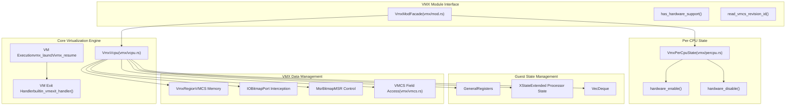
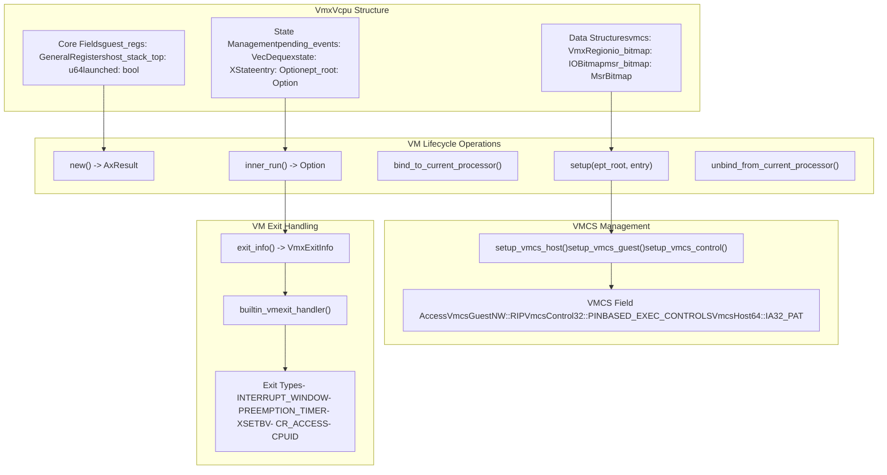
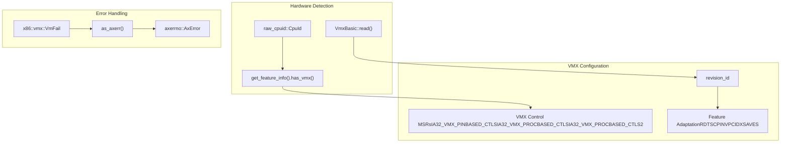

# VMX Virtualization Engine

> **Relevant source files**
> * [src/vmx/mod.rs](https://github.com/arceos-hypervisor/x86_vcpu/blob/2cc42349/src/vmx/mod.rs)
> * [src/vmx/vcpu.rs](https://github.com/arceos-hypervisor/x86_vcpu/blob/2cc42349/src/vmx/vcpu.rs)

The VMX Virtualization Engine forms the core of the x86_vcpu hypervisor library, implementing Intel's VMX (Virtual Machine Extensions) technology to enable hardware-assisted virtualization. This system provides the fundamental infrastructure for creating, managing, and executing virtual CPUs using Intel's VT-x capabilities.

For detailed information about physical memory management, see [Physical Frame Management](/arceos-hypervisor/x86_vcpu/3.1-physical-frame-management). For register and MSR access patterns, see [Supporting Systems](/arceos-hypervisor/x86_vcpu/4-supporting-systems).

## Architecture Overview

The VMX Virtualization Engine consists of several interconnected components that work together to provide complete virtualization functionality. The system is built around the `VmxVcpu` structure, which represents a virtual CPU and manages the complete virtualization lifecycle.



Sources: [src/vmx/mod.rs(L1 - L36)&emsp;](https://github.com/arceos-hypervisor/x86_vcpu/blob/2cc42349/src/vmx/mod.rs#L1-L36) [src/vmx/vcpu.rs(L143 - L159)&emsp;](https://github.com/arceos-hypervisor/x86_vcpu/blob/2cc42349/src/vmx/vcpu.rs#L143-L159)

## Core Components and Interactions

The VMX engine operates through a collection of specialized components that handle different aspects of virtualization. The central `VmxVcpu` structure coordinates these components to provide a complete virtual machine implementation.



Sources: [src/vmx/vcpu.rs(L144 - L159)&emsp;](https://github.com/arceos-hypervisor/x86_vcpu/blob/2cc42349/src/vmx/vcpu.rs#L144-L159) [src/vmx/vcpu.rs(L238 - L280)&emsp;](https://github.com/arceos-hypervisor/x86_vcpu/blob/2cc42349/src/vmx/vcpu.rs#L238-L280) [src/vmx/vcpu.rs(L890 - L906)&emsp;](https://github.com/arceos-hypervisor/x86_vcpu/blob/2cc42349/src/vmx/vcpu.rs#L890-L906)

## VM Execution Lifecycle

The virtual machine execution follows a well-defined lifecycle that involves hardware initialization, VMCS configuration, guest execution, and VM exit handling. This process is managed through careful coordination between the hypervisor and VMX hardware.

```

```

Sources: [src/vmx/vcpu.rs(L162 - L180)&emsp;](https://github.com/arceos-hypervisor/x86_vcpu/blob/2cc42349/src/vmx/vcpu.rs#L162-L180) [src/vmx/vcpu.rs(L238 - L280)&emsp;](https://github.com/arceos-hypervisor/x86_vcpu/blob/2cc42349/src/vmx/vcpu.rs#L238-L280) [src/vmx/vcpu.rs(L822 - L856)&emsp;](https://github.com/arceos-hypervisor/x86_vcpu/blob/2cc42349/src/vmx/vcpu.rs#L822-L856)

## Hardware Support and Abstraction

The VMX engine provides hardware abstraction through well-defined interfaces that detect VMX capabilities and manage processor-specific features. The system validates hardware support and configures VMX features based on detected capabilities.

|Component|Purpose|Key Functions|
| --- | --- | --- |
|Hardware Detection|Validate VMX support|has_hardware_support()|
|VMCS Revision|Get processor VMCS version|read_vmcs_revision_id()|
|Per-CPU State|Manage processor VMX state|hardware_enable(),hardware_disable()|
|Error Handling|Convert VMX errors to AxError|as_axerr()|

The hardware abstraction layer ensures compatibility across different Intel processors while providing a uniform interface for VMX operations. The `VmxBasic` structure reads processor capabilities, and the system adapts its behavior based on detected features such as RDTSCP, INVPCID, and XSAVES support.



Sources: [src/vmx/mod.rs(L16 - L27)&emsp;](https://github.com/arceos-hypervisor/x86_vcpu/blob/2cc42349/src/vmx/mod.rs#L16-L27) [src/vmx/mod.rs(L29 - L35)&emsp;](https://github.com/arceos-hypervisor/x86_vcpu/blob/2cc42349/src/vmx/mod.rs#L29-L35) [src/vmx/vcpu.rs(L606 - L663)&emsp;](https://github.com/arceos-hypervisor/x86_vcpu/blob/2cc42349/src/vmx/vcpu.rs#L606-L663)

## Module Interface and Exports

The VMX module provides a clean interface through its `mod.rs` facade, exporting the essential types and functions needed by the broader hypervisor system. The module structure separates concerns between different aspects of VMX functionality while providing unified access through type aliases.

|Export|Source|Purpose|
| --- | --- | --- |
|VmxExitReason|definitions::VmxExitReason|VM exit reason enumeration|
|VmxArchPerCpuState|percpu::VmxPerCpuState|Per-CPU VMX state management|
|VmxArchVCpu|vcpu::VmxVcpu|Main virtual CPU implementation|
|VmxExitInfo|vmcs::VmxExitInfo|VM exit information structure|
|VmxInterruptInfo|vmcs::VmxInterruptInfo|Interrupt exit details|
|VmxIoExitInfo|vmcs::VmxIoExitInfo|I/O instruction exit details|

The module implements a layered architecture where higher-level abstractions build upon lower-level VMX primitives, providing both flexibility for advanced users and simplicity for common virtualization tasks.

Sources: [src/vmx/mod.rs(L1 - L14)&emsp;](https://github.com/arceos-hypervisor/x86_vcpu/blob/2cc42349/src/vmx/mod.rs#L1-L14) [src/vmx/mod.rs(L11 - L14)&emsp;](https://github.com/arceos-hypervisor/x86_vcpu/blob/2cc42349/src/vmx/mod.rs#L11-L14)