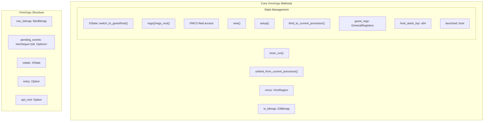
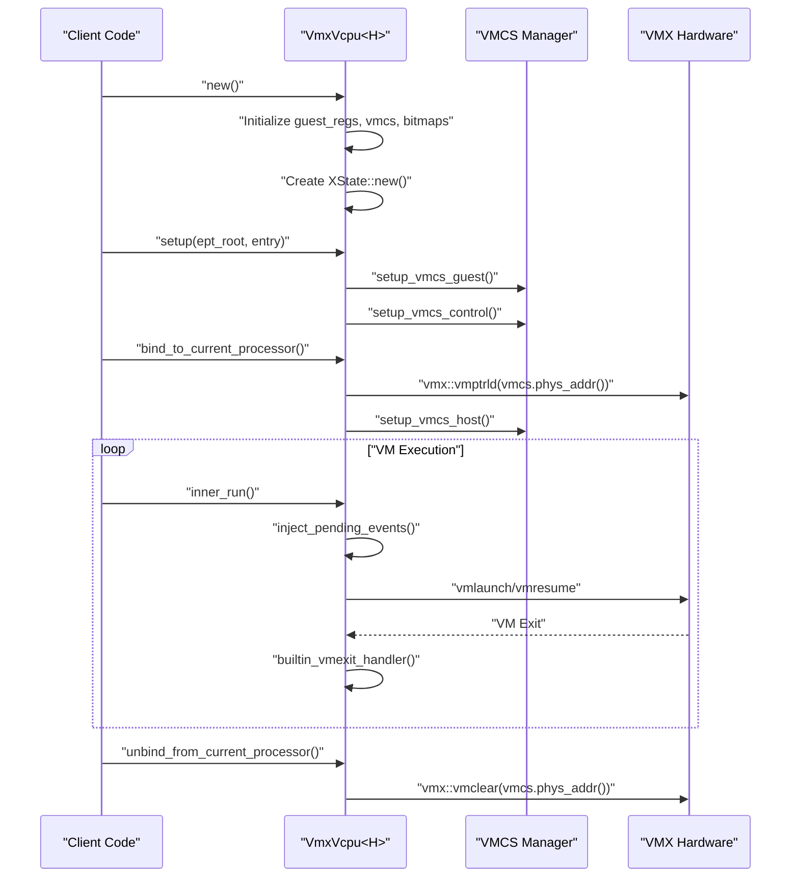
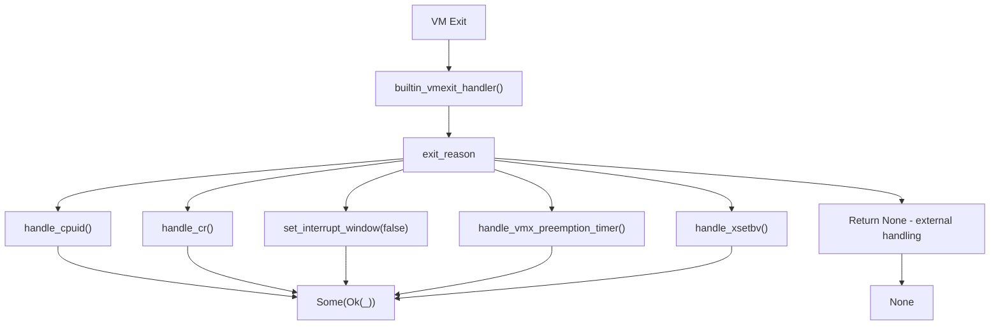
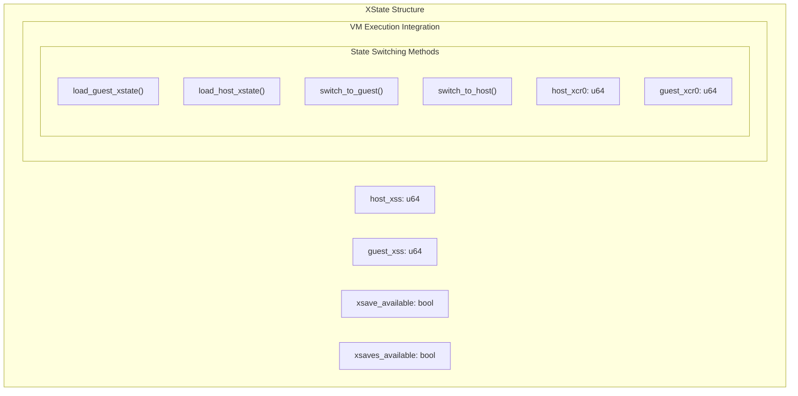

# Virtual CPU Management

> **Relevant source files**
> * [src/vmx/vcpu.rs](https://github.com/arceos-hypervisor/x86_vcpu/blob/2cc42349/src/vmx/vcpu.rs)

This document covers the implementation and lifecycle management of virtual CPUs (vCPUs) in the x86_vcpu hypervisor library. It focuses on the `VmxVcpu` structure and its role in orchestrating VM execution, handling VM exits, and managing guest/host state transitions. For VMX data structures and memory management details, see [VMX Data Structures](/arceos-hypervisor/x86_vcpu/2.2-vmx-data-structures) and [Physical Frame Management](/arceos-hypervisor/x86_vcpu/3.1-physical-frame-management).

## VmxVcpu Structure Overview

The `VmxVcpu<H: AxVCpuHal>` struct serves as the central abstraction for managing virtual CPU execution within the VMX virtualization framework. It encapsulates all necessary state and control structures required for guest execution.



**Sources:** [src/vmx/vcpu.rs(L144 - L159)&emsp;](https://github.com/arceos-hypervisor/x86_vcpu/blob/2cc42349/src/vmx/vcpu.rs#L144-L159)

### Key Components

|Component|Type|Purpose|
| --- | --- | --- |
|guest_regs|GeneralRegisters|Guest general-purpose register state|
|host_stack_top|u64|Host stack pointer for VM exit handling|
|vmcs|VmxRegion<H>|Virtual Machine Control Structure memory region|
|io_bitmap|IOBitmap<H>|I/O port access control bitmap|
|msr_bitmap|MsrBitmap<H>|MSR access control bitmap|
|pending_events|VecDeque<(u8, Option<u32>)>|Queue for interrupt/exception injection|
|xstate|XState|Extended processor state management|

**Sources:** [src/vmx/vcpu.rs(L144 - L159)&emsp;](https://github.com/arceos-hypervisor/x86_vcpu/blob/2cc42349/src/vmx/vcpu.rs#L144-L159)

## Virtual CPU Lifecycle

The virtual CPU follows a well-defined lifecycle from creation through execution to teardown. Each phase involves specific initialization and state management operations.



**Sources:** [src/vmx/vcpu.rs(L162 - L217)&emsp;](https://github.com/arceos-hypervisor/x86_vcpu/blob/2cc42349/src/vmx/vcpu.rs#L162-L217) [src/vmx/vcpu.rs(L238 - L280)&emsp;](https://github.com/arceos-hypervisor/x86_vcpu/blob/2cc42349/src/vmx/vcpu.rs#L238-L280)

### Creation and Setup

The `VmxVcpu::new()` method initializes a new virtual CPU instance with default state:

* Creates default `GeneralRegisters` and `XState`
* Allocates `VmxRegion` with proper VMX revision ID
* Initializes I/O and MSR bitmaps with passthrough configuration
* Sets up pending events queue

**Sources:** [src/vmx/vcpu.rs(L162 - L180)&emsp;](https://github.com/arceos-hypervisor/x86_vcpu/blob/2cc42349/src/vmx/vcpu.rs#L162-L180)

The `setup()` method configures the virtual CPU for a specific guest:

* Calls `setup_vmcs()` to configure VMCS guest, host, and control fields
* Sets guest entry point and EPT root page table address

**Sources:** [src/vmx/vcpu.rs(L183 - L186)&emsp;](https://github.com/arceos-hypervisor/x86_vcpu/blob/2cc42349/src/vmx/vcpu.rs#L183-L186)

### Processor Binding

Before execution, the virtual CPU must be bound to a physical processor using `bind_to_current_processor()`:

* Loads the VMCS using `vmx::vmptrld()`
* Configures host state in VMCS via `setup_vmcs_host()`

**Sources:** [src/vmx/vcpu.rs(L194 - L204)&emsp;](https://github.com/arceos-hypervisor/x86_vcpu/blob/2cc42349/src/vmx/vcpu.rs#L194-L204)

## VM Execution Cycle

The core execution mechanism is implemented in `inner_run()`, which orchestrates the complete VM entry/exit cycle including guest execution and exit handling.

```

```

**Sources:** [src/vmx/vcpu.rs(L238 - L280)&emsp;](https://github.com/arceos-hypervisor/x86_vcpu/blob/2cc42349/src/vmx/vcpu.rs#L238-L280)

### VM Entry Mechanisms

The hypervisor uses naked assembly functions for precise control over VM entry:

* `vmx_launch()`: Initial VM entry using `vmlaunch` instruction
* `vmx_resume()`: Subsequent VM entries using `vmresume` instruction
* Both functions save host state and restore guest state before entry

**Sources:** [src/vmx/vcpu.rs(L822 - L840)&emsp;](https://github.com/arceos-hypervisor/x86_vcpu/blob/2cc42349/src/vmx/vcpu.rs#L822-L840)

### VM Exit Handling

When a VM exit occurs, `vmx_exit()` handles the transition back to host mode:

* Saves guest registers to the `GeneralRegisters` structure
* Restores host stack pointer from `host_stack_top`
* Returns control to `inner_run()` for exit processing

**Sources:** [src/vmx/vcpu.rs(L842 - L856)&emsp;](https://github.com/arceos-hypervisor/x86_vcpu/blob/2cc42349/src/vmx/vcpu.rs#L842-L856)

## Built-in Exit Handling

The `VmxVcpu` implements built-in handlers for common VM exit reasons that can be handled transparently without external intervention.



**Sources:** [src/vmx/vcpu.rs(L890 - L906)&emsp;](https://github.com/arceos-hypervisor/x86_vcpu/blob/2cc42349/src/vmx/vcpu.rs#L890-L906)

### Exit Handler Implementations

|Exit Reason|Handler Method|Purpose|
| --- | --- | --- |
|INTERRUPT_WINDOW|set_interrupt_window(false)|Disable interrupt window exiting after pending interrupt injection|
|PREEMPTION_TIMER|handle_vmx_preemption_timer()|Reset VMX preemption timer value|
|XSETBV|handle_xsetbv()|Handle guest XCR0 modifications for extended state|
|CR_ACCESS|handle_cr()|Handle guest control register access (CR0, CR4)|
|CPUID|handle_cpuid()|Virtualize CPUID instruction with hypervisor-specific responses|

**Sources:** [src/vmx/vcpu.rs(L908 - L1042)&emsp;](https://github.com/arceos-hypervisor/x86_vcpu/blob/2cc42349/src/vmx/vcpu.rs#L908-L1042)

### CPUID Virtualization

The `handle_cpuid()` method provides comprehensive CPUID virtualization:

* Masks VMX feature bit to hide hardware virtualization from guest
* Sets hypervisor present bit to indicate virtualized environment
* Provides custom hypervisor identification strings
* Handles extended state enumeration with proper XState context switching

**Sources:** [src/vmx/vcpu.rs(L955 - L1042)&emsp;](https://github.com/arceos-hypervisor/x86_vcpu/blob/2cc42349/src/vmx/vcpu.rs#L955-L1042)

## State Management

### Extended Processor State (XState)

The `XState` structure manages extended processor state including XCR0 and IA32_XSS registers for both guest and host contexts.



**Sources:** [src/vmx/vcpu.rs(L31 - L138)&emsp;](https://github.com/arceos-hypervisor/x86_vcpu/blob/2cc42349/src/vmx/vcpu.rs#L31-L138)

### Register Access Interface

The `VmxVcpu` provides multiple interfaces for accessing guest processor state:

* `regs()` and `regs_mut()`: Access general-purpose registers
* `stack_pointer()` and `set_stack_pointer()`: Guest RSP access
* `rip()` and `advance_rip()`: Guest instruction pointer management
* `get_cpu_mode()`: Determine current guest CPU mode (Real, Protected, Compatibility, Mode64)

**Sources:** [src/vmx/vcpu.rs(L307 - L399)&emsp;](https://github.com/arceos-hypervisor/x86_vcpu/blob/2cc42349/src/vmx/vcpu.rs#L307-L399)

### Event Injection

The pending events mechanism allows queueing interrupts and exceptions for injection:

* `queue_event()`: Add interrupt/exception to pending queue
* `inject_pending_events()`: Process queue before VM entry
* `set_interrupt_window()`: Enable interrupt window exiting when guest interrupts are blocked

**Sources:** [src/vmx/vcpu.rs(L402 - L404)&emsp;](https://github.com/arceos-hypervisor/x86_vcpu/blob/2cc42349/src/vmx/vcpu.rs#L402-L404) [src/vmx/vcpu.rs(L871 - L888)&emsp;](https://github.com/arceos-hypervisor/x86_vcpu/blob/2cc42349/src/vmx/vcpu.rs#L871-L888)

## Integration with AxArchVCpu Trait

The `VmxVcpu` implements the `AxArchVCpu` trait to provide a standardized interface for the broader hypervisor framework.

|Trait Method|Implementation|Purpose|
| --- | --- | --- |
|new()|VmxVcpu::new()|Create new virtual CPU instance|
|set_entry()|Setsentryfield|Configure guest entry point|
|set_ept_root()|Setsept_rootfield|Configure EPT root page table|
|setup()|Callssetup_vmcs()|Initialize VMCS with entry and EPT root|
|run()|Callsinner_run()and converts exit info|Execute guest and return standardized exit reasons|
|bind()/unbind()|Processor binding/unbinding|Manage processor affinity|

**Sources:** [src/vmx/vcpu.rs(L1144 - L1255)&emsp;](https://github.com/arceos-hypervisor/x86_vcpu/blob/2cc42349/src/vmx/vcpu.rs#L1144-L1255)

This integration enables the VMX-specific virtual CPU implementation to work seamlessly with the broader ArceOS hypervisor architecture while maintaining VMX-specific optimizations and capabilities.

**Sources:** [src/vmx/vcpu.rs(L1 - L1256)&emsp;](https://github.com/arceos-hypervisor/x86_vcpu/blob/2cc42349/src/vmx/vcpu.rs#L1-L1256)