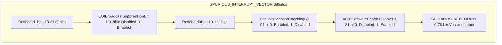
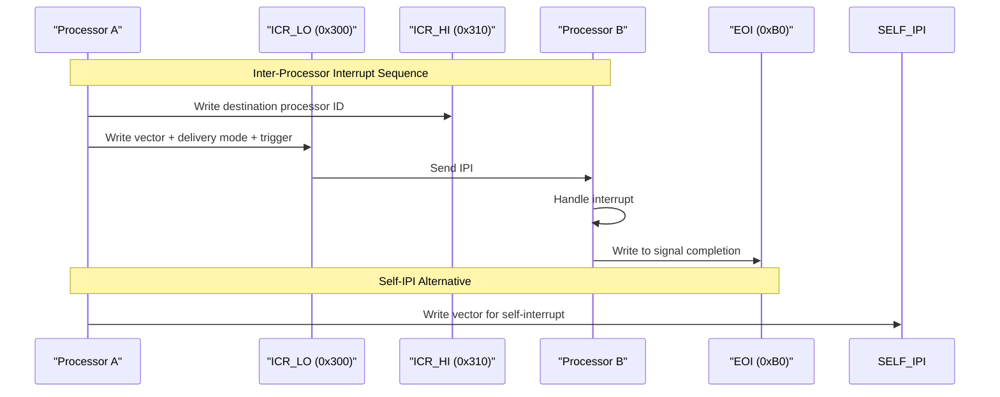

# Control and Status Registers

> **Relevant source files**
> * [src/regs/mod.rs](https://github.com/arceos-hypervisor/x86_vlapic/blob/9b85fb9d/src/regs/mod.rs)
> * [src/regs/svr.rs](https://github.com/arceos-hypervisor/x86_vlapic/blob/9b85fb9d/src/regs/svr.rs)

This document covers the non-LVT (Local Vector Table) control and status registers in the virtual Local APIC implementation. These registers handle APIC identification, interrupt state management, inter-processor communication, and various control functions. For information about Local Vector Table registers, see [LVT System](/arceos-hypervisor/x86_vlapic/3.2-local-vector-table-(lvt)).

The control and status registers are defined as fields in the `LocalAPICRegs` struct and accessed through the `VirtualApicRegs` virtualization layer. These registers implement the core APIC functionality beyond interrupt vector configuration.

## Register Categories Overview

The control and status registers can be organized into several functional categories based on their roles in the APIC system:

**Register Categories and Memory Layout**

```

```

Sources: [src/regs/mod.rs(L13 - L104)&emsp;](https://github.com/arceos-hypervisor/x86_vlapic/blob/9b85fb9d/src/regs/mod.rs#L13-L104)

## Spurious Interrupt Vector Register

The `SVR` register is the most complex control register, implemented with detailed bitfield definitions. It controls APIC software enable/disable, spurious vector configuration, and various interrupt handling behaviors.

**SVR Register Bitfield Structure**



The register provides two type aliases for different access patterns:

* `SpuriousInterruptVectorRegisterMmio`: Direct MMIO access via `ReadWrite<u32, SPURIOUS_INTERRUPT_VECTOR::Register>`
* `SpuriousInterruptVectorRegisterLocal`: Cached local copy via `LocalRegisterCopy<u32, SPURIOUS_INTERRUPT_VECTOR::Register>`

Sources: [src/regs/svr.rs(L1 - L71)&emsp;](https://github.com/arceos-hypervisor/x86_vlapic/blob/9b85fb9d/src/regs/svr.rs#L1-L71) [src/regs/mod.rs(L44 - L45)&emsp;](https://github.com/arceos-hypervisor/x86_vlapic/blob/9b85fb9d/src/regs/mod.rs#L44-L45)

## Control and Identification Registers

These registers provide basic APIC identification and priority control functionality:

|Register|Offset|Type|Purpose|
| --- | --- | --- | --- |
|ID|0x20|ReadWrite<u32>|Local APIC ID for processor identification|
|VERSION|0x30|ReadOnly<u32>|APIC version information and capabilities|
|TPR|0x80|ReadWrite<u32>|Task Priority Register - current task priority level|
|APR|0x90|ReadOnly<u32>|Arbitration Priority Register - for bus arbitration|
|PPR|0xA0|ReadOnly<u32>|Processor Priority Register - combined priority level|

**Priority Register Relationships**

```

```

Sources: [src/regs/mod.rs(L17 - L30)&emsp;](https://github.com/arceos-hypervisor/x86_vlapic/blob/9b85fb9d/src/regs/mod.rs#L17-L30)

## Interrupt State Registers

The interrupt state is maintained in three 256-bit register arrays, each consisting of 8 × 128-bit entries covering the full 256 interrupt vector space:

|Register Array|Offset Range|Type|Purpose|
| --- | --- | --- | --- |
|ISR|0x100-0x170|[ReadOnly<u128>; 8]|In-Service Register - currently serviced interrupts|
|TMR|0x180-0x1F0|[ReadOnly<u128>; 8]|Trigger Mode Register - level vs edge triggered|
|IRR|0x200-0x270|[ReadOnly<u128>; 8]|Interrupt Request Register - pending interrupts|

**Interrupt State Array Layout**

```

```

The IRR uses a specific bit mapping where bit x is located at bit position `(x & 1FH)` at offset `(200H | ((x & E0H) >> 1))`, and only the low 4 bytes of each 16-byte field are used by the processor.

Sources: [src/regs/mod.rs(L47 - L60)&emsp;](https://github.com/arceos-hypervisor/x86_vlapic/blob/9b85fb9d/src/regs/mod.rs#L47-L60)

## Communication Registers

These registers handle inter-processor communication and interrupt acknowledgment:

|Register|Offset|Type|Purpose|
| --- | --- | --- | --- |
|EOI|0xB0|WriteOnly<u32>|End of Interrupt - signal interrupt completion|
|RRD|0xC0|ReadOnly<u32>|Remote Read Register - remote APIC access|
|LDR|0xD0|ReadWrite<u32>|Logical Destination Register - logical addressing|
|DFR|0xE0|ReadWrite<u32>|Destination Format Register - addressing mode|
|ICR_LO|0x300|ReadWrite<u32>|Interrupt Command Register Low - IPI control|
|ICR_HI|0x310|ReadWrite<u32>|Interrupt Command Register High - destination|
|SELF_IPI|0x3F0|WriteOnly<u32>|Self IPI Register - self-directed interrupts|

**Inter-Processor Communication Flow**



Sources: [src/regs/mod.rs(L32 - L42)&emsp;](https://github.com/arceos-hypervisor/x86_vlapic/blob/9b85fb9d/src/regs/mod.rs#L32-L42) [src/regs/mod.rs(L67 - L70)&emsp;](https://github.com/arceos-hypervisor/x86_vlapic/blob/9b85fb9d/src/regs/mod.rs#L67-L70) [src/regs/mod.rs(L99 - L100)&emsp;](https://github.com/arceos-hypervisor/x86_vlapic/blob/9b85fb9d/src/regs/mod.rs#L99-L100)

## Timer Control Registers

The timer subsystem uses dedicated control registers separate from the LVT Timer register:

|Register|Offset|Type|Purpose|
| --- | --- | --- | --- |
|ICR_TIMER|0x380|ReadWrite<u32>|Initial Count Register - timer start value|
|CCR_TIMER|0x390|ReadOnly<u32>|Current Count Register - current timer value|
|DCR_TIMER|0x3E0|ReadWrite<u32>|Divide Configuration Register - timer frequency|

**Timer Control Register Interaction**

```

```

Sources: [src/regs/mod.rs(L90 - L97)&emsp;](https://github.com/arceos-hypervisor/x86_vlapic/blob/9b85fb9d/src/regs/mod.rs#L90-L97)

## Error Status Register

The Error Status Register tracks various APIC error conditions:

|Register|Offset|Type|Purpose|
| --- | --- | --- | --- |
|ESR|0x280|ReadWrite<u32>|Error Status Register - APIC error flags|

This register works in conjunction with the LVT Error register to handle and report APIC internal errors.

Sources: [src/regs/mod.rs(L61 - L62)&emsp;](https://github.com/arceos-hypervisor/x86_vlapic/blob/9b85fb9d/src/regs/mod.rs#L61-L62)

## Register Access Patterns

All control and status registers are accessed through the same virtualization infrastructure as LVT registers, supporting both xAPIC MMIO and x2APIC MSR access modes:

**Register Access Flow**

```

```

Sources: [src/regs/mod.rs(L13 - L104)&emsp;](https://github.com/arceos-hypervisor/x86_vlapic/blob/9b85fb9d/src/regs/mod.rs#L13-L104)