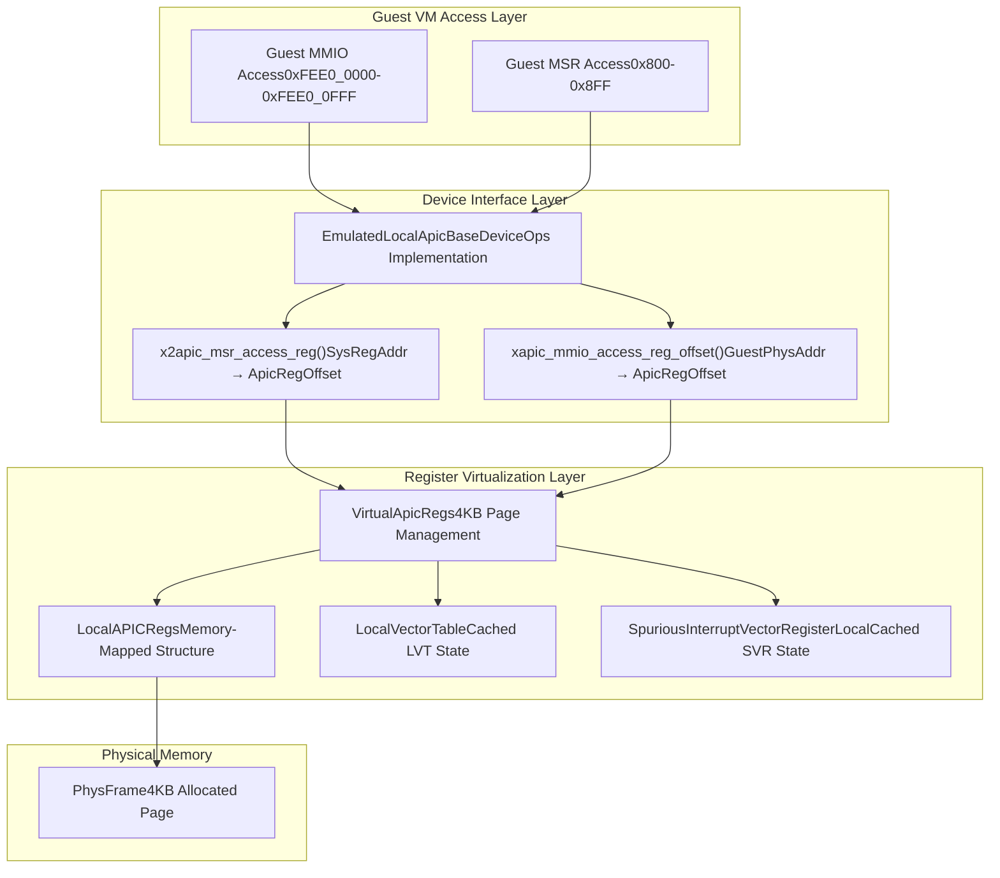
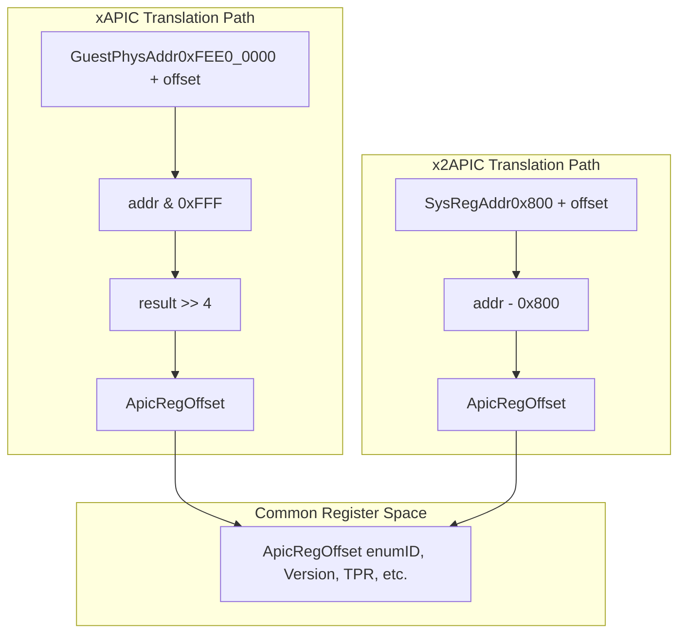
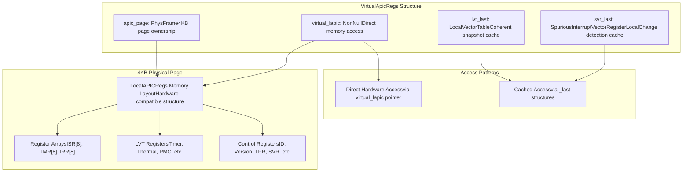

# Core Architecture

> **Relevant source files**
> * [src/consts.rs](https://github.com/arceos-hypervisor/x86_vlapic/blob/9b85fb9d/src/consts.rs)
> * [src/lib.rs](https://github.com/arceos-hypervisor/x86_vlapic/blob/9b85fb9d/src/lib.rs)
> * [src/vlapic.rs](https://github.com/arceos-hypervisor/x86_vlapic/blob/9b85fb9d/src/vlapic.rs)

This document explains the fundamental architectural design of the x86_vlapic virtual Local APIC implementation, covering the main components and their interactions. The architecture provides virtualization of x86 Local APIC functionality for hypervisor environments, supporting both legacy xAPIC (MMIO-based) and modern x2APIC (MSR-based) access patterns.

For detailed information about individual register implementations, see [Register System](/arceos-hypervisor/x86_vlapic/3-register-system). For specific LVT register functionality, see [Local Vector Table (LVT)](/arceos-hypervisor/x86_vlapic/3.2-local-vector-table-(lvt)).

## Main Architectural Components

The x86_vlapic crate implements a three-layer architecture that provides complete virtualization of Local APIC functionality:



Sources: [src/lib.rs(L33 - L44)&emsp;](https://github.com/arceos-hypervisor/x86_vlapic/blob/9b85fb9d/src/lib.rs#L33-L44) [src/vlapic.rs(L15 - L28)&emsp;](https://github.com/arceos-hypervisor/x86_vlapic/blob/9b85fb9d/src/vlapic.rs#L15-L28) [src/consts.rs(L200 - L202)&emsp;](https://github.com/arceos-hypervisor/x86_vlapic/blob/9b85fb9d/src/consts.rs#L200-L202) [src/consts.rs(L213 - L215)&emsp;](https://github.com/arceos-hypervisor/x86_vlapic/blob/9b85fb9d/src/consts.rs#L213-L215)

The `EmulatedLocalApic<H>` struct serves as the primary device interface, implementing `BaseDeviceOps` for both `AddrRange<GuestPhysAddr>` (xAPIC) and `SysRegAddrRange` (x2APIC) access patterns. It contains a single `VirtualApicRegs<H>` instance that manages the actual register virtualization.

## Address Translation Architecture

The system implements two distinct address translation paths to convert guest accesses into internal register offsets:



Sources: [src/consts.rs(L200 - L202)&emsp;](https://github.com/arceos-hypervisor/x86_vlapic/blob/9b85fb9d/src/consts.rs#L200-L202) [src/consts.rs(L213 - L215)&emsp;](https://github.com/arceos-hypervisor/x86_vlapic/blob/9b85fb9d/src/consts.rs#L213-L215) [src/consts.rs(L117 - L148)&emsp;](https://github.com/arceos-hypervisor/x86_vlapic/blob/9b85fb9d/src/consts.rs#L117-L148)

The `xapic_mmio_access_reg_offset()` function extracts the register offset from xAPIC MMIO addresses by masking the lower 12 bits and shifting right by 4, effectively converting byte offsets to 16-byte aligned register indices. The `x2apic_msr_access_reg()` function performs simple arithmetic subtraction from the MSR base address. Both paths converge on the same `ApicRegOffset` enum, enabling unified register handling.

## Virtual Register Memory Management

The `VirtualApicRegs<H>` struct implements a sophisticated memory management system that provides both hardware-compatible register layout and software-accessible caching:



Sources: [src/vlapic.rs(L15 - L28)&emsp;](https://github.com/arceos-hypervisor/x86_vlapic/blob/9b85fb9d/src/vlapic.rs#L15-L28) [src/vlapic.rs(L32 - L40)&emsp;](https://github.com/arceos-hypervisor/x86_vlapic/blob/9b85fb9d/src/vlapic.rs#L32-L40) [src/vlapic.rs(L55 - L59)&emsp;](https://github.com/arceos-hypervisor/x86_vlapic/blob/9b85fb9d/src/vlapic.rs#L55-L59)

The system allocates a zero-initialized 4KB page using `PhysFrame::alloc_zero()` and maps the `LocalAPICRegs` structure directly onto this memory. The `NonNull<LocalAPICRegs>` pointer provides direct access to hardware-compatible register layout, while cached copies in `svr_last` and `lvt_last` enable change detection and maintain coherent snapshots of critical registers.

## Device Interface Implementation

The `EmulatedLocalApic<H>` implements dual `BaseDeviceOps` traits to handle both xAPIC and x2APIC access patterns:

```

```

Sources: [src/lib.rs(L67 - L112)&emsp;](https://github.com/arceos-hypervisor/x86_vlapic/blob/9b85fb9d/src/lib.rs#L67-L112) [src/lib.rs(L114 - L159)&emsp;](https://github.com/arceos-hypervisor/x86_vlapic/blob/9b85fb9d/src/lib.rs#L114-L159) [src/vlapic.rs(L62 - L176)&emsp;](https://github.com/arceos-hypervisor/x86_vlapic/blob/9b85fb9d/src/vlapic.rs#L62-L176)

Both access patterns converge on the same `VirtualApicRegs::handle_read()` and `VirtualApicRegs::handle_write()` methods, ensuring consistent behavior regardless of the guest's chosen access mode. The `EmulatedLocalApic` provides address range information through `address_range()` methods and implements device type identification via `emu_type()` returning `EmuDeviceTInterruptController`.

## Static Memory Layout

The architecture includes a static 4KB page for APIC access virtualization:

|Component|Purpose|Memory Management|
| --- | --- | --- |
|VIRTUAL_APIC_ACCESS_PAGE|Static 4KB page for VMX APIC-access page|Statically allocated, aligned to 4KB|
|VirtualApicRegs.apic_page|Dynamic 4KB page for register storage|Dynamically allocated viaPhysFrame::alloc_zero()|
|virtual_lapicpointer|Direct access to register structure|Points to dynamically allocated page|

Sources: [src/lib.rs(L27 - L30)&emsp;](https://github.com/arceos-hypervisor/x86_vlapic/blob/9b85fb9d/src/lib.rs#L27-L30) [src/lib.rs(L52 - L56)&emsp;](https://github.com/arceos-hypervisor/x86_vlapic/blob/9b85fb9d/src/lib.rs#L52-L56) [src/vlapic.rs(L32 - L40)&emsp;](https://github.com/arceos-hypervisor/x86_vlapic/blob/9b85fb9d/src/vlapic.rs#L32-L40)

The static `VIRTUAL_APIC_ACCESS_PAGE` supports VMX virtualization features, while the dynamic page in `VirtualApicRegs` provides the actual register storage and implements proper memory lifecycle management through the `Drop` trait.