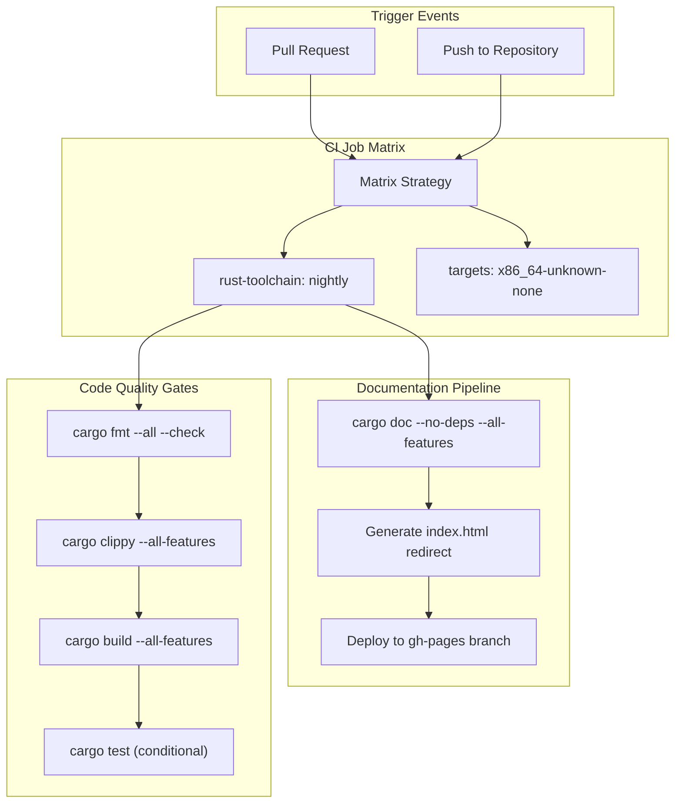
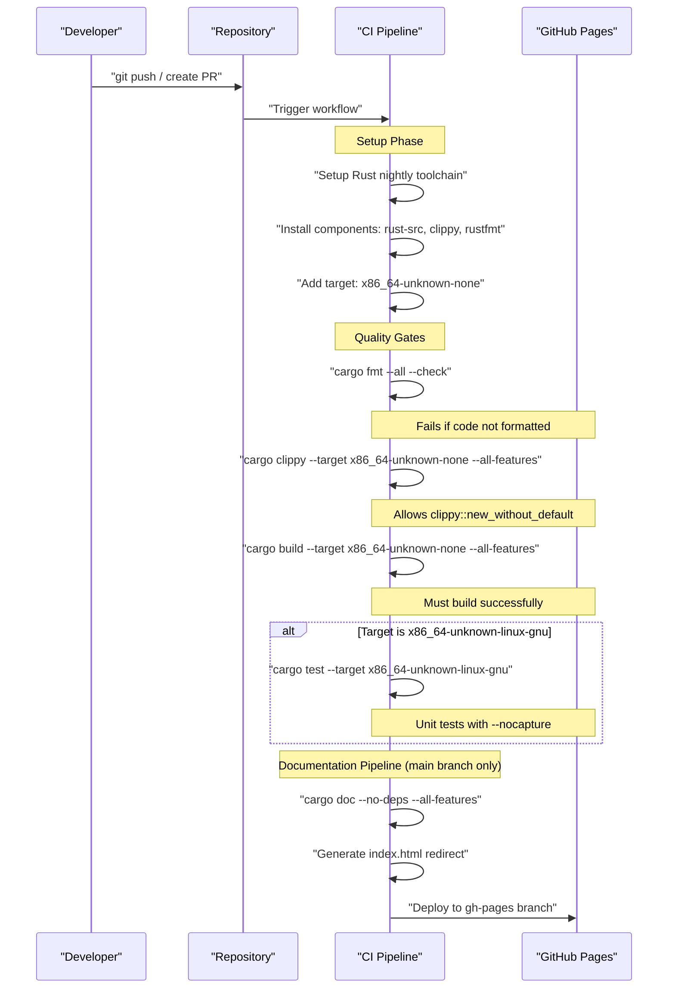
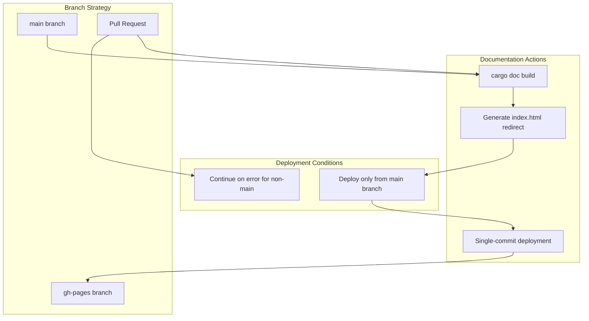
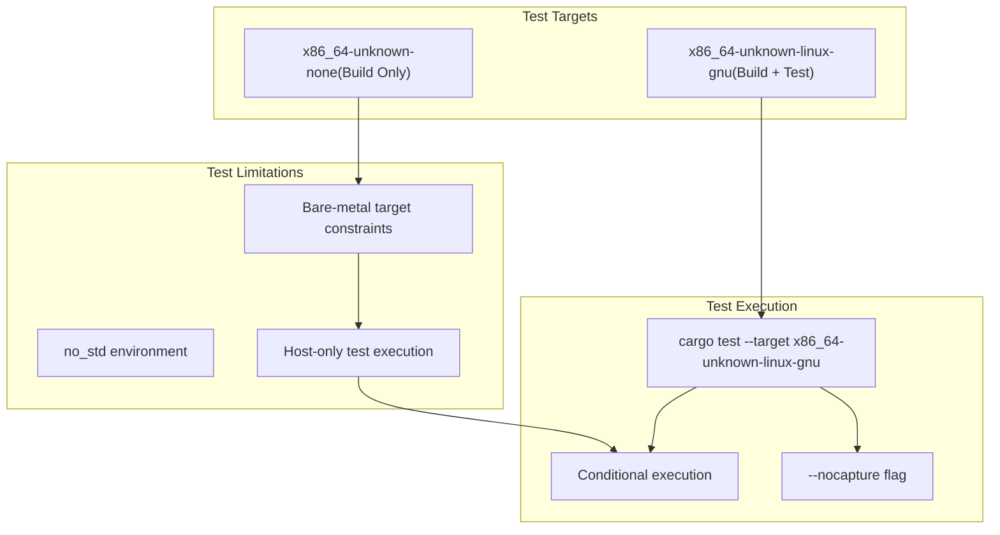
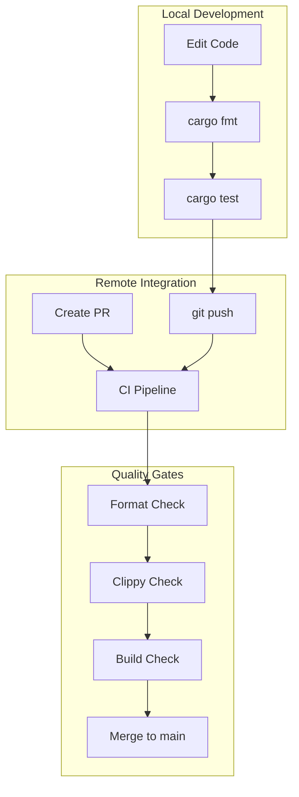

# Development and Project Management

> **Relevant source files**
> * [.github/workflows/ci.yml](https://github.com/arceos-hypervisor/x86_vlapic/blob/9b85fb9d/.github/workflows/ci.yml)
> * [.gitignore](https://github.com/arceos-hypervisor/x86_vlapic/blob/9b85fb9d/.gitignore)

This page documents the development workflow, continuous integration pipeline, build configuration, and testing procedures for the x86_vlapic crate. It covers the automated processes that ensure code quality, build consistency, and documentation deployment.

For information about the core system architecture and components, see [Core Architecture](/arceos-hypervisor/x86_vlapic/2-core-architecture). For details about the register system implementation, see [Register System](/arceos-hypervisor/x86_vlapic/3-register-system).

## CI/CD Pipeline Overview

The x86_vlapic project uses GitHub Actions for continuous integration and deployment. The pipeline is designed to ensure code quality, build consistency across targets, and automated documentation deployment.

### Pipeline Architecture



Sources: [.github/workflows/ci.yml(L1 - L56)&emsp;](https://github.com/arceos-hypervisor/x86_vlapic/blob/9b85fb9d/.github/workflows/ci.yml#L1-L56)

### Toolchain Configuration

The project requires specific Rust toolchain configuration to support the bare-metal x86 target:

|Component|Configuration|Purpose|
| --- | --- | --- |
|Toolchain|nightly|Required for no_std features and advanced compiler options|
|Target|x86_64-unknown-none|Bare-metal x86_64 target for hypervisor environments|
|Components|rust-src|Source code for core library compilation|
|Components|clippy|Linting and code analysis|
|Components|rustfmt|Code formatting enforcement|

Sources: [.github/workflows/ci.yml(L11 - L19)&emsp;](https://github.com/arceos-hypervisor/x86_vlapic/blob/9b85fb9d/.github/workflows/ci.yml#L11-L19)

## Build Process and Quality Checks

### Code Quality Workflow



Sources: [.github/workflows/ci.yml(L20 - L31)&emsp;](https://github.com/arceos-hypervisor/x86_vlapic/blob/9b85fb9d/.github/workflows/ci.yml#L20-L31) [.github/workflows/ci.yml(L44 - L55)&emsp;](https://github.com/arceos-hypervisor/x86_vlapic/blob/9b85fb9d/.github/workflows/ci.yml#L44-L55)

### Linting Configuration

The project uses specific Clippy configuration to balance code quality with practical considerations:

```
cargo clippy --target x86_64-unknown-none --all-features -- -A clippy::new_without_default
```

The `-A clippy::new_without_default` flag allows `new()` methods without requiring `Default` implementation, which is common in device driver patterns.

Sources: [.github/workflows/ci.yml(L25)&emsp;](https://github.com/arceos-hypervisor/x86_vlapic/blob/9b85fb9d/.github/workflows/ci.yml#L25-L25)

## Documentation Management

### Documentation Build Process

The documentation pipeline includes special configuration for comprehensive API documentation:

|Configuration|Value|Purpose|
| --- | --- | --- |
|RUSTDOCFLAGS|-D rustdoc::broken_intra_doc_links|Fail on broken internal links|
|RUSTDOCFLAGS|-D missing-docs|Require documentation for all public items|
|Build flags|--no-deps --all-features|Generate docs only for this crate with all features|

Sources: [.github/workflows/ci.yml(L40)&emsp;](https://github.com/arceos-hypervisor/x86_vlapic/blob/9b85fb9d/.github/workflows/ci.yml#L40-L40) [.github/workflows/ci.yml(L47)&emsp;](https://github.com/arceos-hypervisor/x86_vlapic/blob/9b85fb9d/.github/workflows/ci.yml#L47-L47)

### Documentation Deployment Strategy



Sources: [.github/workflows/ci.yml(L45)&emsp;](https://github.com/arceos-hypervisor/x86_vlapic/blob/9b85fb9d/.github/workflows/ci.yml#L45-L45) [.github/workflows/ci.yml(L50 - L55)&emsp;](https://github.com/arceos-hypervisor/x86_vlapic/blob/9b85fb9d/.github/workflows/ci.yml#L50-L55)

## Testing Framework

### Test Execution Strategy

The testing approach is target-specific due to the bare-metal nature of the codebase:



Sources: [.github/workflows/ci.yml(L28 - L30)&emsp;](https://github.com/arceos-hypervisor/x86_vlapic/blob/9b85fb9d/.github/workflows/ci.yml#L28-L30)

## Development Workflow

### Recommended Development Process

|Step|Command|Purpose|
| --- | --- | --- |
|1. Format|cargo fmt --all|Ensure consistent code formatting|
|2. Lint|cargo clippy --target x86_64-unknown-none --all-features|Check for common issues|
|3. Build|cargo build --target x86_64-unknown-none --all-features|Verify compilation|
|4. Test|cargo test(on host)|Run unit tests if available|
|5. Document|cargo doc --all-features|Generate and verify documentation|

### Repository Management

The project follows standard Git practices with specific CI integration:



Sources: [.github/workflows/ci.yml(L3)&emsp;](https://github.com/arceos-hypervisor/x86_vlapic/blob/9b85fb9d/.github/workflows/ci.yml#L3-L3) [.gitignore(L1 - L5)&emsp;](https://github.com/arceos-hypervisor/x86_vlapic/blob/9b85fb9d/.gitignore#L1-L5)

### Build Artifacts and Exclusions

The `.gitignore` configuration excludes standard Rust build artifacts and development tools:

* `/target` - Cargo build output directory
* `/.vscode` - Visual Studio Code workspace files
* `.DS_Store` - macOS system files
* `Cargo.lock` - Lock file (typically excluded for libraries)

Sources: [.gitignore(L1 - L5)&emsp;](https://github.com/arceos-hypervisor/x86_vlapic/blob/9b85fb9d/.gitignore#L1-L5)

This configuration ensures that only source code and essential project files are tracked in version control, while build artifacts and editor-specific files are excluded.