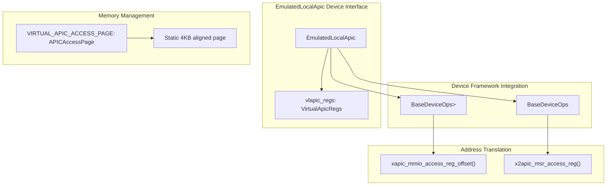
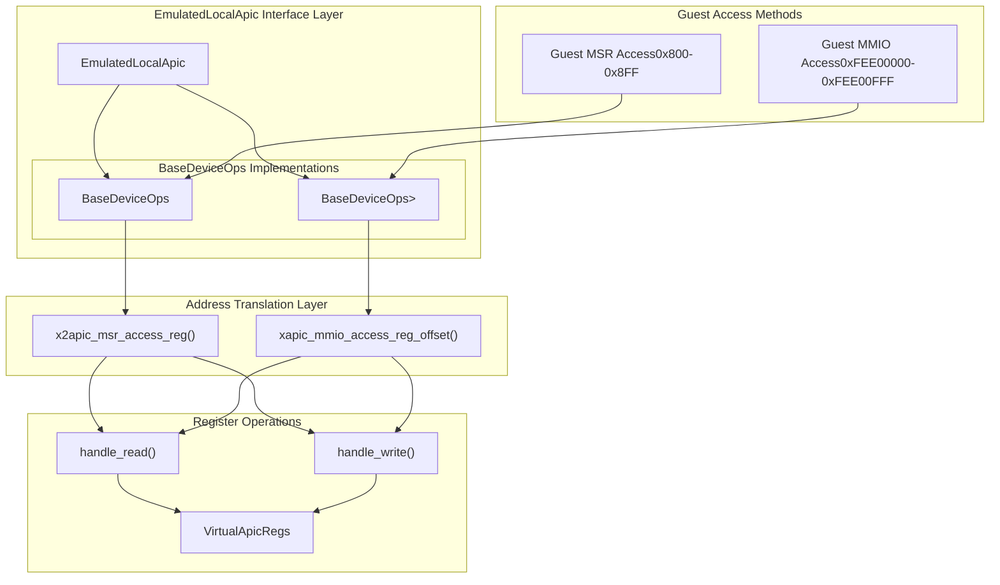
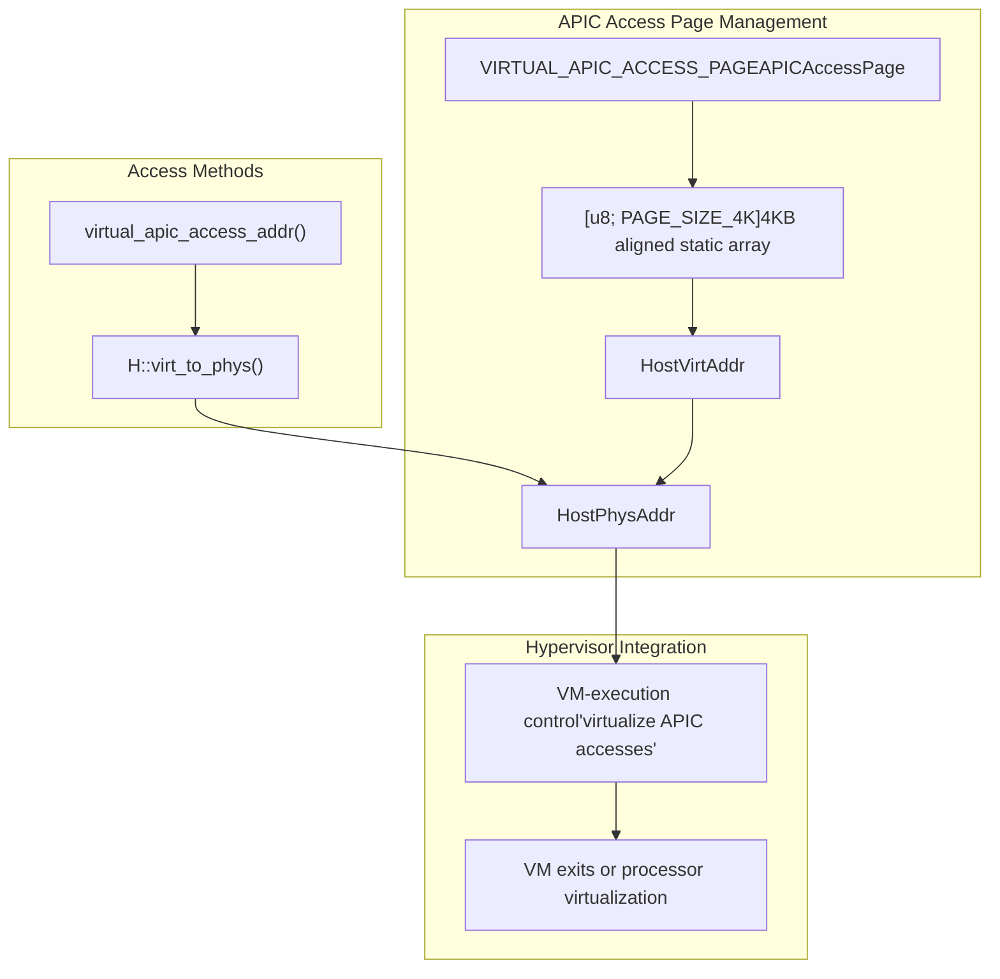
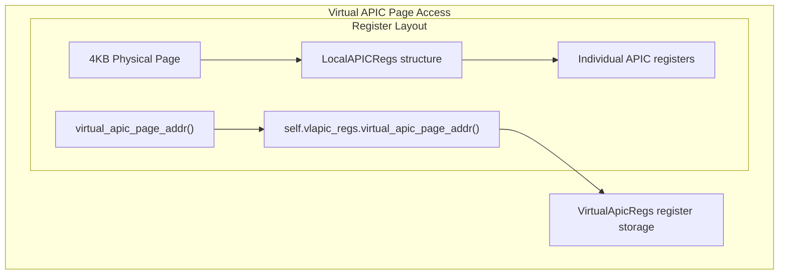
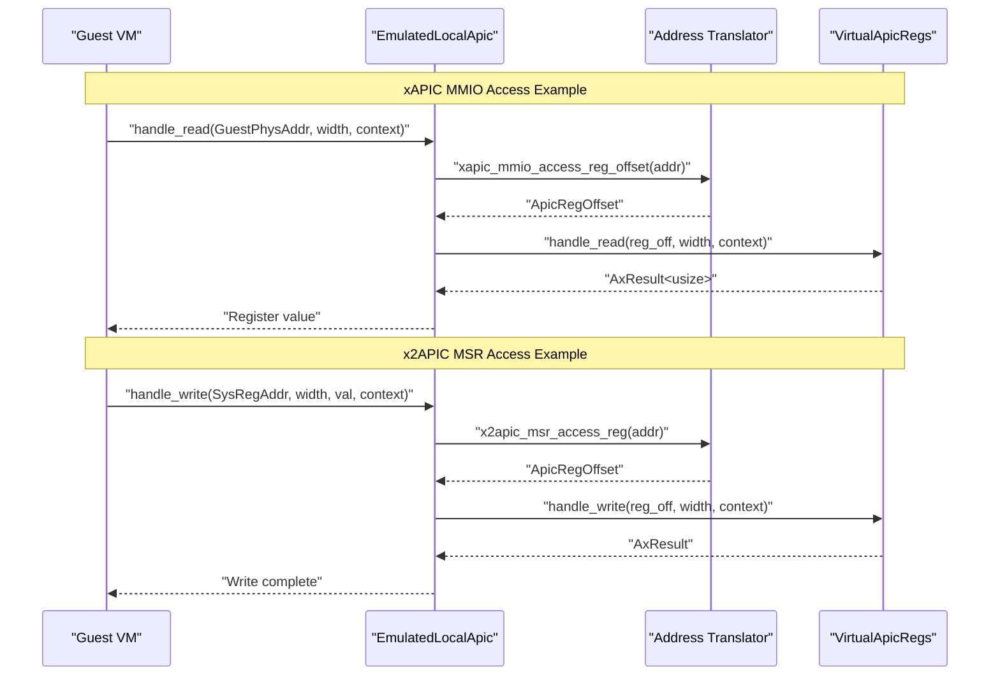

# EmulatedLocalApic Device Interface

> **Relevant source files**
> * [src/lib.rs](https://github.com/arceos-hypervisor/x86_vlapic/blob/9b85fb9d/src/lib.rs)

## Purpose and Scope

This document covers the `EmulatedLocalApic` struct, which serves as the primary device interface for virtual Local APIC emulation in the x86_vlapic crate. The `EmulatedLocalApic` implements the `BaseDeviceOps` trait twice to provide unified handling for both xAPIC MMIO accesses and x2APIC MSR accesses, while delegating actual register operations to the underlying virtual register management system.

For details on the virtual register management system that `EmulatedLocalApic` delegates to, see [Virtual Register Management](/arceos-hypervisor/x86_vlapic/2.2-virtual-register-management). For information about address translation mechanisms, see [Register Address Translation](/arceos-hypervisor/x86_vlapic/2.3-register-address-translation).

## Core EmulatedLocalApic Structure

The `EmulatedLocalApic` struct is a thin wrapper around the virtual register management system that provides the device interface layer required by the ArceOS hypervisor framework.

**EmulatedLocalApic Structure Components**

|Component|Type|Purpose|
| --- | --- | --- |
|vlapic_regs|VirtualApicRegs<H>|Manages actual APIC register virtualization and storage|

The struct uses a generic type parameter `H: AxMmHal` to integrate with the ArceOS memory management abstraction layer.

**Sources:** [src/lib.rs(L33 - L35)&emsp;](https://github.com/arceos-hypervisor/x86_vlapic/blob/9b85fb9d/src/lib.rs#L33-L35) [src/lib.rs(L39 - L43)&emsp;](https://github.com/arceos-hypervisor/x86_vlapic/blob/9b85fb9d/src/lib.rs#L39-L43)

## Device Interface Implementation

The `EmulatedLocalApic` implements `BaseDeviceOps` twice to handle the two distinct access methods for Local APIC registers: xAPIC memory-mapped I/O and x2APIC model-specific registers.

### Dual Interface Architecture

**Sources:** [src/lib.rs(L67 - L112)&emsp;](https://github.com/arceos-hypervisor/x86_vlapic/blob/9b85fb9d/src/lib.rs#L67-L112) [src/lib.rs(L114 - L159)&emsp;](https://github.com/arceos-hypervisor/x86_vlapic/blob/9b85fb9d/src/lib.rs#L114-L159)

### xAPIC MMIO Interface

The xAPIC interface handles memory-mapped I/O accesses in the traditional Local APIC address range.

**Interface Configuration**

|Property|Value|Description|
| --- | --- | --- |
|Address Range|0xFEE00000 - 0xFEE00FFF|4KB MMIO region for xAPIC registers|
|Device Type|EmuDeviceTInterruptController|Identifies as interrupt controller device|
|Access Translation|xapic_mmio_access_reg_offset()|ConvertsGuestPhysAddrtoApicRegOffset|

**Access Flow**

1. Guest performs MMIO read/write to xAPIC address range
2. `handle_read()` or `handle_write()` called with `GuestPhysAddr`
3. Address translated via `xapic_mmio_access_reg_offset()`
4. Operation delegated to `VirtualApicRegs::handle_read()/handle_write()`

**Sources:** [src/lib.rs(L67 - L112)&emsp;](https://github.com/arceos-hypervisor/x86_vlapic/blob/9b85fb9d/src/lib.rs#L67-L112) [src/lib.rs(L90 - L91)&emsp;](https://github.com/arceos-hypervisor/x86_vlapic/blob/9b85fb9d/src/lib.rs#L90-L91) [src/lib.rs(L105 - L106)&emsp;](https://github.com/arceos-hypervisor/x86_vlapic/blob/9b85fb9d/src/lib.rs#L105-L106)

### x2APIC MSR Interface

The x2APIC interface handles model-specific register accesses for the extended Local APIC mode.

**Interface Configuration**

|Property|Value|Description|
| --- | --- | --- |
|Address Range|0x800 - 0x8FF|MSR range for x2APIC registers|
|Device Type|EmuDeviceTInterruptController|Identifies as interrupt controller device|
|Access Translation|x2apic_msr_access_reg()|ConvertsSysRegAddrtoApicRegOffset|

**Access Flow**

1. Guest performs MSR read/write to x2APIC address range
2. `handle_read()` or `handle_write()` called with `SysRegAddr`
3. Address translated via `x2apic_msr_access_reg()`
4. Operation delegated to `VirtualApicRegs::handle_read()/handle_write()`

**Sources:** [src/lib.rs(L114 - L159)&emsp;](https://github.com/arceos-hypervisor/x86_vlapic/blob/9b85fb9d/src/lib.rs#L114-L159) [src/lib.rs(L137 - L138)&emsp;](https://github.com/arceos-hypervisor/x86_vlapic/blob/9b85fb9d/src/lib.rs#L137-L138) [src/lib.rs(L152 - L153)&emsp;](https://github.com/arceos-hypervisor/x86_vlapic/blob/9b85fb9d/src/lib.rs#L152-L153)

## Memory Management

The `EmulatedLocalApic` manages two distinct 4KB memory pages for virtual Local APIC functionality, each serving different purposes in the virtualization architecture.

### APIC Access Page

The APIC access page is a static 4KB page used by hardware virtualization features to control guest access to the APIC MMIO region.

**APIC Access Page Characteristics**

|Property|Value|Purpose|
| --- | --- | --- |
|Type|APICAccessPage|4KB aligned wrapper around byte array|
|Alignment|4096 bytes|Required by hardware virtualization|
|Initialization|Zero-filled|Safe default state|
|Scope|Static global|Shared across all EmulatedLocalApic instances|

**Sources:** [src/lib.rs(L27 - L30)&emsp;](https://github.com/arceos-hypervisor/x86_vlapic/blob/9b85fb9d/src/lib.rs#L27-L30) [src/lib.rs(L47 - L56)&emsp;](https://github.com/arceos-hypervisor/x86_vlapic/blob/9b85fb9d/src/lib.rs#L47-L56)

### Virtual APIC Page

The virtual APIC page contains the actual register storage and is managed by the `VirtualApicRegs` component.

The virtual APIC page provides the actual register storage that guests read from and write to during APIC operations.

**Sources:** [src/lib.rs(L58 - L64)&emsp;](https://github.com/arceos-hypervisor/x86_vlapic/blob/9b85fb9d/src/lib.rs#L58-L64)

## Address Translation and Delegation

The `EmulatedLocalApic` acts as an address translation layer, converting guest addresses to register offsets before delegating operations to the virtual register system.

### Translation Architecture

**Translation Functions**

|Function|Input Type|Output Type|Purpose|
| --- | --- | --- | --- |
|xapic_mmio_access_reg_offset()|GuestPhysAddr|ApicRegOffset|Convert xAPIC MMIO address to register offset|
|x2apic_msr_access_reg()|SysRegAddr|ApicRegOffset|Convert x2APIC MSR address to register offset|

Both translation functions convert different address formats to the unified `ApicRegOffset` enum used by the virtual register system.

**Sources:** [src/lib.rs(L23 - L24)&emsp;](https://github.com/arceos-hypervisor/x86_vlapic/blob/9b85fb9d/src/lib.rs#L23-L24) [src/lib.rs(L90 - L91)&emsp;](https://github.com/arceos-hypervisor/x86_vlapic/blob/9b85fb9d/src/lib.rs#L90-L91) [src/lib.rs(L105 - L106)&emsp;](https://github.com/arceos-hypervisor/x86_vlapic/blob/9b85fb9d/src/lib.rs#L105-L106) [src/lib.rs(L137 - L138)&emsp;](https://github.com/arceos-hypervisor/x86_vlapic/blob/9b85fb9d/src/lib.rs#L137-L138) [src/lib.rs(L152 - L153)&emsp;](https://github.com/arceos-hypervisor/x86_vlapic/blob/9b85fb9d/src/lib.rs#L152-L153)