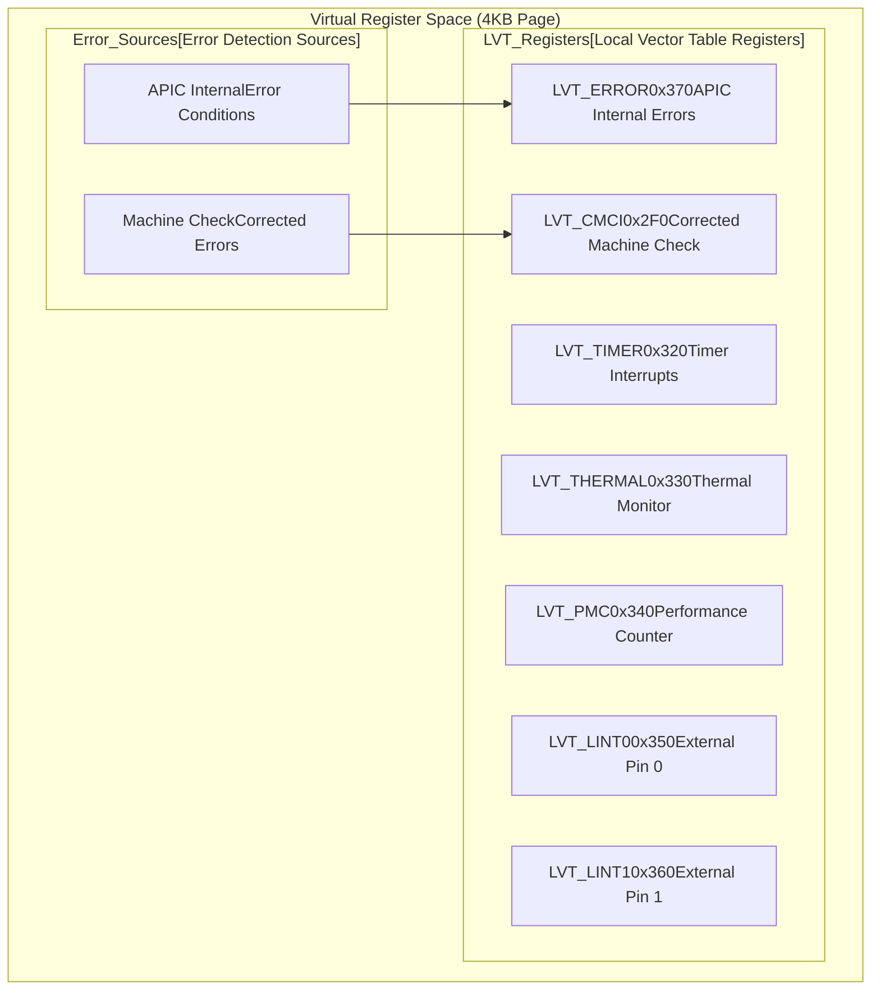
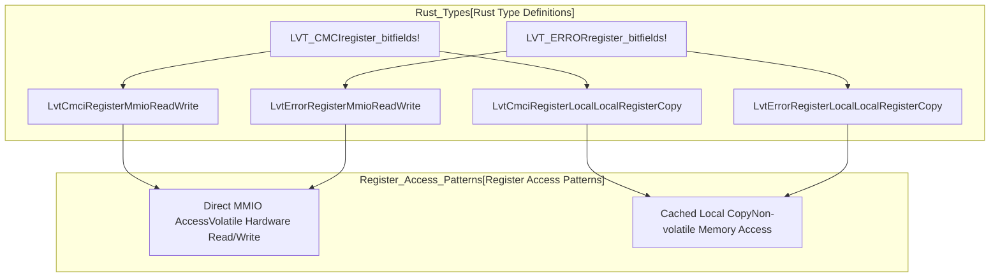
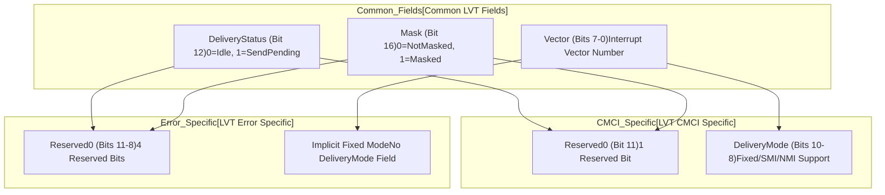
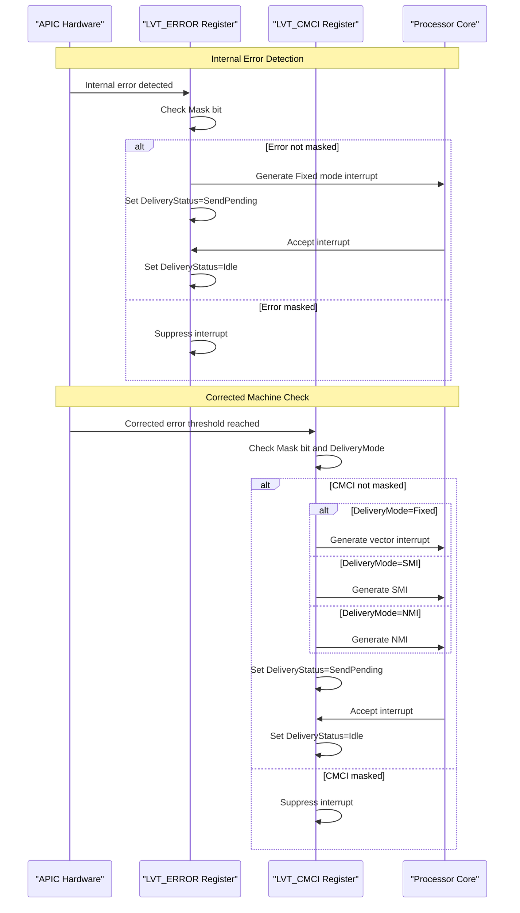

# Error Handling LVT Registers

> **Relevant source files**
> * [src/regs/lvt/cmci.rs](https://github.com/arceos-hypervisor/x86_vlapic/blob/9b85fb9d/src/regs/lvt/cmci.rs)
> * [src/regs/lvt/error.rs](https://github.com/arceos-hypervisor/x86_vlapic/blob/9b85fb9d/src/regs/lvt/error.rs)

This document covers the two Local Vector Table (LVT) registers responsible for error handling in the virtual LAPIC implementation: the LVT Error Register and the LVT CMCI (Corrected Machine Check Interrupt) Register. These registers configure interrupt delivery for APIC internal errors and corrected machine check errors respectively.

For information about other LVT registers such as timer and external interrupt pins, see [Timer LVT Register](/arceos-hypervisor/x86_vlapic/3.2.1-timer-lvt-register) and [External Interrupt Pin Registers](/arceos-hypervisor/x86_vlapic/3.2.2-external-interrupt-pin-registers). For system monitoring LVT registers, see [System Monitoring LVT Registers](/arceos-hypervisor/x86_vlapic/3.2.3-system-monitoring-lvt-registers).

## Error Handling LVT Architecture

The error handling LVT registers are part of the broader LVT subsystem and provide interrupt configuration for different types of error conditions detected by the APIC.

### Error Handling LVT Position in Register Space

**Sources:** [src/regs/lvt/error.rs(L35 - L36)&emsp;](https://github.com/arceos-hypervisor/x86_vlapic/blob/9b85fb9d/src/regs/lvt/error.rs#L35-L36) [src/regs/lvt/cmci.rs(L62 - L65)&emsp;](https://github.com/arceos-hypervisor/x86_vlapic/blob/9b85fb9d/src/regs/lvt/cmci.rs#L62-L65)

### Code Entity Mapping

**Sources:** [src/regs/lvt/error.rs(L37 - L44)&emsp;](https://github.com/arceos-hypervisor/x86_vlapic/blob/9b85fb9d/src/regs/lvt/error.rs#L37-L44) [src/regs/lvt/cmci.rs(L66 - L73)&emsp;](https://github.com/arceos-hypervisor/x86_vlapic/blob/9b85fb9d/src/regs/lvt/cmci.rs#L66-L73)

## LVT Error Register

The LVT Error Register handles interrupts generated when the APIC detects internal error conditions. It is located at offset `0x370` in the APIC register space.

### Register Structure

|Bits|Field|Description|
| --- | --- | --- |
|31-17|Reserved2|Reserved bits|
|16|Mask|Interrupt mask (0=NotMasked, 1=Masked)|
|15-13|Reserved1|Reserved bits|
|12|DeliveryStatus|Read-only delivery status (0=Idle, 1=SendPending)|
|11-8|Reserved0|Reserved bits|
|7-0|Vector|Interrupt vector number|

The LVT Error Register has a simplified structure compared to other LVT registers, lacking delivery mode configuration since error interrupts are always delivered using Fixed mode.

### Key Characteristics

* **Fixed Delivery Mode Only**: Unlike the CMCI register, the Error register implicitly uses Fixed delivery mode
* **Simple Configuration**: Only requires vector number and mask bit configuration
* **Internal Error Detection**: Triggers on APIC hardware-detected error conditions
* **Read-Only Status**: The `DeliveryStatus` field provides read-only interrupt delivery state

**Sources:** [src/regs/lvt/error.rs(L5 - L33)&emsp;](https://github.com/arceos-hypervisor/x86_vlapic/blob/9b85fb9d/src/regs/lvt/error.rs#L5-L33) [src/regs/lvt/error.rs(L35 - L36)&emsp;](https://github.com/arceos-hypervisor/x86_vlapic/blob/9b85fb9d/src/regs/lvt/error.rs#L35-L36)

## LVT CMCI Register

The LVT CMCI (Corrected Machine Check Interrupt) Register handles interrupts for corrected machine check errors when error counts reach threshold values. It is located at offset `0x2F0` in the APIC register space.

### Register Structure

|Bits|Field|Description|
| --- | --- | --- |
|31-17|Reserved2|Reserved bits|
|16|Mask|Interrupt mask (0=NotMasked, 1=Masked)|
|15-13|Reserved1|Reserved bits|
|12|DeliveryStatus|Read-only delivery status (0=Idle, 1=SendPending)|
|11|Reserved0|Reserved bit|
|10-8|DeliveryMode|Interrupt delivery mode|
|7-0|Vector|Interrupt vector number|

### Delivery Modes

The CMCI register supports multiple delivery modes for flexible error handling:

|Mode|Binary|Description|Supported|
| --- | --- | --- | --- |
|Fixed|000|Delivers interrupt specified in vector field|✓|
|SMI|010|System Management Interrupt|✓|
|NMI|100|Non-Maskable Interrupt|✓|
|INIT|101|Initialization request|✗|
|Reserved|110|Not supported|✗|
|ExtINT|111|External interrupt controller|✗|

**Note**: INIT and ExtINT delivery modes are explicitly not supported for the CMCI register.

**Sources:** [src/regs/lvt/cmci.rs(L5 - L60)&emsp;](https://github.com/arceos-hypervisor/x86_vlapic/blob/9b85fb9d/src/regs/lvt/cmci.rs#L5-L60) [src/regs/lvt/cmci.rs(L44 - L45)&emsp;](https://github.com/arceos-hypervisor/x86_vlapic/blob/9b85fb9d/src/regs/lvt/cmci.rs#L44-L45) [src/regs/lvt/cmci.rs(L54 - L55)&emsp;](https://github.com/arceos-hypervisor/x86_vlapic/blob/9b85fb9d/src/regs/lvt/cmci.rs#L54-L55)

## Register Field Comparison

**Sources:** [src/regs/lvt/error.rs(L10 - L31)&emsp;](https://github.com/arceos-hypervisor/x86_vlapic/blob/9b85fb9d/src/regs/lvt/error.rs#L10-L31) [src/regs/lvt/cmci.rs(L10 - L58)&emsp;](https://github.com/arceos-hypervisor/x86_vlapic/blob/9b85fb9d/src/regs/lvt/cmci.rs#L10-L58)

## Error Handling Workflow

The error handling LVT registers integrate into the broader APIC interrupt delivery system to handle different categories of errors:

**Sources:** [src/regs/lvt/error.rs(L18 - L27)&emsp;](https://github.com/arceos-hypervisor/x86_vlapic/blob/9b85fb9d/src/regs/lvt/error.rs#L18-L27) [src/regs/lvt/cmci.rs(L18 - L27)&emsp;](https://github.com/arceos-hypervisor/x86_vlapic/blob/9b85fb9d/src/regs/lvt/cmci.rs#L18-L27) [src/regs/lvt/cmci.rs(L32 - L56)&emsp;](https://github.com/arceos-hypervisor/x86_vlapic/blob/9b85fb9d/src/regs/lvt/cmci.rs#L32-L56)

## Register Type Definitions

Both registers provide dual access patterns through the tock-registers framework:

* **MMIO Types**: `LvtErrorRegisterMmio` and `LvtCmciRegisterMmio` for direct hardware access
* **Local Copy Types**: `LvtErrorRegisterLocal` and `LvtCmciRegisterLocal` for cached register copies

The local copy types enable efficient register manipulation without volatile MMIO operations for each access, which is particularly useful in virtualization scenarios where register state is maintained in memory.

**Sources:** [src/regs/lvt/error.rs(L37 - L44)&emsp;](https://github.com/arceos-hypervisor/x86_vlapic/blob/9b85fb9d/src/regs/lvt/error.rs#L37-L44) [src/regs/lvt/cmci.rs(L66 - L73)&emsp;](https://github.com/arceos-hypervisor/x86_vlapic/blob/9b85fb9d/src/regs/lvt/cmci.rs#L66-L73)