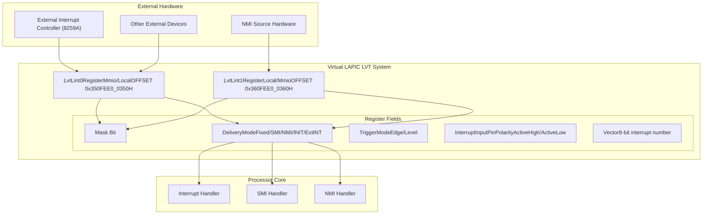
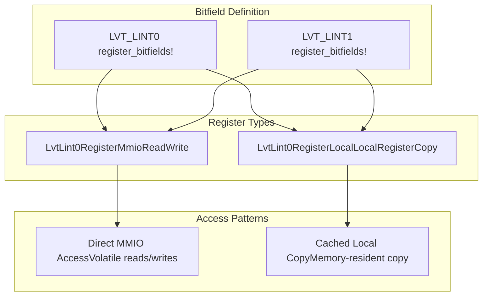

# External Interrupt Pin Registers

> **Relevant source files**
> * [src/regs/lvt/lint0.rs](https://github.com/arceos-hypervisor/x86_vlapic/blob/9b85fb9d/src/regs/lvt/lint0.rs)
> * [src/regs/lvt/lint1.rs](https://github.com/arceos-hypervisor/x86_vlapic/blob/9b85fb9d/src/regs/lvt/lint1.rs)

This document covers the LINT0 and LINT1 Local Vector Table (LVT) registers, which handle external interrupt pins in the virtual LAPIC implementation. These registers configure how the APIC responds to interrupts signaled through external hardware interrupt pins.

For information about other LVT registers like timer and thermal monitoring, see [Timer LVT Register](/arceos-hypervisor/x86_vlapic/3.2.1-timer-lvt-register) and [System Monitoring LVT Registers](/arceos-hypervisor/x86_vlapic/3.2.3-system-monitoring-lvt-registers).

## Overview

The LINT0 and LINT1 registers are part of the Local Vector Table that configure external interrupt pin behavior. LINT0 is typically used for external interrupt controllers (like the legacy 8259A PIC), while LINT1 is commonly configured for NMI delivery from external sources.

Both registers share identical field layouts but serve different interrupt pins and have some operational constraints:

* LINT0 supports all delivery modes and trigger configurations
* LINT1 should always use edge-sensitive triggering and does not support level-sensitive interrupts

Sources: [src/regs/lvt/lint0.rs(L88 - L90)&emsp;](https://github.com/arceos-hypervisor/x86_vlapic/blob/9b85fb9d/src/regs/lvt/lint0.rs#L88-L90) [src/regs/lvt/lint1.rs(L88 - L90)&emsp;](https://github.com/arceos-hypervisor/x86_vlapic/blob/9b85fb9d/src/regs/lvt/lint1.rs#L88-L90)

## Register Structure and Implementation

Both LINT0 and LINT1 registers implement identical 32-bit layouts using the `tock_registers` framework. The implementation provides both MMIO and local cached register types.

Sources: [src/regs/lvt/lint0.rs(L1 - L4)&emsp;](https://github.com/arceos-hypervisor/x86_vlapic/blob/9b85fb9d/src/regs/lvt/lint0.rs#L1-L4) [src/regs/lvt/lint0.rs(L90 - L97)&emsp;](https://github.com/arceos-hypervisor/x86_vlapic/blob/9b85fb9d/src/regs/lvt/lint0.rs#L90-L97) [src/regs/lvt/lint1.rs(L90 - L97)&emsp;](https://github.com/arceos-hypervisor/x86_vlapic/blob/9b85fb9d/src/regs/lvt/lint1.rs#L90-L97)

### Register Field Layout

|Bits|Field|Description|Values|
| --- | --- | --- | --- |
|31-17|Reserved1|Reserved bits|Must be 0|
|16|Mask|Enable/disable interrupt|0=NotMasked, 1=Masked|
|15|TriggerMode|Edge or level sensitive|0=EdgeSensitive, 1=LevelSensitive|
|14|RemoteIRR|Remote IRR flag (RO)|Set when interrupt accepted|
|13|InterruptInputPinPolarity|Pin polarity|0=ActiveHigh, 1=ActiveLow|
|12|DeliveryStatus|Delivery status (RO)|0=Idle, 1=SendPending|
|11|Reserved0|Reserved|Must be 0|
|10-8|DeliveryMode|Interrupt delivery type|See delivery modes table|
|7-0|Vector|Interrupt vector number|0-255|

Sources: [src/regs/lvt/lint0.rs(L7 - L86)&emsp;](https://github.com/arceos-hypervisor/x86_vlapic/blob/9b85fb9d/src/regs/lvt/lint0.rs#L7-L86) [src/regs/lvt/lint1.rs(L7 - L86)&emsp;](https://github.com/arceos-hypervisor/x86_vlapic/blob/9b85fb9d/src/regs/lvt/lint1.rs#L7-L86)

## Delivery Modes

The `DeliveryMode` field determines how the interrupt is delivered to the processor core. Different modes serve different purposes in the interrupt handling system.

|Mode|Value|Description|Vector Usage|
| --- | --- | --- | --- |
|Fixed|000b|Standard interrupt delivery|Uses Vector field|
|SMI|010b|System Management Interrupt|Vector should be 00H|
|NMI|100b|Non-Maskable Interrupt|Vector ignored|
|INIT|101b|Processor initialization|Vector should be 00H|
|ExtINT|111b|External interrupt controller|Vector from external controller|

### Delivery Mode Constraints

* **Fixed Mode**: Most common mode, uses the vector field to specify interrupt number
* **SMI Mode**: Triggers System Management Mode entry, vector field ignored
* **NMI Mode**: Generates non-maskable interrupt, bypasses interrupt masking
* **INIT Mode**: Causes processor reset/initialization, not supported for thermal/PMC/CMCI registers
* **ExtINT Mode**: Compatibility with 8259A-style external controllers, only one system-wide ExtINT source allowed

Sources: [src/regs/lvt/lint0.rs(L56 - L82)&emsp;](https://github.com/arceos-hypervisor/x86_vlapic/blob/9b85fb9d/src/regs/lvt/lint0.rs#L56-L82) [src/regs/lvt/lint1.rs(L56 - L82)&emsp;](https://github.com/arceos-hypervisor/x86_vlapic/blob/9b85fb9d/src/regs/lvt/lint1.rs#L56-L82)

## Trigger Mode and Polarity Configuration

The trigger mode and polarity settings determine how the APIC interprets signals on the LINT pins.

### Trigger Mode Behavior

* **Edge Sensitive (0)**: Interrupt triggered on signal transition
* **Level Sensitive (1)**: Interrupt triggered while signal is active

**Important constraints:**

* LINT1 should always use edge-sensitive triggering
* Level-sensitive interrupts are not supported for LINT1
* Fixed delivery mode can use either trigger mode
* NMI, SMI, and INIT modes always use edge-sensitive triggering
* ExtINT mode always uses level-sensitive triggering

### Polarity Configuration

The `InterruptInputPinPolarity` field configures the active state of the interrupt pin:

* **ActiveHigh (0)**: Interrupt active when pin is high
* **ActiveLow (1)**: Interrupt active when pin is low

Sources: [src/regs/lvt/lint0.rs(L17 - L30)&emsp;](https://github.com/arceos-hypervisor/x86_vlapic/blob/9b85fb9d/src/regs/lvt/lint0.rs#L17-L30) [src/regs/lvt/lint0.rs(L36 - L43)&emsp;](https://github.com/arceos-hypervisor/x86_vlapic/blob/9b85fb9d/src/regs/lvt/lint0.rs#L36-L43) [src/regs/lvt/lint1.rs(L17 - L30)&emsp;](https://github.com/arceos-hypervisor/x86_vlapic/blob/9b85fb9d/src/regs/lvt/lint1.rs#L17-L30) [src/regs/lvt/lint1.rs(L36 - L43)&emsp;](https://github.com/arceos-hypervisor/x86_vlapic/blob/9b85fb9d/src/regs/lvt/lint1.rs#L36-L43)

## Status and Control Fields

### Delivery Status (Read-Only)

The `DeliveryStatus` field indicates the current state of interrupt delivery:

* **Idle (0)**: No pending activity or previous interrupt accepted
* **SendPending (1)**: Interrupt delivered to core but not yet accepted

### Remote IRR Flag (Read-Only)

For fixed mode, level-triggered interrupts, the `RemoteIRR` flag tracks interrupt servicing:

* Set when the local APIC accepts the interrupt
* Reset when an EOI command is received
* Undefined for edge-triggered interrupts and other delivery modes

### Mask Bit

The `Mask` field controls interrupt enabling:

* **NotMasked (0)**: Interrupt enabled
* **Masked (1)**: Interrupt disabled

Sources: [src/regs/lvt/lint0.rs(L10 - L16)&emsp;](https://github.com/arceos-hypervisor/x86_vlapic/blob/9b85fb9d/src/regs/lvt/lint0.rs#L10-L16) [src/regs/lvt/lint0.rs(L31 - L35)&emsp;](https://github.com/arceos-hypervisor/x86_vlapic/blob/9b85fb9d/src/regs/lvt/lint0.rs#L31-L35) [src/regs/lvt/lint0.rs(L44 - L54)&emsp;](https://github.com/arceos-hypervisor/x86_vlapic/blob/9b85fb9d/src/regs/lvt/lint0.rs#L44-L54)