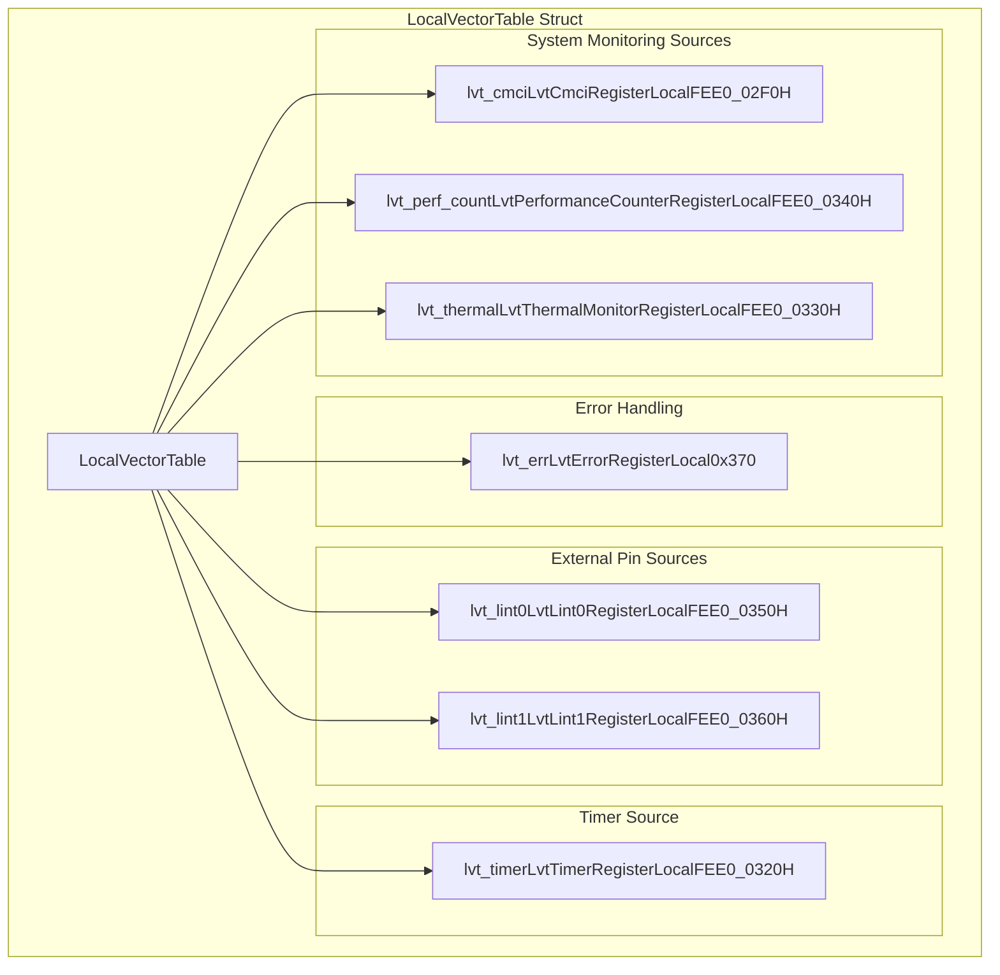
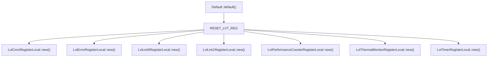
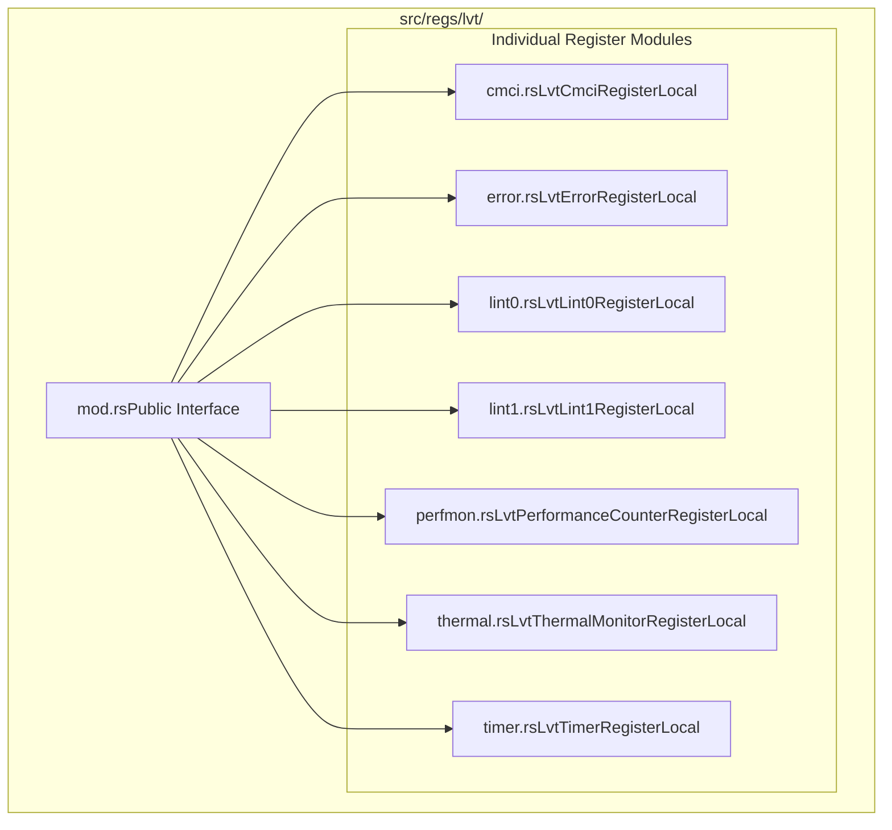

# Local Vector Table (LVT)

> **Relevant source files**
> * [src/lvt.rs](https://github.com/arceos-hypervisor/x86_vlapic/blob/9b85fb9d/src/lvt.rs)
> * [src/regs/lvt/mod.rs](https://github.com/arceos-hypervisor/x86_vlapic/blob/9b85fb9d/src/regs/lvt/mod.rs)

## Purpose and Scope

This document covers the Local Vector Table (LVT) subsystem within the x86_vlapic crate, which manages interrupt vector configuration for various local interrupt sources in the virtual Local APIC implementation. The LVT provides a standardized interface for configuring how different types of interrupts (timer, thermal, performance monitoring, external pins, errors) are delivered to the processor.

For detailed information about individual LVT register implementations, see [Timer LVT Register](/arceos-hypervisor/x86_vlapic/3.2.1-timer-lvt-register), [External Interrupt Pin Registers](/arceos-hypervisor/x86_vlapic/3.2.2-external-interrupt-pin-registers), [System Monitoring LVT Registers](/arceos-hypervisor/x86_vlapic/3.2.3-system-monitoring-lvt-registers), and [Error Handling LVT Registers](/arceos-hypervisor/x86_vlapic/3.2.4-error-handling-lvt-registers). For broader APIC register system context, see [Register System](/arceos-hypervisor/x86_vlapic/3-register-system).

## LVT Architecture Overview

The Local Vector Table consists of seven specialized registers that control different interrupt sources within the Local APIC. Each register follows a common structural pattern while providing source-specific functionality.

### LVT Register Layout

Sources: [src/lvt.rs(L9 - L24)&emsp;](https://github.com/arceos-hypervisor/x86_vlapic/blob/9b85fb9d/src/lvt.rs#L9-L24)

### Register Address Mapping

The LVT registers are mapped to specific offsets within the APIC register space:

|Register|Type|Address Offset|Purpose|
| --- | --- | --- | --- |
|lvt_cmci|LvtCmciRegisterLocal|FEE0_02F0H|Corrected Machine Check Interrupts|
|lvt_timer|LvtTimerRegisterLocal|FEE0_0320H|Local APIC Timer|
|lvt_thermal|LvtThermalMonitorRegisterLocal|FEE0_0330H|Thermal Monitoring|
|lvt_perf_count|LvtPerformanceCounterRegisterLocal|FEE0_0340H|Performance Counter Overflow|
|lvt_lint0|LvtLint0RegisterLocal|FEE0_0350H|External Interrupt Pin 0|
|lvt_lint1|LvtLint1RegisterLocal|FEE0_0360H|External Interrupt Pin 1|
|lvt_err|LvtErrorRegisterLocal|0x370|APIC Error Conditions|

Sources: [src/lvt.rs(L10 - L23)&emsp;](https://github.com/arceos-hypervisor/x86_vlapic/blob/9b85fb9d/src/lvt.rs#L10-L23)

## Common LVT Structure and Functionality

All LVT registers share a common architectural pattern using the `*RegisterLocal` type structure, which provides local cached copies of register values. This design enables efficient access while maintaining consistency with the underlying APIC register model.

### Initialization Pattern

Sources: [src/lvt.rs(L26 - L38)&emsp;](https://github.com/arceos-hypervisor/x86_vlapic/blob/9b85fb9d/src/lvt.rs#L26-L38)

All LVT registers are initialized with the same reset value `RESET_LVT_REG`, providing a consistent starting state across all interrupt sources. This ensures predictable behavior during system initialization and reset conditions.

## Register Organization

The LVT implementation follows a modular architecture where each register type is implemented in its own module, promoting code organization and maintainability.

### Module Structure

Sources: [src/regs/lvt/mod.rs(L1 - L16)&emsp;](https://github.com/arceos-hypervisor/x86_vlapic/blob/9b85fb9d/src/regs/lvt/mod.rs#L1-L16)

Each module implements a specific LVT register type with its unique functionality while maintaining the common interface pattern. The `mod.rs` file serves as the public interface, re-exporting all register types for use by the `LocalVectorTable` struct.

## Integration with Virtual APIC System

The `LocalVectorTable` is integrated into the broader virtual APIC register system through the `VirtualApicRegs` structure, where it manages all interrupt vector table functionality as a cohesive unit. This design separates interrupt configuration concerns from other APIC functionality while maintaining the standard APIC register interface.

Sources: [src/lvt.rs(L1 - L39)&emsp;](https://github.com/arceos-hypervisor/x86_vlapic/blob/9b85fb9d/src/lvt.rs#L1-L39) [src/regs/lvt/mod.rs(L1 - L16)&emsp;](https://github.com/arceos-hypervisor/x86_vlapic/blob/9b85fb9d/src/regs/lvt/mod.rs#L1-L16)