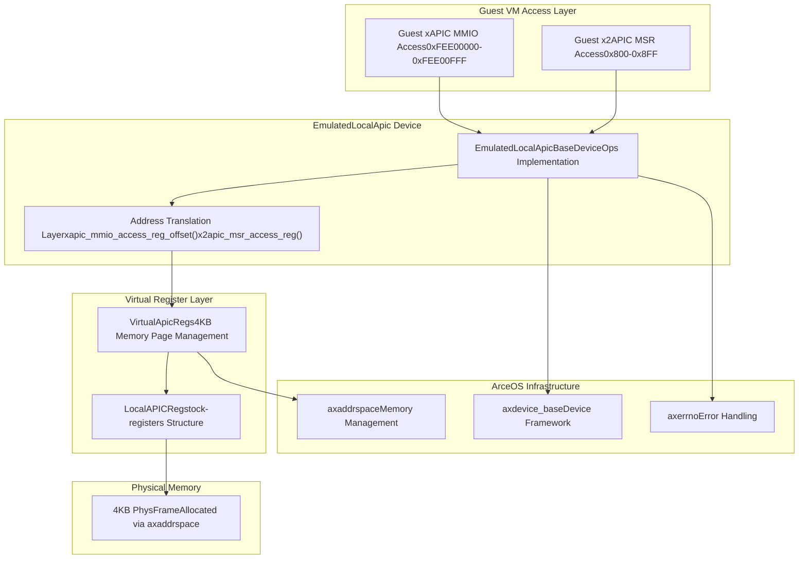
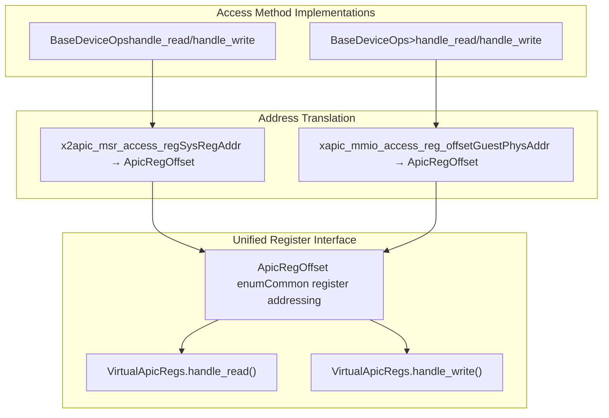

# Overview

> **Relevant source files**
> * [Cargo.toml](https://github.com/arceos-hypervisor/x86_vlapic/blob/9b85fb9d/Cargo.toml)
> * [src/lib.rs](https://github.com/arceos-hypervisor/x86_vlapic/blob/9b85fb9d/src/lib.rs)

## Purpose and Scope

The `x86_vlapic` crate provides a software implementation of a virtual Local Advanced Programmable Interrupt Controller (LAPIC) for x86 hypervisor systems. This crate enables hypervisors to emulate LAPIC functionality for guest virtual machines without requiring direct hardware access to the physical LAPIC.

The crate implements both legacy xAPIC (MMIO-based) and modern x2APIC (MSR-based) access methods, allowing guest VMs to interact with a fully functional virtual interrupt controller. For detailed information about the architectural design and component interactions, see [Core Architecture](/arceos-hypervisor/x86_vlapic/2-core-architecture). For comprehensive register documentation and functionality, see [Register System](/arceos-hypervisor/x86_vlapic/3-register-system).

## Virtual LAPIC Fundamentals

A Local APIC is a critical component in x86 multiprocessor systems that handles interrupt delivery, inter-processor communication, and timer functionality for each CPU core. In virtualized environments, guest operating systems expect to interact with LAPIC hardware, but direct hardware access would compromise isolation between virtual machines.

The `x86_vlapic` crate solves this by providing a software-based LAPIC implementation that:

* Virtualizes all standard LAPIC registers and functionality
* Supports both xAPIC MMIO accesses (address range `0xFEE00000-0xFEE00FFF`) and x2APIC MSR accesses (MSR range `0x800-0x8FF`)
* Manages interrupt state through virtualized register arrays (ISR, TMR, IRR)
* Implements Local Vector Table (LVT) registers for various interrupt sources
* Provides timer functionality with support for one-shot, periodic, and TSC-deadline modes

## High-Level System Architecture

Sources: [src/lib.rs(L32 - L44)&emsp;](https://github.com/arceos-hypervisor/x86_vlapic/blob/9b85fb9d/src/lib.rs#L32-L44) [Cargo.toml(L14 - L16)&emsp;](https://github.com/arceos-hypervisor/x86_vlapic/blob/9b85fb9d/Cargo.toml#L14-L16)

## Dual Access Method Support

The virtual LAPIC supports both traditional and modern CPU access methods through a unified interface:

### xAPIC Mode (MMIO-Based)

* **Address Range**: `0xFEE00000` to `0xFEE00FFF` (4KB)
* **Access Method**: Memory-mapped I/O through guest physical addresses
* **Implementation**: `BaseDeviceOps<AddrRange<GuestPhysAddr>>` trait
* **Translation Function**: `xapic_mmio_access_reg_offset()`

### x2APIC Mode (MSR-Based)

* **Address Range**: MSR `0x800` to `0x8FF`
* **Access Method**: Model-Specific Register instructions (RDMSR/WRMSR)
* **Implementation**: `BaseDeviceOps<SysRegAddrRange>` trait
* **Translation Function**: `x2apic_msr_access_reg()`

Sources: [src/lib.rs(L67 - L112)&emsp;](https://github.com/arceos-hypervisor/x86_vlapic/blob/9b85fb9d/src/lib.rs#L67-L112) [src/lib.rs(L114 - L159)&emsp;](https://github.com/arceos-hypervisor/x86_vlapic/blob/9b85fb9d/src/lib.rs#L114-L159) [src/lib.rs(L23 - L24)&emsp;](https://github.com/arceos-hypervisor/x86_vlapic/blob/9b85fb9d/src/lib.rs#L23-L24)

## Core Components

### EmulatedLocalApic Device

The `EmulatedLocalApic<H: AxMmHal>` struct serves as the primary device interface, implementing the ArceOS device framework through `BaseDeviceOps`. It coordinates between guest access requests and the underlying virtual register management system.

### VirtualApicRegs Management

The `VirtualApicRegs<H: AxMmHal>` component manages a 4KB memory page that contains all virtualized LAPIC registers. This page is structured according to the standard LAPIC register layout and uses the `tock-registers` crate for type-safe register access.

### Static APIC Access Page

A statically allocated 4KB page (`VIRTUAL_APIC_ACCESS_PAGE`) provides the foundation for hardware virtualization features. The address of this page can be configured in hardware virtualization controls to enable optimized guest access handling.

### Register System

The crate implements a comprehensive register system including:

* **Control Registers**: ID, Version, Task Priority Register (TPR), Spurious Interrupt Vector Register (SVR)
* **Interrupt State Arrays**: In-Service Register (ISR), Trigger Mode Register (TMR), Interrupt Request Register (IRR)
* **Local Vector Table**: Timer, Thermal, Performance Counter, LINT0/1, Error, CMCI registers
* **Timer Subsystem**: Initial Count, Current Count, Divide Configuration registers

Sources: [src/lib.rs(L27 - L30)&emsp;](https://github.com/arceos-hypervisor/x86_vlapic/blob/9b85fb9d/src/lib.rs#L27-L30) [src/lib.rs(L33 - L43)&emsp;](https://github.com/arceos-hypervisor/x86_vlapic/blob/9b85fb9d/src/lib.rs#L33-L43) [src/lib.rs(L47 - L64)&emsp;](https://github.com/arceos-hypervisor/x86_vlapic/blob/9b85fb9d/src/lib.rs#L47-L64) [Cargo.toml(L7 - L16)&emsp;](https://github.com/arceos-hypervisor/x86_vlapic/blob/9b85fb9d/Cargo.toml#L7-L16)

## Dependencies and Integration

The crate integrates with the ArceOS hypervisor ecosystem through several key dependencies:

|Component|Purpose|Usage|
| --- | --- | --- |
|axaddrspace|Memory management and address space operations|Physical frame allocation, address translation|
|axdevice_base|Device emulation framework|BaseDeviceOpstrait implementation, interrupt injection|
|axerrno|Error handling|Standardized error types (AxResult)|
|tock-registers|Type-safe register access|Register field definitions and access patterns|
|memory_addr|Address abstractions|GuestPhysAddr,HostPhysAddr,HostVirtAddrtypes|

The crate is designed to work within hypervisor systems that provide hardware-assisted virtualization features, supporting both Intel VT-x and AMD-V virtualization extensions through the abstracted `AxMmHal` trait.

Sources: [Cargo.toml(L7 - L16)&emsp;](https://github.com/arceos-hypervisor/x86_vlapic/blob/9b85fb9d/Cargo.toml#L7-L16) [src/lib.rs(L16 - L21)&emsp;](https://github.com/arceos-hypervisor/x86_vlapic/blob/9b85fb9d/src/lib.rs#L16-L21)