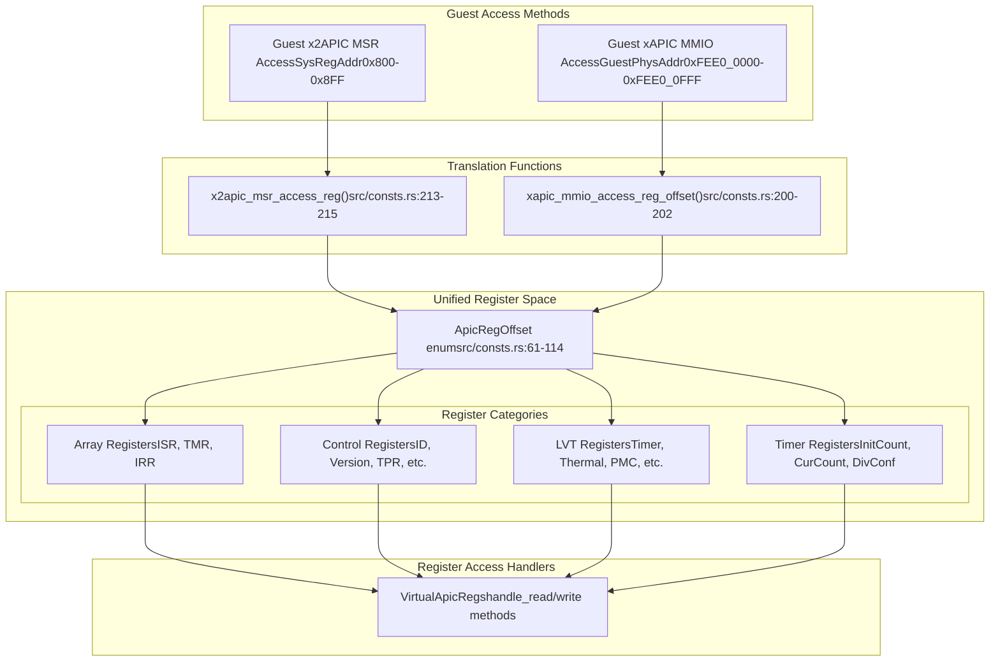
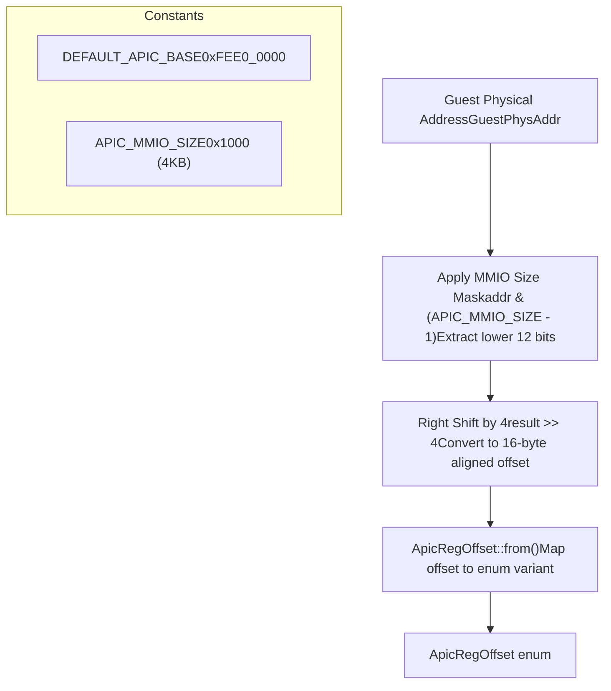
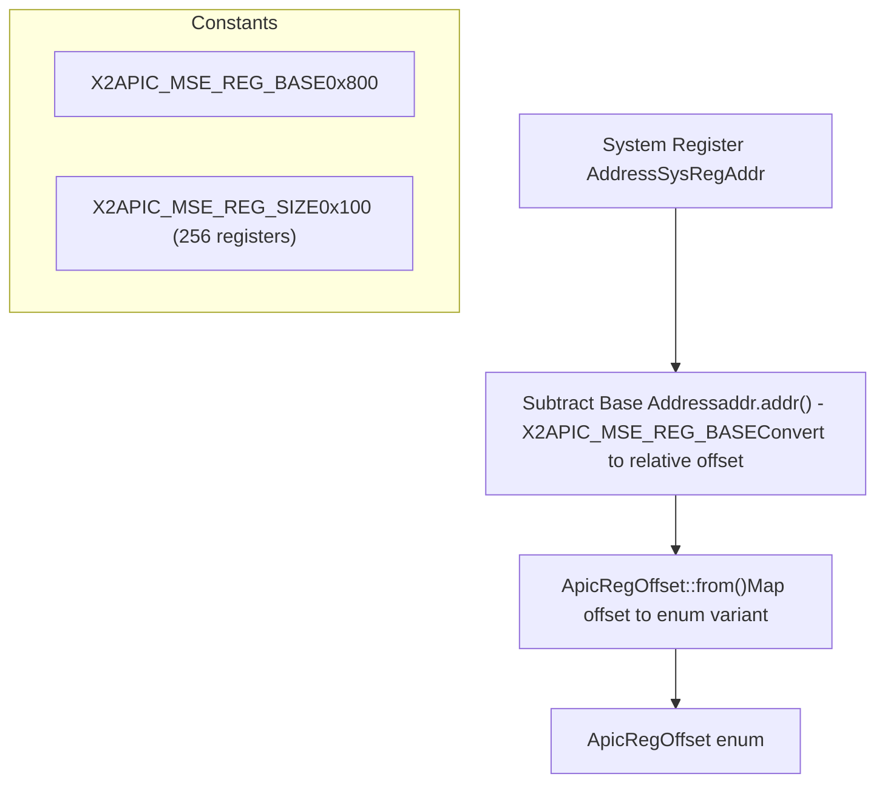
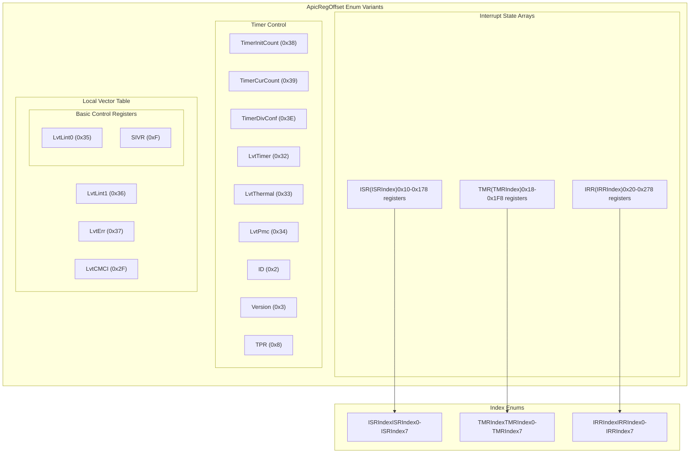
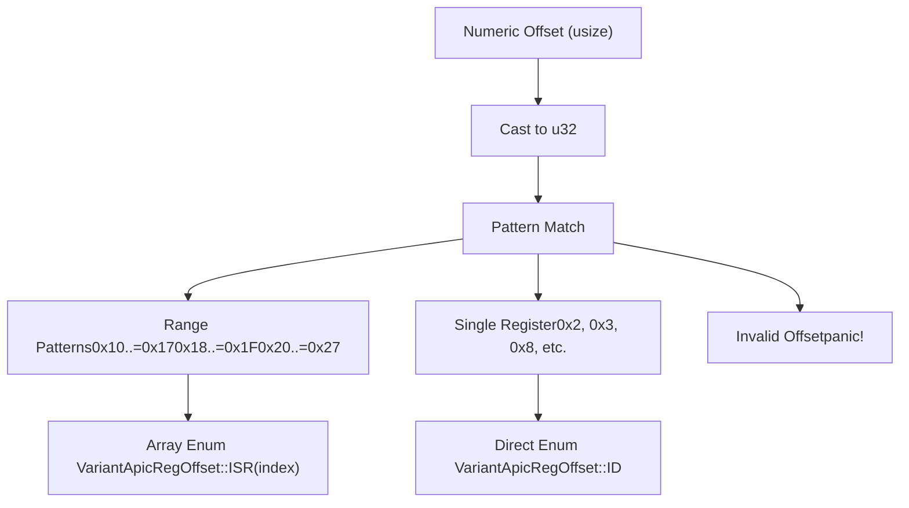

# Register Address Translation

> **Relevant source files**
> * [src/consts.rs](https://github.com/arceos-hypervisor/x86_vlapic/blob/9b85fb9d/src/consts.rs)
> * [src/lib.rs](https://github.com/arceos-hypervisor/x86_vlapic/blob/9b85fb9d/src/lib.rs)

This document describes the address translation mechanism that converts guest memory accesses into internal register identifiers within the x86_vlapic crate. The translation layer serves as a bridge between two different APIC access methods (xAPIC MMIO and x2APIC MSR) and the unified internal register representation using the `ApicRegOffset` enum.

For information about the overall virtual register management system, see [Virtual Register Management](/arceos-hypervisor/x86_vlapic/2.2-virtual-register-management). For details about specific register layouts and functionality, see [Register System](/arceos-hypervisor/x86_vlapic/3-register-system).

## Translation Architecture Overview

The address translation system provides a unified interface for accessing APIC registers regardless of whether the guest uses xAPIC MMIO-based access or x2APIC MSR-based access. Both access methods are translated into the same internal `ApicRegOffset` enum representation.



Sources: [src/consts.rs(L200 - L202)&emsp;](https://github.com/arceos-hypervisor/x86_vlapic/blob/9b85fb9d/src/consts.rs#L200-L202) [src/consts.rs(L213 - L215)&emsp;](https://github.com/arceos-hypervisor/x86_vlapic/blob/9b85fb9d/src/consts.rs#L213-L215) [src/consts.rs(L61 - L114)&emsp;](https://github.com/arceos-hypervisor/x86_vlapic/blob/9b85fb9d/src/consts.rs#L61-L114) [src/lib.rs(L90)&emsp;](https://github.com/arceos-hypervisor/x86_vlapic/blob/9b85fb9d/src/lib.rs#L90-L90) [src/lib.rs(L105)&emsp;](https://github.com/arceos-hypervisor/x86_vlapic/blob/9b85fb9d/src/lib.rs#L105-L105) [src/lib.rs(L137)&emsp;](https://github.com/arceos-hypervisor/x86_vlapic/blob/9b85fb9d/src/lib.rs#L137-L137) [src/lib.rs(L152)&emsp;](https://github.com/arceos-hypervisor/x86_vlapic/blob/9b85fb9d/src/lib.rs#L152-L152)

## xAPIC MMIO Address Translation

The xAPIC mode uses Memory-Mapped I/O (MMIO) for register access. Guest physical addresses in the range `0xFEE0_0000` to `0xFEE0_0FFF` are translated to register offsets using the `xapic_mmio_access_reg_offset()` function.

### Translation Process



The translation algorithm:

1. **Mask Address**: `addr.as_usize() & (APIC_MMIO_SIZE - 1)` extracts the offset within the 4KB APIC region
2. **Normalize to 16-byte boundaries**: `result >> 4` converts byte offset to register offset (APIC registers are 16-byte aligned)
3. **Convert to enum**: `ApicRegOffset::from(offset)` maps the numeric offset to the appropriate enum variant

### Address Mapping Examples

|Guest Physical Address|Masked Offset|Register Offset|ApicRegOffset Enum|
| --- | --- | --- | --- |
|0xFEE0_0020|0x020|0x2|ApicRegOffset::ID|
|0xFEE0_0030|0x030|0x3|ApicRegOffset::Version|
|0xFEE0_0100|0x100|0x10|ApicRegOffset::ISR(ISRIndex0)|
|0xFEE0_0320|0x320|0x32|ApicRegOffset::LvtTimer|

Sources: [src/consts.rs(L192 - L203)&emsp;](https://github.com/arceos-hypervisor/x86_vlapic/blob/9b85fb9d/src/consts.rs#L192-L203) [src/consts.rs(L197 - L198)&emsp;](https://github.com/arceos-hypervisor/x86_vlapic/blob/9b85fb9d/src/consts.rs#L197-L198) [src/lib.rs(L90)&emsp;](https://github.com/arceos-hypervisor/x86_vlapic/blob/9b85fb9d/src/lib.rs#L90-L90) [src/lib.rs(L105)&emsp;](https://github.com/arceos-hypervisor/x86_vlapic/blob/9b85fb9d/src/lib.rs#L105-L105)

## x2APIC MSR Address Translation

The x2APIC mode uses Model-Specific Registers (MSRs) for register access. MSR addresses in the range `0x800` to `0x8FF` are translated using the `x2apic_msr_access_reg()` function.

### Translation Process



The translation is simpler than xAPIC because x2APIC MSRs directly correspond to register offsets:

1. **Calculate relative offset**: `addr.addr() - X2APIC_MSE_REG_BASE` gives the register offset
2. **Convert to enum**: `ApicRegOffset::from(offset)` maps the offset to the enum variant

### MSR Address Mapping Examples

|MSR Address|Relative Offset|ApicRegOffset Enum|
| --- | --- | --- |
|0x802|0x2|ApicRegOffset::ID|
|0x803|0x3|ApicRegOffset::Version|
|0x810|0x10|ApicRegOffset::ISR(ISRIndex0)|
|0x832|0x32|ApicRegOffset::LvtTimer|

Sources: [src/consts.rs(L205 - L216)&emsp;](https://github.com/arceos-hypervisor/x86_vlapic/blob/9b85fb9d/src/consts.rs#L205-L216) [src/consts.rs(L210 - L211)&emsp;](https://github.com/arceos-hypervisor/x86_vlapic/blob/9b85fb9d/src/consts.rs#L210-L211) [src/lib.rs(L137)&emsp;](https://github.com/arceos-hypervisor/x86_vlapic/blob/9b85fb9d/src/lib.rs#L137-L137) [src/lib.rs(L152)&emsp;](https://github.com/arceos-hypervisor/x86_vlapic/blob/9b85fb9d/src/lib.rs#L152-L152)

## ApicRegOffset Enum Structure

The `ApicRegOffset` enum serves as the unified internal representation for all APIC registers. It categorizes registers into distinct types and handles special cases like register arrays.



### Register Array Handling

The enum includes special handling for register arrays (ISR, TMR, IRR) that span multiple consecutive offsets. Each array uses a dedicated index enum generated by the `define_index_enum!` macro:

* **ISR (In-Service Register)**: 8 registers at offsets `0x10-0x17`
* **TMR (Trigger Mode Register)**: 8 registers at offsets `0x18-0x1F`
* **IRR (Interrupt Request Register)**: 8 registers at offsets `0x20-0x27`

The index calculation uses: `IndexType::from(offset - base_offset)` where `base_offset` is the starting offset for each array.

Sources: [src/consts.rs(L61 - L114)&emsp;](https://github.com/arceos-hypervisor/x86_vlapic/blob/9b85fb9d/src/consts.rs#L61-L114) [src/consts.rs(L129 - L131)&emsp;](https://github.com/arceos-hypervisor/x86_vlapic/blob/9b85fb9d/src/consts.rs#L129-L131) [src/consts.rs(L3 - L54)&emsp;](https://github.com/arceos-hypervisor/x86_vlapic/blob/9b85fb9d/src/consts.rs#L3-L54) [src/consts.rs(L56 - L58)&emsp;](https://github.com/arceos-hypervisor/x86_vlapic/blob/9b85fb9d/src/consts.rs#L56-L58)

## Translation Implementation Details

The core translation logic is implemented in the `ApicRegOffset::from()` method, which uses pattern matching to map numeric offsets to enum variants.

### Pattern Matching Strategy



The implementation handles three categories of offsets:

1. **Direct mappings**: Single offsets like `0x2 => ApicRegOffset::ID`
2. **Range mappings**: Consecutive ranges like `0x10..=0x17 => ApicRegOffset::ISR(index)`
3. **Invalid offsets**: Any unmapped offset triggers a panic

### Index Calculation for Arrays

For register arrays, the index is calculated by subtracting the base offset:

```
// Example for ISR array (offset 0x10-0x17)
0x10..=0x17 => ApicRegOffset::ISR(ISRIndex::from(value - 0x10))
```

This ensures that offset `0x10` maps to `ISRIndex0`, offset `0x11` maps to `ISRIndex1`, and so on.

Sources: [src/consts.rs(L116 - L148)&emsp;](https://github.com/arceos-hypervisor/x86_vlapic/blob/9b85fb9d/src/consts.rs#L116-L148) [src/consts.rs(L129 - L131)&emsp;](https://github.com/arceos-hypervisor/x86_vlapic/blob/9b85fb9d/src/consts.rs#L129-L131) [src/consts.rs(L19 - L31)&emsp;](https://github.com/arceos-hypervisor/x86_vlapic/blob/9b85fb9d/src/consts.rs#L19-L31)