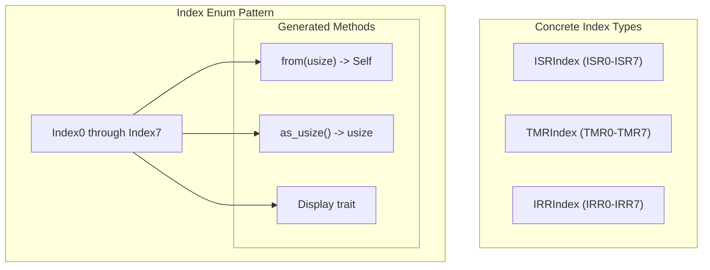
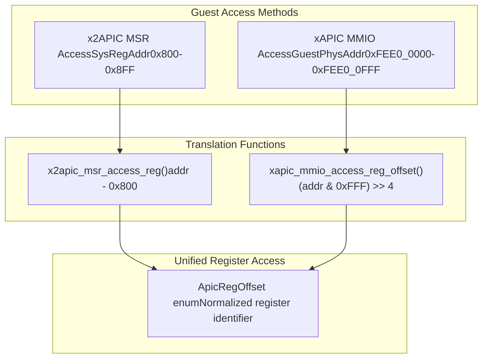
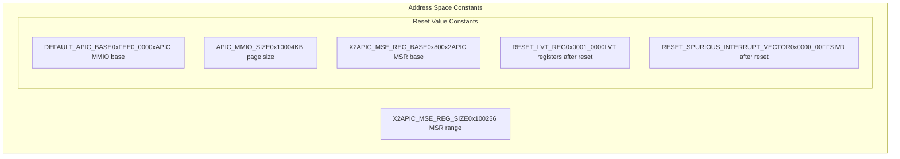

# Register Constants and Offsets

> **Relevant source files**
> * [src/consts.rs](https://github.com/arceos-hypervisor/x86_vlapic/blob/9b85fb9d/src/consts.rs)

This document covers the register constant definitions and address offset mappings used by the virtual Local APIC implementation. It documents the `ApicRegOffset` enum that standardizes access to all APIC registers, the index enums for register arrays, and the address translation functions that convert between xAPIC MMIO addresses and x2APIC MSR addresses to unified register offsets.

For information about the actual register layouts and bit field definitions, see the Local Vector Table documentation ([3.2](/arceos-hypervisor/x86_vlapic/3.2-local-vector-table-(lvt))) and Control and Status Registers ([3.3](/arceos-hypervisor/x86_vlapic/3.3-control-and-status-registers)).

## ApicRegOffset Enum

The `ApicRegOffset` enum serves as the central abstraction for all APIC register types, providing a unified interface for both xAPIC and x2APIC access modes. Each variant corresponds to a specific APIC register defined in the Intel x86 architecture specification.

```mermaid
flowchart TD
subgraph subGraph5["ApicRegOffset Register Categories"]
    subgraph LVT_Registers["Local Vector Table"]
        TimerInitCount["TimerInitCount (0x38)"]
        TimerCurCount["TimerCurCount (0x39)"]
        TimerDivConf["TimerDivConf (0x3E)"]
        LvtTimer["LvtTimer (0x32)"]
        LvtThermal["LvtThermal (0x33)"]
        LvtPmc["LvtPmc (0x34)"]
        LvtLint0["LvtLint0 (0x35)"]
        LvtLint1["LvtLint1 (0x36)"]
        LvtErr["LvtErr (0x37)"]
        LvtCMCI["LvtCMCI (0x2F)"]
        ISR["ISR[0-7] (0x10-0x17)"]
        TMR["TMR[0-7] (0x18-0x1F)"]
        IRR["IRR[0-7] (0x20-0x27)"]
        EOI["EOI (0xB)"]
        SIVR["SIVR (0xF)"]
        ESR["ESR (0x28)"]
        ICRLow["ICRLow (0x30)"]
        ICRHi["ICRHi (0x31)"]
        ID["ID (0x2)"]
        Version["Version (0x3)"]
        TPR["TPR (0x8)"]
        APR["APR (0x9)"]
        PPR["PPR (0xA)"]
        subgraph Interrupt_Management["Interrupt Management"]
            subgraph Control_Registers["Control Registers"]
                TimerInitCount["TimerInitCount (0x38)"]
                TimerCurCount["TimerCurCount (0x39)"]
                TimerDivConf["TimerDivConf (0x3E)"]
                LvtTimer["LvtTimer (0x32)"]
                LvtThermal["LvtThermal (0x33)"]
                LvtPmc["LvtPmc (0x34)"]
                LvtLint0["LvtLint0 (0x35)"]
                ISR["ISR[0-7] (0x10-0x17)"]
                TMR["TMR[0-7] (0x18-0x1F)"]
                IRR["IRR[0-7] (0x20-0x27)"]
                EOI["EOI (0xB)"]
                SIVR["SIVR (0xF)"]
                ESR["ESR (0x28)"]
                ICRLow["ICRLow (0x30)"]
                ICRHi["ICRHi (0x31)"]
                ID["ID (0x2)"]
                Version["Version (0x3)"]
                TPR["TPR (0x8)"]
                APR["APR (0x9)"]
                PPR["PPR (0xA)"]
                subgraph Timer_Subsystem["Timer Subsystem"]
                    subgraph Register_Arrays["Register Arrays"]
                        TimerInitCount["TimerInitCount (0x38)"]
                        TimerCurCount["TimerCurCount (0x39)"]
                        TimerDivConf["TimerDivConf (0x3E)"]
                        LvtTimer["LvtTimer (0x32)"]
                        LvtThermal["LvtThermal (0x33)"]
                        LvtPmc["LvtPmc (0x34)"]
                        LvtLint0["LvtLint0 (0x35)"]
                        ISR["ISR[0-7] (0x10-0x17)"]
                        TMR["TMR[0-7] (0x18-0x1F)"]
                        IRR["IRR[0-7] (0x20-0x27)"]
                        EOI["EOI (0xB)"]
                        SIVR["SIVR (0xF)"]
                        ESR["ESR (0x28)"]
                        ICRLow["ICRLow (0x30)"]
                        ID["ID (0x2)"]
                        Version["Version (0x3)"]
                        TPR["TPR (0x8)"]
                        APR["APR (0x9)"]
                    end
                end
            end
        end
    end
end
```

The enum implements a `from` method that performs offset-to-register mapping based on the numeric offset values defined in the Intel specification. Register arrays like ISR, TMR, and IRR use index-based variants to represent their 8-register sequences.

Sources: [src/consts.rs(L61 - L114)&emsp;](https://github.com/arceos-hypervisor/x86_vlapic/blob/9b85fb9d/src/consts.rs#L61-L114) [src/consts.rs(L116 - L148)&emsp;](https://github.com/arceos-hypervisor/x86_vlapic/blob/9b85fb9d/src/consts.rs#L116-L148)

## Register Array Index Enums

Three specialized index enums handle the APIC's 256-bit register arrays, each consisting of 8 consecutive 32-bit registers:

|Array Type|Index Enum|Register Range|Purpose|
| --- | --- | --- | --- |
|In-Service Register|ISRIndex|0x10-0x17|Tracks interrupts currently being serviced|
|Trigger Mode Register|TMRIndex|0x18-0x1F|Stores trigger mode for each interrupt vector|
|Interrupt Request Register|IRRIndex|0x20-0x27|Queues pending interrupt requests|

The `define_index_enum!` macro generates identical implementations for all three index types, providing type-safe indexing into the 8-register arrays while maintaining zero runtime cost through const evaluation.

Sources: [src/consts.rs(L3 - L54)&emsp;](https://github.com/arceos-hypervisor/x86_vlapic/blob/9b85fb9d/src/consts.rs#L3-L54) [src/consts.rs(L56 - L58)&emsp;](https://github.com/arceos-hypervisor/x86_vlapic/blob/9b85fb9d/src/consts.rs#L56-L58)

## Address Translation Functions

The virtual APIC supports both xAPIC (MMIO-based) and x2APIC (MSR-based) access modes through dedicated address translation functions that convert guest addresses to `ApicRegOffset` values.

### xAPIC MMIO Translation

The `xapic_mmio_access_reg_offset` function extracts the 12-bit offset from the guest physical address and shifts right by 4 bits to obtain the register index. This follows the xAPIC specification where registers are aligned on 16-byte boundaries within the 4KB APIC page.

|Address Range|Calculation|Register Type|
| --- | --- | --- |
|0xFEE0_0020|(0x20 & 0xFFF) >> 4 = 0x2|ID Register|
|0xFEE0_0100|(0x100 & 0xFFF) >> 4 = 0x10|ISR[0]|
|0xFEE0_0320|(0x320 & 0xFFF) >> 4 = 0x32|LVT Timer|

### x2APIC MSR Translation

The `x2apic_msr_access_reg` function performs simple offset subtraction from the MSR base address 0x800. x2APIC mode provides a flat MSR address space for APIC registers.

|MSR Address|Calculation|Register Type|
| --- | --- | --- |
|0x802|0x802 - 0x800 = 0x2|ID Register|
|0x810|0x810 - 0x800 = 0x10|ISR[0]|
|0x832|0x832 - 0x800 = 0x32|LVT Timer|

Sources: [src/consts.rs(L192 - L203)&emsp;](https://github.com/arceos-hypervisor/x86_vlapic/blob/9b85fb9d/src/consts.rs#L192-L203) [src/consts.rs(L205 - L216)&emsp;](https://github.com/arceos-hypervisor/x86_vlapic/blob/9b85fb9d/src/consts.rs#L205-L216)

## Reset Values and Default Constants

The system defines standard reset values for APIC registers according to Intel specifications:

|Constant|Value|Purpose|Specification Reference|
| --- | --- | --- | --- |
|RESET_LVT_REG|0x0001_0000|LVT register reset state|Intel Manual 11.5.1|
|RESET_SPURIOUS_INTERRUPT_VECTOR|0x0000_00FF|SIVR reset state|Intel Manual 11.9|
|DEFAULT_APIC_BASE|0xFEE0_0000|Standard xAPIC MMIO base|Intel Manual 11.4.1|
|APIC_MMIO_SIZE|0x1000|xAPIC page size|Intel Manual 11.4.1|

The reset values ensure that LVT registers start in a masked state (bit 16 set) and the spurious interrupt vector defaults to vector 0xFF, providing safe initialization conditions for the virtual APIC.

Sources: [src/consts.rs(L183 - L191)&emsp;](https://github.com/arceos-hypervisor/x86_vlapic/blob/9b85fb9d/src/consts.rs#L183-L191) [src/consts.rs(L197 - L198)&emsp;](https://github.com/arceos-hypervisor/x86_vlapic/blob/9b85fb9d/src/consts.rs#L197-L198) [src/consts.rs(L210 - L211)&emsp;](https://github.com/arceos-hypervisor/x86_vlapic/blob/9b85fb9d/src/consts.rs#L210-L211)