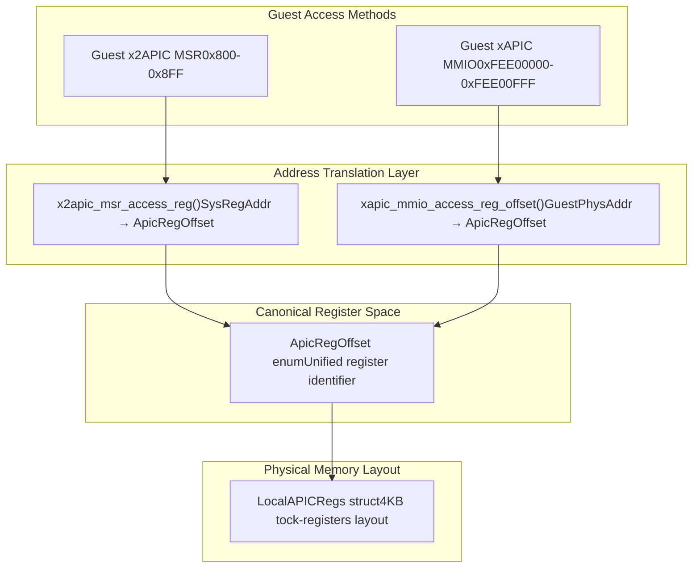
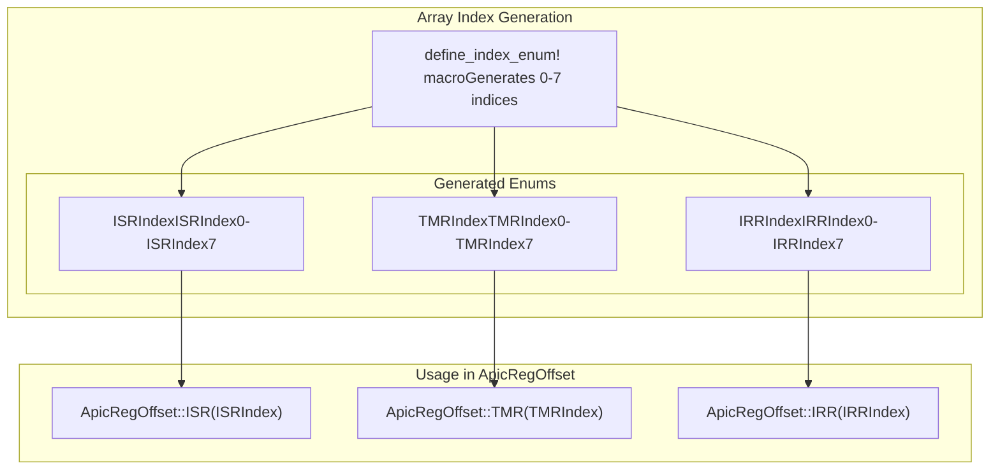
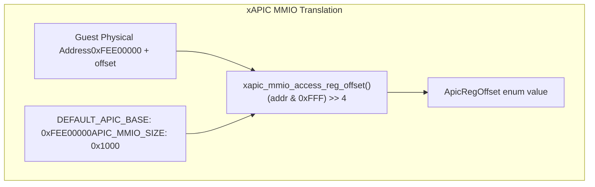
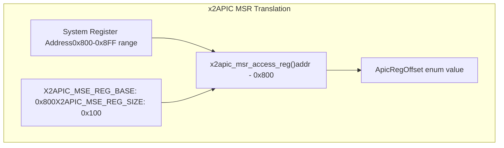

# Register System

> **Relevant source files**
> * [src/consts.rs](https://github.com/arceos-hypervisor/x86_vlapic/blob/9b85fb9d/src/consts.rs)
> * [src/regs/mod.rs](https://github.com/arceos-hypervisor/x86_vlapic/blob/9b85fb9d/src/regs/mod.rs)

This document provides comprehensive documentation of the virtual Local APIC register system implemented in the x86_vlapic crate. It covers all APIC registers, their memory layouts, address translation mechanisms, and access patterns for both xAPIC and x2APIC operating modes. For details about specific Local Vector Table register implementations, see [Local Vector Table (LVT)](/arceos-hypervisor/x86_vlapic/3.2-local-vector-table-(lvt)). For information about the higher-level device interface and virtualization architecture, see [Core Architecture](/arceos-hypervisor/x86_vlapic/2-core-architecture).

## Register Organization Overview

The virtual LAPIC register system virtualizes the complete set of x86 Local APIC registers within a 4KB memory page. The system supports dual access modes: legacy xAPIC MMIO access and modern x2APIC MSR access, both mapping to the same underlying register state.

### Register Address Translation

The system translates guest access addresses to internal register offsets using the `ApicRegOffset` enum, which serves as the canonical register identifier throughout the codebase.

**Sources:** [src/consts.rs(L200 - L202)&emsp;](https://github.com/arceos-hypervisor/x86_vlapic/blob/9b85fb9d/src/consts.rs#L200-L202) [src/consts.rs(L213 - L215)&emsp;](https://github.com/arceos-hypervisor/x86_vlapic/blob/9b85fb9d/src/consts.rs#L213-L215) [src/consts.rs(L61 - L114)&emsp;](https://github.com/arceos-hypervisor/x86_vlapic/blob/9b85fb9d/src/consts.rs#L61-L114)

### Register Categories

The APIC register space is organized into several functional categories, each serving distinct purposes in interrupt handling and APIC management.

```mermaid
flowchart TD
subgraph subGraph5["APIC Register Categories"]
    subgraph subGraph2["Local Vector Table"]
        ICR_LOW["ICR_LO (0x300)Command Register Low"]
        ICR_HIGH["ICR_HI (0x310)Command Register High"]
        TIMER_INIT["ICR_TIMER (0x380)Initial Count"]
        TIMER_CUR["CCR_TIMER (0x390)Current Count"]
        TIMER_DIV["DCR_TIMER (0x3E0)Divide Configuration"]
        LVT_TIMER["LVT_TIMER (0x320)Timer Interrupt"]
        LVT_THERMAL["LVT_THERMAL (0x330)Thermal Monitor"]
        LVT_PMC["LVT_PMC (0x340)Performance Counter"]
        LVT_LINT1["LVT_LINT1 (0x360)External Pin 1"]
        LVT_ERROR["LVT_ERROR (0x370)Error Interrupt"]
        LVT_CMCI["LVT_CMCI (0x2F0)Corrected Machine Check"]
        ISR["ISR Array (0x100-0x170)In-Service Registers8 x 128-bit"]
        TMR["TMR Array (0x180-0x1F0)Trigger Mode Registers8 x 128-bit"]
        IRR["IRR Array (0x200-0x270)Interrupt Request Registers8 x 128-bit"]
        ID["ID (0x20)Local APIC Identifier"]
        VERSION["VERSION (0x30)APIC Version Info"]
        TPR["TPR (0x80)Task Priority"]
        subgraph subGraph0["Control Registers"]
            LVT_LINT0["LVT_LINT0 (0x350)External Pin 0"]
            SVR["SVR (0xF0)Spurious Interrupt Vector"]
            subgraph subGraph4["Interrupt Command"]
                ICR_LOW["ICR_LO (0x300)Command Register Low"]
                ICR_HIGH["ICR_HI (0x310)Command Register High"]
                TIMER_INIT["ICR_TIMER (0x380)Initial Count"]
                TIMER_CUR["CCR_TIMER (0x390)Current Count"]
                LVT_TIMER["LVT_TIMER (0x320)Timer Interrupt"]
                LVT_THERMAL["LVT_THERMAL (0x330)Thermal Monitor"]
                ISR["ISR Array (0x100-0x170)In-Service Registers8 x 128-bit"]
                TMR["TMR Array (0x180-0x1F0)Trigger Mode Registers8 x 128-bit"]
                ID["ID (0x20)Local APIC Identifier"]
                VERSION["VERSION (0x30)APIC Version Info"]
            end
            subgraph subGraph3["Timer Subsystem"]
                ICR_LOW["ICR_LO (0x300)Command Register Low"]
                ICR_HIGH["ICR_HI (0x310)Command Register High"]
                TIMER_INIT["ICR_TIMER (0x380)Initial Count"]
                TIMER_CUR["CCR_TIMER (0x390)Current Count"]
                TIMER_DIV["DCR_TIMER (0x3E0)Divide Configuration"]
                LVT_TIMER["LVT_TIMER (0x320)Timer Interrupt"]
                LVT_THERMAL["LVT_THERMAL (0x330)Thermal Monitor"]
                LVT_PMC["LVT_PMC (0x340)Performance Counter"]
                ISR["ISR Array (0x100-0x170)In-Service Registers8 x 128-bit"]
                TMR["TMR Array (0x180-0x1F0)Trigger Mode Registers8 x 128-bit"]
                IRR["IRR Array (0x200-0x270)Interrupt Request Registers8 x 128-bit"]
                ID["ID (0x20)Local APIC Identifier"]
                VERSION["VERSION (0x30)APIC Version Info"]
                TPR["TPR (0x80)Task Priority"]
            end
        end
    end
    subgraph subGraph1["Interrupt State Arrays"]
        LVT_LINT0["LVT_LINT0 (0x350)External Pin 0"]
        SVR["SVR (0xF0)Spurious Interrupt Vector"]
        subgraph subGraph4["Interrupt Command"]
            ICR_LOW["ICR_LO (0x300)Command Register Low"]
            ICR_HIGH["ICR_HI (0x310)Command Register High"]
            TIMER_INIT["ICR_TIMER (0x380)Initial Count"]
            TIMER_CUR["CCR_TIMER (0x390)Current Count"]
            LVT_TIMER["LVT_TIMER (0x320)Timer Interrupt"]
            LVT_THERMAL["LVT_THERMAL (0x330)Thermal Monitor"]
            ISR["ISR Array (0x100-0x170)In-Service Registers8 x 128-bit"]
            TMR["TMR Array (0x180-0x1F0)Trigger Mode Registers8 x 128-bit"]
            ID["ID (0x20)Local APIC Identifier"]
            VERSION["VERSION (0x30)APIC Version Info"]
        end
        subgraph subGraph3["Timer Subsystem"]
            ICR_LOW["ICR_LO (0x300)Command Register Low"]
            ICR_HIGH["ICR_HI (0x310)Command Register High"]
            TIMER_INIT["ICR_TIMER (0x380)Initial Count"]
            TIMER_CUR["CCR_TIMER (0x390)Current Count"]
            TIMER_DIV["DCR_TIMER (0x3E0)Divide Configuration"]
            LVT_TIMER["LVT_TIMER (0x320)Timer Interrupt"]
            LVT_THERMAL["LVT_THERMAL (0x330)Thermal Monitor"]
            LVT_PMC["LVT_PMC (0x340)Performance Counter"]
            ISR["ISR Array (0x100-0x170)In-Service Registers8 x 128-bit"]
            TMR["TMR Array (0x180-0x1F0)Trigger Mode Registers8 x 128-bit"]
            IRR["IRR Array (0x200-0x270)Interrupt Request Registers8 x 128-bit"]
            ID["ID (0x20)Local APIC Identifier"]
            VERSION["VERSION (0x30)APIC Version Info"]
            TPR["TPR (0x80)Task Priority"]
        end
    end
end
```

**Sources:** [src/consts.rs(L61 - L114)&emsp;](https://github.com/arceos-hypervisor/x86_vlapic/blob/9b85fb9d/src/consts.rs#L61-L114) [src/regs/mod.rs(L15 - L104)&emsp;](https://github.com/arceos-hypervisor/x86_vlapic/blob/9b85fb9d/src/regs/mod.rs#L15-L104)

## Address Translation Implementation

The `ApicRegOffset` enum provides a unified addressing scheme that abstracts the differences between xAPIC and x2APIC access patterns.

### ApicRegOffset Enum Structure

|Register Category|Offset Range|ApicRegOffset Variants|
| --- | --- | --- |
|Control Registers|0x2-0xF|ID,Version,TPR,APR,PPR,EOI,RRR,LDR,DFR,SIVR|
|Interrupt Arrays|0x10-0x27|ISR(ISRIndex),TMR(TMRIndex),IRR(IRRIndex)|
|Error Status|0x28|ESR|
|LVT Registers|0x2F, 0x32-0x37|LvtCMCI,LvtTimer,LvtThermal,LvtPmc,LvtLint0,LvtLint1,LvtErr|
|Interrupt Command|0x30-0x31|ICRLow,ICRHi|
|Timer Registers|0x38-0x39, 0x3E|TimerInitCount,TimerCurCount,TimerDivConf|

**Sources:** [src/consts.rs(L61 - L114)&emsp;](https://github.com/arceos-hypervisor/x86_vlapic/blob/9b85fb9d/src/consts.rs#L61-L114) [src/consts.rs(L116 - L148)&emsp;](https://github.com/arceos-hypervisor/x86_vlapic/blob/9b85fb9d/src/consts.rs#L116-L148)

### Index Enums for Register Arrays

The system uses generated index enums for the three 256-bit interrupt state arrays, each comprising 8 128-bit registers.

**Sources:** [src/consts.rs(L3 - L54)&emsp;](https://github.com/arceos-hypervisor/x86_vlapic/blob/9b85fb9d/src/consts.rs#L3-L54) [src/consts.rs(L56 - L58)&emsp;](https://github.com/arceos-hypervisor/x86_vlapic/blob/9b85fb9d/src/consts.rs#L56-L58)

## Memory Layout Implementation

The `LocalAPICRegs` struct defines the physical memory layout using the tock-registers crate, providing type-safe register access with appropriate read/write permissions.

### Register Access Patterns

|Access Type|Usage|Examples|
| --- | --- | --- |
|ReadWrite<u32>|Configurable control registers|ID,TPR,LDR,DFR,ESR|
|ReadOnly<u32>|Status and version registers|VERSION,APR,PPR,RRD,CCR_TIMER|
|WriteOnly<u32>|Command registers|EOI,SELF_IPI|
|ReadOnly<u128>|Interrupt state arrays|ISR,TMR,IRRarrays|
|LVT Register Types|Specialized LVT registers|LvtTimerRegisterMmio,LvtThermalMonitorRegisterMmio, etc.|

**Sources:** [src/regs/mod.rs(L15 - L104)&emsp;](https://github.com/arceos-hypervisor/x86_vlapic/blob/9b85fb9d/src/regs/mod.rs#L15-L104)

### Reset Values and Constants

The system defines standardized reset values for APIC registers according to the x86 specification:

|Constant|Value|Purpose|
| --- | --- | --- |
|RESET_LVT_REG|0x0001_0000|Default LVT register state with interrupt masked|
|RESET_SPURIOUS_INTERRUPT_VECTOR|0x0000_00FF|Default spurious interrupt vector configuration|

**Sources:** [src/consts.rs(L183 - L190)&emsp;](https://github.com/arceos-hypervisor/x86_vlapic/blob/9b85fb9d/src/consts.rs#L183-L190)

## Access Mode Implementation

The register system supports both xAPIC and x2APIC access modes through dedicated translation functions.

### xAPIC MMIO Access

**Sources:** [src/consts.rs(L192 - L202)&emsp;](https://github.com/arceos-hypervisor/x86_vlapic/blob/9b85fb9d/src/consts.rs#L192-L202)

### x2APIC MSR Access

**Sources:** [src/consts.rs(L205 - L216)&emsp;](https://github.com/arceos-hypervisor/x86_vlapic/blob/9b85fb9d/src/consts.rs#L205-L216)

## Register Structure Organization

The complete register system provides a comprehensive virtualization of Local APIC functionality, supporting interrupt handling, inter-processor communication, and timer operations through a unified, type-safe interface that abstracts the complexities of dual-mode APIC access.

**Sources:** [src/consts.rs(L1 - L217)&emsp;](https://github.com/arceos-hypervisor/x86_vlapic/blob/9b85fb9d/src/consts.rs#L1-L217) [src/regs/mod.rs(L1 - L105)&emsp;](https://github.com/arceos-hypervisor/x86_vlapic/blob/9b85fb9d/src/regs/mod.rs#L1-L105)