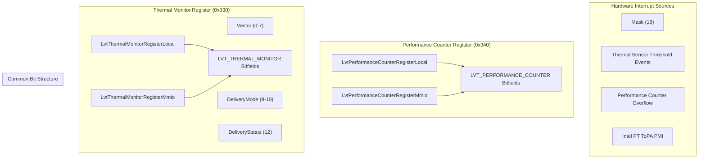
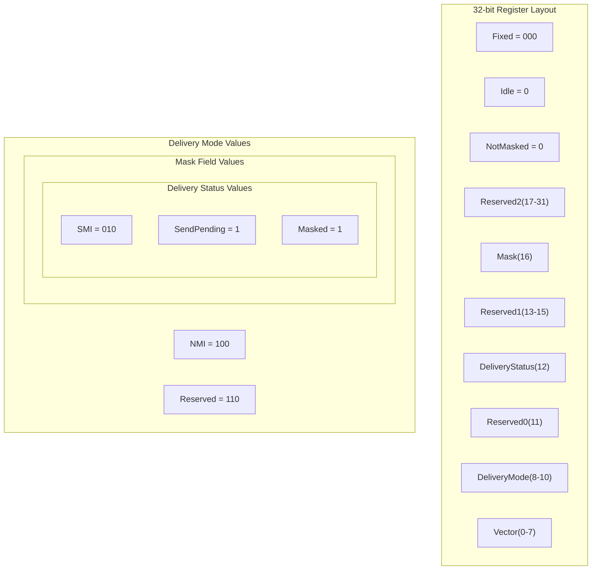
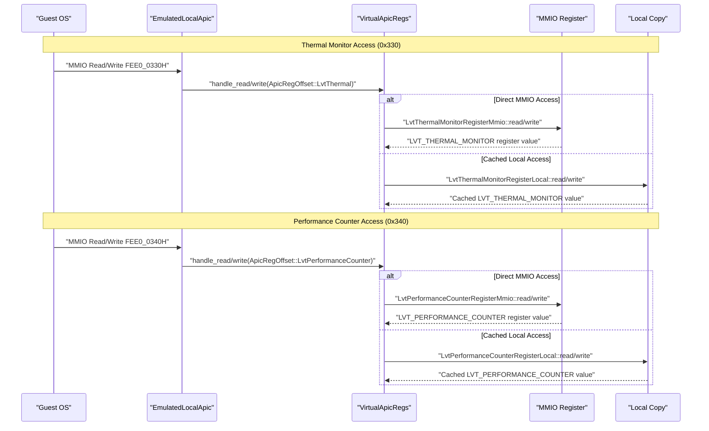

# System Monitoring LVT Registers

> **Relevant source files**
> * [src/regs/lvt/perfmon.rs](https://github.com/arceos-hypervisor/x86_vlapic/blob/9b85fb9d/src/regs/lvt/perfmon.rs)
> * [src/regs/lvt/thermal.rs](https://github.com/arceos-hypervisor/x86_vlapic/blob/9b85fb9d/src/regs/lvt/thermal.rs)

This document covers the system monitoring Local Vector Table (LVT) registers in the x86_vlapic implementation. These registers handle interrupts generated by thermal monitoring hardware and performance counter overflow events. System monitoring LVT registers are distinct from timer-based interrupts (see [Timer LVT Register](/arceos-hypervisor/x86_vlapic/3.2.1-timer-lvt-register)), external pin interrupts (see [External Interrupt Pin Registers](/arceos-hypervisor/x86_vlapic/3.2.2-external-interrupt-pin-registers)), and error condition interrupts (see [Error Handling LVT Registers](/arceos-hypervisor/x86_vlapic/3.2.4-error-handling-lvt-registers)).

## Overview

The x86_vlapic crate implements two system monitoring LVT registers that provide interrupt delivery for hardware monitoring subsystems:

* **Thermal Monitor Register**: Handles thermal sensor threshold interrupts
* **Performance Counter Register**: Handles performance monitoring unit (PMU) overflow and Intel Processor Trace (PT) interrupts

Both registers are implementation-specific extensions to the APIC architecture and share a common bit field structure for interrupt configuration.

## System Monitoring LVT Architecture

System Monitoring LVT Register Structure

Sources: [src/regs/lvt/thermal.rs(L1 - L74)&emsp;](https://github.com/arceos-hypervisor/x86_vlapic/blob/9b85fb9d/src/regs/lvt/thermal.rs#L1-L74) [src/regs/lvt/perfmon.rs(L1 - L75)&emsp;](https://github.com/arceos-hypervisor/x86_vlapic/blob/9b85fb9d/src/regs/lvt/perfmon.rs#L1-L75)

## Thermal Monitor Register

The LVT Thermal Monitor Register at offset `0x330` delivers interrupts when thermal monitoring hardware detects temperature threshold violations. This register is implementation-specific and always located at base address `FEE0 0330H` when implemented.

### Register Definition

The thermal monitor register is defined using the `LVT_THERMAL_MONITOR` bitfield structure:

|Field|Bits|Description|
| --- | --- | --- |
|Vector|0-7|Interrupt vector number|
|DeliveryMode|8-10|Interrupt delivery type|
|DeliveryStatus|12|Read-only delivery status|
|Mask|16|Interrupt enable/disable|

### Thermal Interrupt Conditions

The thermal monitor generates interrupts when:

* Processor temperature exceeds configured thresholds
* Thermal control circuit (TCC) activation occurs
* Temperature monitoring hardware detects critical conditions

### Register Types

The crate provides two access patterns for the thermal monitor register:

* `LvtThermalMonitorRegisterMmio`: Direct MMIO access using `ReadWrite<u32, LVT_THERMAL_MONITOR::Register>`
* `LvtThermalMonitorRegisterLocal`: Cached local copy using `LocalRegisterCopy<u32, LVT_THERMAL_MONITOR::Register>`

Sources: [src/regs/lvt/thermal.rs(L5 - L66)&emsp;](https://github.com/arceos-hypervisor/x86_vlapic/blob/9b85fb9d/src/regs/lvt/thermal.rs#L5-L66) [src/regs/lvt/thermal.rs(L68 - L73)&emsp;](https://github.com/arceos-hypervisor/x86_vlapic/blob/9b85fb9d/src/regs/lvt/thermal.rs#L68-L73)

## Performance Counter Register

The LVT Performance Counter Register at offset `0x340` handles interrupts from performance monitoring units and Intel Processor Trace events. This register is implementation-specific and not guaranteed to be at the documented base address.

### Register Definition

The performance counter register uses the `LVT_PERFORMANCE_COUNTER` bitfield structure with identical bit layout to the thermal monitor register:

|Field|Bits|Description|
| --- | --- | --- |
|Vector|0-7|Interrupt vector number|
|DeliveryMode|8-10|Interrupt delivery type|
|DeliveryStatus|12|Read-only delivery status|
|Mask|16|Interrupt enable/disable|

### Performance Monitoring Interrupt Sources

The performance counter register delivers interrupts for:

1. **Performance Counter Overflow**: When hardware performance counters exceed their configured limits
2. **Intel PT ToPA PMI**: Performance Monitoring Interrupt (PMI) signals from Intel Processor Trace Table of Physical Addresses (ToPA) mechanism

### Register Types

Similar to the thermal register, two access patterns are provided:

* `LvtPerformanceCounterRegisterMmio`: Direct MMIO access using `ReadWrite<u32, LVT_PERFORMANCE_COUNTER::Register>`
* `LvtPerformanceCounterRegisterLocal`: Cached local copy using `LocalRegisterCopy<u32, LVT_PERFORMANCE_COUNTER::Register>`

Sources: [src/regs/lvt/perfmon.rs(L5 - L66)&emsp;](https://github.com/arceos-hypervisor/x86_vlapic/blob/9b85fb9d/src/regs/lvt/perfmon.rs#L5-L66) [src/regs/lvt/perfmon.rs(L68 - L74)&emsp;](https://github.com/arceos-hypervisor/x86_vlapic/blob/9b85fb9d/src/regs/lvt/perfmon.rs#L68-L74)

## Common Bit Field Structure

Both system monitoring registers share identical bit field definitions, providing consistent configuration interfaces across different monitoring subsystems.

System Monitoring Register Bit Fields

Sources: [src/regs/lvt/thermal.rs(L10 - L16)&emsp;](https://github.com/arceos-hypervisor/x86_vlapic/blob/9b85fb9d/src/regs/lvt/thermal.rs#L10-L16) [src/regs/lvt/perfmon.rs(L10 - L16)&emsp;](https://github.com/arceos-hypervisor/x86_vlapic/blob/9b85fb9d/src/regs/lvt/perfmon.rs#L10-L16) [src/regs/lvt/thermal.rs(L30 - L56)&emsp;](https://github.com/arceos-hypervisor/x86_vlapic/blob/9b85fb9d/src/regs/lvt/thermal.rs#L30-L56) [src/regs/lvt/perfmon.rs(L30 - L56)&emsp;](https://github.com/arceos-hypervisor/x86_vlapic/blob/9b85fb9d/src/regs/lvt/perfmon.rs#L30-L56)

### Delivery Mode Restrictions

System monitoring LVT registers have specific delivery mode restrictions compared to other LVT registers:

|Mode|Binary|Support Status|
| --- | --- | --- |
|Fixed|000|✅ Supported|
|SMI|010|✅ Supported|
|NMI|100|✅ Supported|
|INIT|101|❌ Not supported|
|Reserved|110|❌ Not supported|
|ExtINT|111|❌ Not supported|

The `INIT` and `ExtINT` delivery modes are explicitly not supported for thermal monitor and performance counter registers.

Sources: [src/regs/lvt/thermal.rs(L44 - L45)&emsp;](https://github.com/arceos-hypervisor/x86_vlapic/blob/9b85fb9d/src/regs/lvt/thermal.rs#L44-L45) [src/regs/lvt/perfmon.rs(L44 - L45)&emsp;](https://github.com/arceos-hypervisor/x86_vlapic/blob/9b85fb9d/src/regs/lvt/perfmon.rs#L44-L45) [src/regs/lvt/thermal.rs(L54 - L55)&emsp;](https://github.com/arceos-hypervisor/x86_vlapic/blob/9b85fb9d/src/regs/lvt/thermal.rs#L54-L55) [src/regs/lvt/perfmon.rs(L54 - L55)&emsp;](https://github.com/arceos-hypervisor/x86_vlapic/blob/9b85fb9d/src/regs/lvt/perfmon.rs#L54-L55)

## Register Access Patterns

System monitoring LVT registers support both direct MMIO access and cached local copy patterns using the tock-registers framework.

LVT System Monitoring Register Access Architecture

Sources: [src/regs/lvt/thermal.rs(L66 - L73)&emsp;](https://github.com/arceos-hypervisor/x86_vlapic/blob/9b85fb9d/src/regs/lvt/thermal.rs#L66-L73) [src/regs/lvt/perfmon.rs(L66 - L74)&emsp;](https://github.com/arceos-hypervisor/x86_vlapic/blob/9b85fb9d/src/regs/lvt/perfmon.rs#L66-L74)