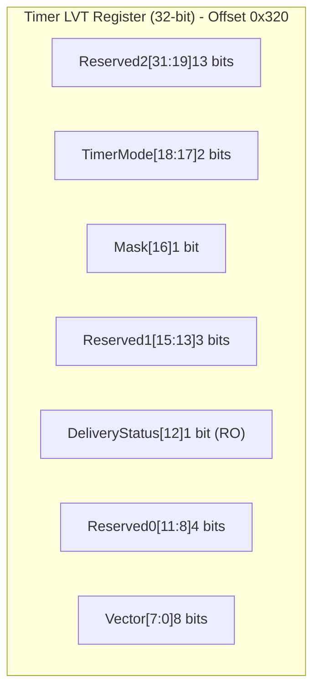
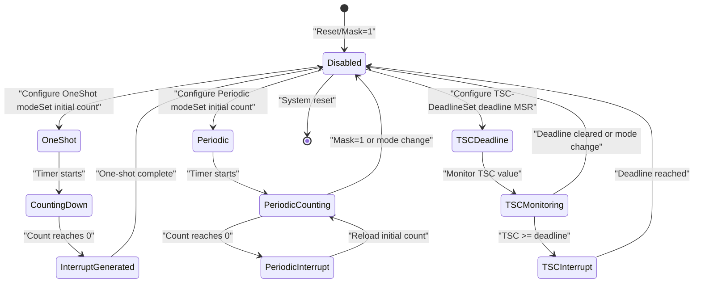
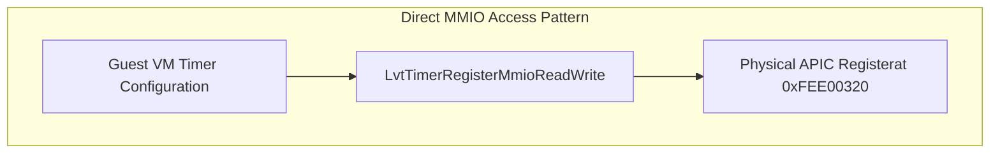
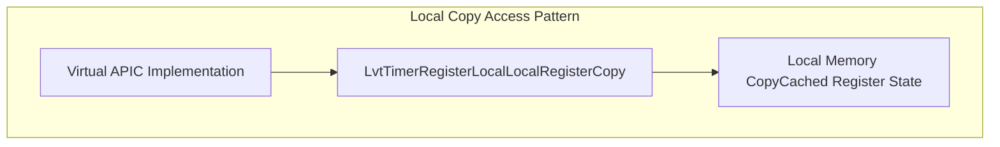
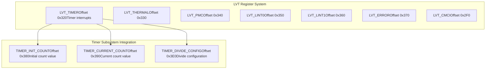

# Timer LVT Register

> **Relevant source files**
> * [src/regs/lvt/timer.rs](https://github.com/arceos-hypervisor/x86_vlapic/blob/9b85fb9d/src/regs/lvt/timer.rs)

This document covers the Timer LVT (Local Vector Table) Register implementation in the x86_vlapic crate. The Timer LVT register controls the configuration and behavior of timer-based interrupts in the virtual Local APIC, including timer modes, interrupt masking, and delivery status monitoring.

For information about other LVT registers, see [External Interrupt Pin Registers](/arceos-hypervisor/x86_vlapic/3.2.2-external-interrupt-pin-registers), [System Monitoring LVT Registers](/arceos-hypervisor/x86_vlapic/3.2.3-system-monitoring-lvt-registers), and [Error Handling LVT Registers](/arceos-hypervisor/x86_vlapic/3.2.4-error-handling-lvt-registers). For the broader LVT system architecture, see [Local Vector Table (LVT)](/arceos-hypervisor/x86_vlapic/3.2-local-vector-table-(lvt)).

## Register Overview

The Timer LVT register is located at offset `0x320` in the APIC register space and provides control over timer interrupt generation and delivery. It supports three distinct timer modes and includes standard LVT fields for interrupt configuration.

### Timer LVT Register Bit Layout

Sources: [src/regs/lvt/timer.rs(L5 - L49)&emsp;](https://github.com/arceos-hypervisor/x86_vlapic/blob/9b85fb9d/src/regs/lvt/timer.rs#L5-L49)

## Register Fields

### Timer Mode Field

The `TimerMode` field at bits [18:17] controls the operational mode of the timer:

|Mode|Value|Description|
| --- | --- | --- |
|OneShot|0b00|One-shot mode using a count-down value|
|Periodic|0b01|Periodic mode reloading a count-down value|
|TSCDeadline|0b10|TSC-Deadline mode using absolute target value in IA32_TSC_DEADLINE MSR|
|Reserved|0b11|Reserved value (not used)|

Sources: [src/regs/lvt/timer.rs(L10 - L20)&emsp;](https://github.com/arceos-hypervisor/x86_vlapic/blob/9b85fb9d/src/regs/lvt/timer.rs#L10-L20)

### Mask Field

The `Mask` bit at position [16] controls interrupt reception:

* `NotMasked` (0): Enables reception of the interrupt
* `Masked` (1): Inhibits reception of the interrupt

The mask flag is automatically set to 1 on reset and can only be cleared by software. When the local APIC handles a timer interrupt, it may automatically set this mask flag depending on the timer configuration.

Sources: [src/regs/lvt/timer.rs(L21 - L32)&emsp;](https://github.com/arceos-hypervisor/x86_vlapic/blob/9b85fb9d/src/regs/lvt/timer.rs#L21-L32)

### Delivery Status Field

The `DeliveryStatus` bit at position [12] is read-only and indicates interrupt delivery status:

* `Idle` (0): No current activity for this interrupt source, or the previous interrupt was delivered and accepted
* `SendPending` (1): An interrupt has been delivered to the processor core but not yet accepted

Sources: [src/regs/lvt/timer.rs(L34 - L44)&emsp;](https://github.com/arceos-hypervisor/x86_vlapic/blob/9b85fb9d/src/regs/lvt/timer.rs#L34-L44)

### Vector Field

The `Vector` field at bits [7:0] specifies the interrupt vector number that will be used when the timer interrupt is delivered to the processor.

Sources: [src/regs/lvt/timer.rs(L46 - L47)&emsp;](https://github.com/arceos-hypervisor/x86_vlapic/blob/9b85fb9d/src/regs/lvt/timer.rs#L46-L47)

## Timer Mode Details

### Timer Mode Operation Flow

Sources: [src/regs/lvt/timer.rs(L11 - L19)&emsp;](https://github.com/arceos-hypervisor/x86_vlapic/blob/9b85fb9d/src/regs/lvt/timer.rs#L11-L19)

## Access Types

The Timer LVT register supports two access patterns for different use cases:

### MMIO Access Type

The `LvtTimerRegisterMmio` type provides direct memory-mapped I/O access to the timer LVT register for real-time configuration changes.

Sources: [src/regs/lvt/timer.rs(L52)&emsp;](https://github.com/arceos-hypervisor/x86_vlapic/blob/9b85fb9d/src/regs/lvt/timer.rs#L52-L52)

### Local Copy Access Type

The `LvtTimerRegisterLocal` type maintains a local cached copy of the register contents in memory, avoiding volatile MMIO reads for each access while providing the same interface.

Sources: [src/regs/lvt/timer.rs(L54 - L59)&emsp;](https://github.com/arceos-hypervisor/x86_vlapic/blob/9b85fb9d/src/regs/lvt/timer.rs#L54-L59)

## Integration with Virtual APIC System

### Timer LVT in LVT System Context

The Timer LVT register works in conjunction with the timer count and divide configuration registers to provide complete timer interrupt functionality within the virtual APIC system.

Sources: [src/regs/lvt/timer.rs(L1 - L60)&emsp;](https://github.com/arceos-hypervisor/x86_vlapic/blob/9b85fb9d/src/regs/lvt/timer.rs#L1-L60)