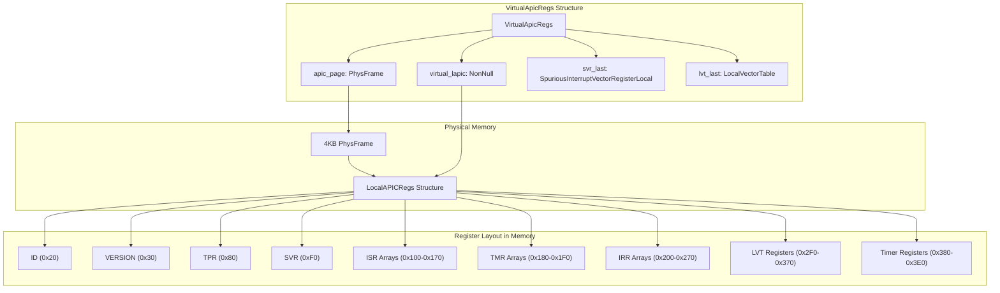
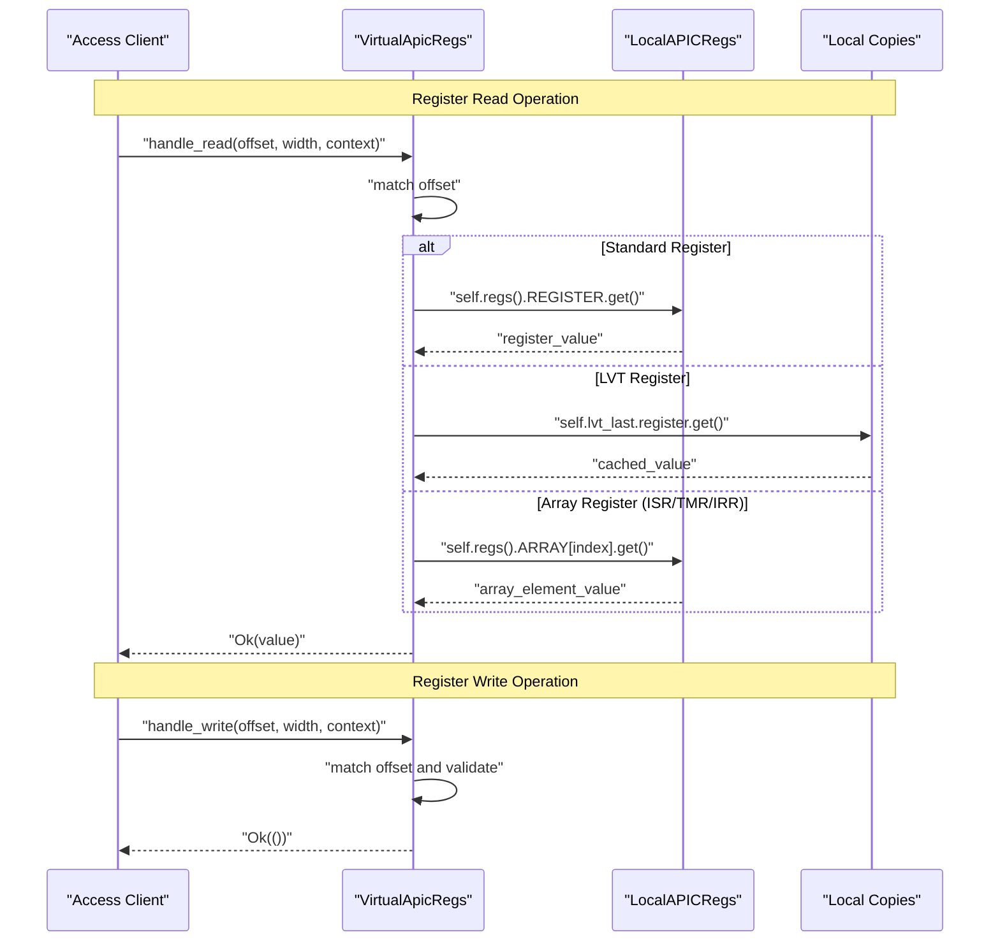
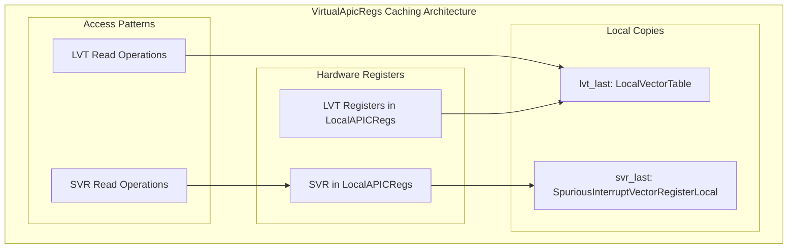
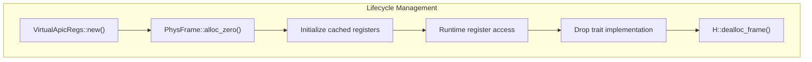

# Virtual Register Management

> **Relevant source files**
> * [src/regs/mod.rs](https://github.com/arceos-hypervisor/x86_vlapic/blob/9b85fb9d/src/regs/mod.rs)
> * [src/vlapic.rs](https://github.com/arceos-hypervisor/x86_vlapic/blob/9b85fb9d/src/vlapic.rs)

The Virtual Register Management system implements the core virtualization layer for APIC registers through the `VirtualApicRegs` struct. This system allocates and manages a 4KB memory page that contains a complete set of virtualized Local APIC registers, providing the foundation for both xAPIC MMIO and x2APIC MSR access patterns. For information about the device interface that uses this register management, see [EmulatedLocalApic Device Interface](/arceos-hypervisor/x86_vlapic/2.1-emulatedlocalapic-device-interface). For details about address translation that routes to these registers, see [Register Address Translation](/arceos-hypervisor/x86_vlapic/2.3-register-address-translation).

## Memory Management Architecture

The `VirtualApicRegs<H: AxMmHal>` struct serves as the primary memory manager for virtualized APIC registers. It allocates a single 4KB physical memory page and maps the `LocalAPICRegs` structure directly onto this page, providing a complete virtualized APIC register set.

The allocation process uses `PhysFrame::alloc_zero()` to obtain a zeroed 4KB page, ensuring clean initial register state. The `NonNull<LocalAPICRegs>` pointer provides direct access to the register structure while maintaining memory safety.

Sources: [src/vlapic.rs(L15 - L40)&emsp;](https://github.com/arceos-hypervisor/x86_vlapic/blob/9b85fb9d/src/vlapic.rs#L15-L40)

## Register Structure and Layout

The `LocalAPICRegs` structure defines the exact memory layout of the 4KB virtual APIC page, mapping all register offsets according to the Intel APIC specification. This structure uses the `tock_registers` framework to provide type-safe register access with proper read/write permissions.

```mermaid
flowchart TD
subgraph subGraph4["LocalAPICRegs Memory Map (4KB Page)"]
    subgraph subGraph2["Local Vector Table"]
        ICR_TIMER["ICR_TIMER: ReadWrite<u32> (0x380)"]
        CCR_TIMER["CCR_TIMER: ReadOnly<u32> (0x390)"]
        DCR_TIMER["DCR_TIMER: ReadWrite<u32> (0x3E0)"]
        LVT_CMCI["LVT_CMCI: LvtCmciRegisterMmio (0x2F0)"]
        LVT_TIMER["LVT_TIMER: LvtTimerRegisterMmio (0x320)"]
        LVT_THERMAL["LVT_THERMAL: LvtThermalMonitorRegisterMmio (0x330)"]
        LVT_PMI["LVT_PMI: LvtPerformanceCounterRegisterMmio (0x340)"]
        LVT_LINT0["LVT_LINT0: LvtLint0RegisterMmio (0x350)"]
        LVT_LINT1["LVT_LINT1: LvtLint1RegisterMmio (0x360)"]
        LVT_ERROR["LVT_ERROR: LvtErrorRegisterMmio (0x370)"]
        ISR_REG["ISR: [ReadOnly<u128>; 8] (0x100-0x170)"]
        TMR_REG["TMR: [ReadOnly<u128>; 8] (0x180-0x1F0)"]
        IRR_REG["IRR: [ReadOnly<u128>; 8] (0x200-0x270)"]
        ID_REG["ID: ReadWrite<u32> (0x20)"]
        VERSION_REG["VERSION: ReadOnly<u32> (0x30)"]
        TPR_REG["TPR: ReadWrite<u32> (0x80)"]
        SVR_REG["SVR: SpuriousInterruptVectorRegisterMmio (0xF0)"]
    end
    subgraph subGraph0["Control Registers"]
        ICR_TIMER["ICR_TIMER: ReadWrite<u32> (0x380)"]
        CCR_TIMER["CCR_TIMER: ReadOnly<u32> (0x390)"]
        DCR_TIMER["DCR_TIMER: ReadWrite<u32> (0x3E0)"]
        LVT_CMCI["LVT_CMCI: LvtCmciRegisterMmio (0x2F0)"]
        LVT_TIMER["LVT_TIMER: LvtTimerRegisterMmio (0x320)"]
        LVT_THERMAL["LVT_THERMAL: LvtThermalMonitorRegisterMmio (0x330)"]
        LVT_PMI["LVT_PMI: LvtPerformanceCounterRegisterMmio (0x340)"]
        ISR_REG["ISR: [ReadOnly<u128>; 8] (0x100-0x170)"]
        TMR_REG["TMR: [ReadOnly<u128>; 8] (0x180-0x1F0)"]
        IRR_REG["IRR: [ReadOnly<u128>; 8] (0x200-0x270)"]
        ID_REG["ID: ReadWrite<u32> (0x20)"]
        VERSION_REG["VERSION: ReadOnly<u32> (0x30)"]
        TPR_REG["TPR: ReadWrite<u32> (0x80)"]
        SVR_REG["SVR: SpuriousInterruptVectorRegisterMmio (0xF0)"]
    end
end
```

The register arrays (ISR, TMR, IRR) each consist of 8 x 128-bit fields that collectively represent 256-bit interrupt state vectors, with each bit corresponding to a specific interrupt vector number.

Sources: [src/regs/mod.rs(L13 - L104)&emsp;](https://github.com/arceos-hypervisor/x86_vlapic/blob/9b85fb9d/src/regs/mod.rs#L13-L104)

## Register Access Patterns

The `VirtualApicRegs` implements register access through `handle_read()` and `handle_write()` methods that translate `ApicRegOffset` enum values to direct memory operations on the `LocalAPICRegs` structure. This provides a unified interface for both xAPIC MMIO and x2APIC MSR access patterns.

The read operations access different register types through specific patterns:

* Standard registers: Direct access via `self.regs().REGISTER.get()`
* LVT registers: Cached access via `self.lvt_last.register.get()`
* Array registers: Indexed access via `self.regs().ARRAY[index].get()`

Sources: [src/vlapic.rs(L62 - L186)&emsp;](https://github.com/arceos-hypervisor/x86_vlapic/blob/9b85fb9d/src/vlapic.rs#L62-L186)

## Caching Strategy

The `VirtualApicRegs` maintains local copies of certain registers to support change detection and coherent snapshots. This caching strategy ensures consistent behavior during register modifications and enables tracking of register state changes.

|Cached Register Type|Field Name|Purpose|
| --- | --- | --- |
|Spurious Interrupt Vector|svr_last: SpuriousInterruptVectorRegisterLocal|Change detection for SVR modifications|
|Local Vector Table|lvt_last: LocalVectorTable|Coherent snapshot of all LVT registers|

The cached LVT registers are accessed during read operations instead of the hardware registers, providing stable values during register modifications. The SVR cache enables detection of configuration changes that affect APIC behavior.

Sources: [src/vlapic.rs(L21 - L26)&emsp;](https://github.com/arceos-hypervisor/x86_vlapic/blob/9b85fb9d/src/vlapic.rs#L21-L26) [src/vlapic.rs(L37 - L38)&emsp;](https://github.com/arceos-hypervisor/x86_vlapic/blob/9b85fb9d/src/vlapic.rs#L37-L38) [src/vlapic.rs(L131 - L157)&emsp;](https://github.com/arceos-hypervisor/x86_vlapic/blob/9b85fb9d/src/vlapic.rs#L131-L157)

## Memory Management Lifecycle

The `VirtualApicRegs` implements proper resource management through RAII patterns, automatically deallocating the 4KB page when the instance is dropped.

The initialization process sets default values for cached registers using `RESET_SPURIOUS_INTERRUPT_VECTOR` for the SVR and `LocalVectorTable::default()` for the LVT state, ensuring proper initial configuration.

Sources: [src/vlapic.rs(L30 - L40)&emsp;](https://github.com/arceos-hypervisor/x86_vlapic/blob/9b85fb9d/src/vlapic.rs#L30-L40) [src/vlapic.rs(L55 - L59)&emsp;](https://github.com/arceos-hypervisor/x86_vlapic/blob/9b85fb9d/src/vlapic.rs#L55-L59)